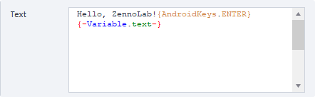

:::info **Please read the [*Material Usage Rules on this site*](../../Disclaimer).**
:::

_______________________________________________
## Keyboard Emulation in ZD  
This action lets you simulate typing data into text fields using the keyboard.  

  

 You can also press system buttons like **Home**, **Recent Apps**, **Back**, power, volume, and others.

_______________________________________________
### How do you add it to your project?
**Right-click → Add Action → Android → Keyboard Emulation**

_______________________________________________
### What can you put in the "Text" field?

You can enter plain text, variables, or special key macros in the action's text field, like: `{AndroidKeys.BACK}`, `{AndroidKeys.HOME}`, `{AndroidKeys.CLEAR}`. These mimic certain Android system buttons and more.

### What key macros are there?
- `{AndroidKeys.ENTER}`: New line. Submits forms on websites. Confirms actions in apps.
- `{AndroidKeys.APP_SWITCH}`: Shows recently used apps.
- `{AndroidKeys.BACK}`: Go back.
- `{AndroidKeys.CLEAR}`: Clears the input field.
- `{AndroidKeys.HOME}`: Returns to the home screen.
- `{AndroidKeys.COPY}`: Copies the selected text to the clipboard.
- `{AndroidKeys.POWER}`: Simulates pressing the power button.
- `{AndroidKeys.VOLUME_DOWN/UP}`: Turns the volume down or up.
- `{AndroidKeys.CAMERA}`: Activates the camera.
- `{AndroidKeys.DEL}`: Deletes one character to the left of the cursor.

That's only some of the available commands. You can find the rest [**here**](https://developer.android.com/reference/android/view/KeyEvent).

You can also use the button's numeric code instead of its name. You'll find it at the link above by clicking the macro name.

   

>  

### Delay
  

This parameter lets you set a pause between typing each character.

  

But if you uncheck "Delay," it will be disabled and the text will appear instantly.
:::warning Be careful.
If you turn off the delay, Android macros will stop working. They'll be typed as plain text instead of being executed.
:::