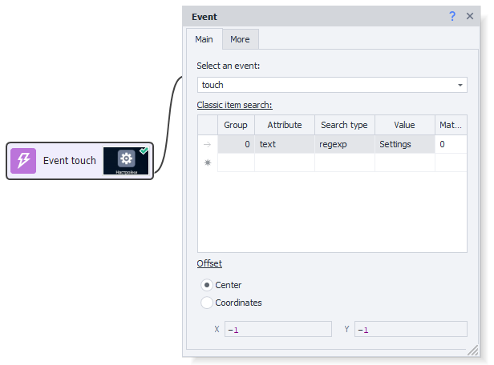
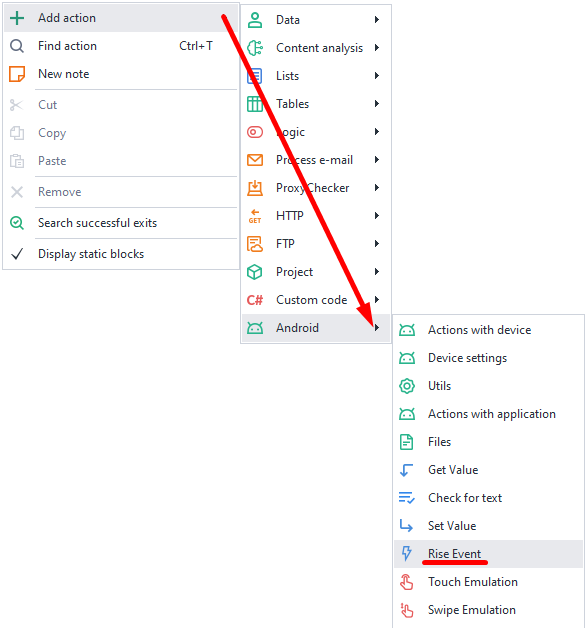
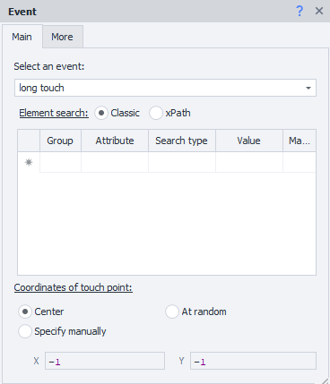
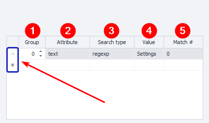
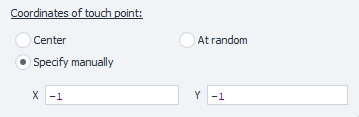
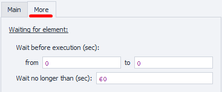
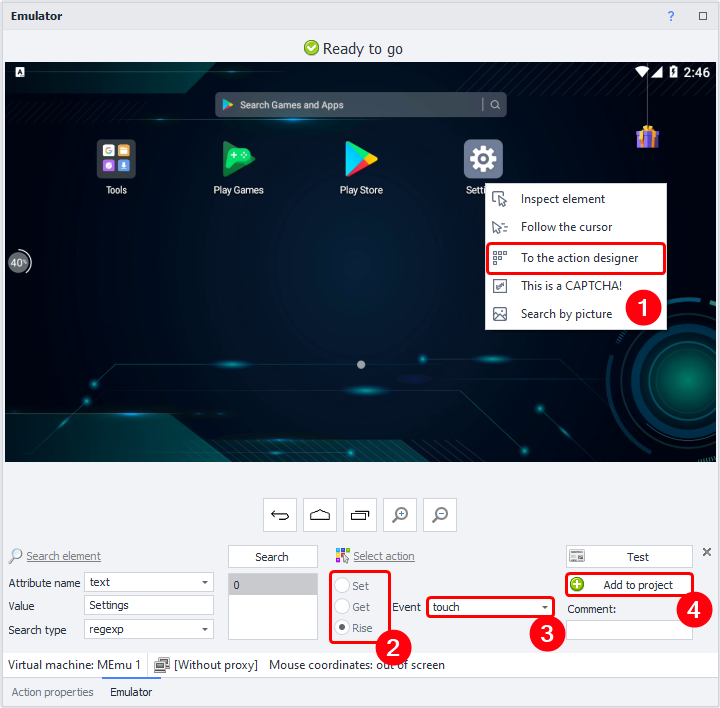

---
sidebar_position: 9
title: Trigger an Event
description: Clicking on an element.
---
:::info **Please read the [*Material Usage Rules on this site*](../../Disclaimer).**
:::
_______________________________________________  
## Description  
This action is used for simply tapping an element (touch) or for tapping and holding (long touch).

- **touch**. Used for clicking buttons, menu items, and checkboxes.
- **long touch**. Usually needed to bring up an extra menu on elements.

### How to add to your project?
Right-click on the canvas context menu:  
**Add action → Android → Trigger an event**.

_______________________________________________  
## The "Main" Tab

### Choose an Event
Here you set what you want to do with the element:
- *touch*
- *long touch*

#### Finding an Element
Fill in the parameters to search for the element you want to interact with.
_______________________________________________
### Search Conditions

**1. Group** — sets the priority for this condition. The higher the number, the lower the priority.
If the action can't find an element with the highest priority (**0**), it'll move on to the next condition. It goes through the priorities until it finds the element or runs out of conditions.

You can add several conditions with the same priority, and the search will run for all of them at once.

**2. Attribute** — specify the element attribute to search by.
**3. Search type:**
   - *text*. Search by full or partial text match;
   - *notext*. Searches among elements that don't have the specified text;
   - *regexp*. Searches using [**regular expressions**](../../Tools/RegEx_Tester).
   
**4. Value** — set the value for the attribute.
**5. Match no.** — the index number of the found element (starts from zero).

#### Removing a Condition
To remove a search condition, left-click on the field to its left (highlighted blue in the screenshot above), then press **Delete** on your keyboard.

#### Multiple Conditions
An element can be searched using several conditions at once:

Always try to set the conditions so that only one element will be left after the search.
_______________________________________________  
### Offset

- **Center**. The tap (touch/long touch) will happen exactly at the center of the element.
- **Coordinates**. You can also set specific coordinates inside the found element to tap on.

#### Coordinate Examples
- `0`;`0`. Top-left corner of the element.
- `99`;`49`. Picks the pixel at the intersection of the 100th horizontal and 50th vertical pixel.
- `-1`;`-1 (any negative number)`. Tap at the center of the element.
    - `-1`;`9`. Tap on the pixel at the horizontal center and 10th pixel from the top.
    - `0`;`-26`. The horizontal click happens at the far left of the element, vertical — at the center.
    - `-760`;`-2600`. This is also a click at the center of the element.
:::tip **If you set a value that's bigger than the height or width of the element,**  
It'll automatically decrease to the closest real value.
:::
_______________________________________________  
## The "Advanced" Tab

### Wait Before Triggering
Set a range **FROM** and **TO** in seconds, and it'll pick a random delay within that range before executing.

### Wait for Element, Max
If the element doesn't appear within the specified number of seconds, the action will end with an error.
_______________________________________________  
## Example Use
You need to use this action any time you want to tap an element. For example, to click the **Settings** shortcut on the emulator's main screen.

**1**. Right-click the shortcut → **To Action Builder**.
**2**. Choose the **Rise** action.
**3**. Event: **touch**.
**4**. **Add to project**.
_______________________________________________  
## Useful Links
- [**Action Builder**](../../pm/Interface/ActionBuilder)
- [**Device Window**](../../pm/Interface/DeviceWindow)