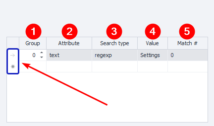

:::info **Please read the [*Guidelines for using materials on this resource*](../../Disclaimer).**
:::
_______________________________________________  
## Description  
This action is used to set a value in an input field.

### How to add it to your project
Right-click on the workspace:
**Add Action → Android → Set Value**

_______________________________________________
## Working with the action
### Choosing the field to set the value
**1.** In the [**Emulator Window**](../../pm/Interface/DeviceWindow), right-click on the element you want to set a value for. Then in the context menu, select [**To the Action Builder**](../../pm/Interface/ActionBuilder).
**2.** After that, the action builder will appear at the bottom of the emulator window. There, select the **Set** action type.
**3.** Enter the value in the text field.
**4.** **Add to the project** by clicking the special button.

_______________________________________________
### “Main” tab

#### What to insert

Type the text you want to insert. Besides plain text, you can also use [**Variable macros**](../../Data/WorkWithVariables) — `{-Variable.someVar-}` and `{-Profile.Name-}`.

#### Element search
Fill in the parameters for finding the element you want to work with.

### Search conditions

**1. Group** — sets this condition’s priority. The higher the number, the lower the priority.
If the action cannot find an element with the highest priority (**0**), it moves to the next condition. It’ll keep checking priorities until the element is found, or all conditions are tried.

You can add multiple conditions with the same priority—if so, all will be searched in parallel.

**2. Attribute** — specify the element’s attribute to search by.
**3. Search type:**
   - *text*. Search for full or partial text match;
   - *notext*. Looks among elements that don’t have the specified text;
   - *regexp*. Searches using ***regular expressions***.
   
**4. Value** — set the value for the attribute.
**5. Match number** — the index number of the found element (starts from zero).

#### Removing a condition
To delete a search condition, left-click the field to the left of it (highlighted in blue in the screenshot above), then press **Delete** on your keyboard.

#### Multiple conditions
You can search for an element using several conditions at once:

Always try to set your conditions so that only one element is found as a result.
_______________________________________________
### “Advanced” tab

#### Wait before executing
Set the range **FROM** and **TO** (in seconds), and a random wait time will be chosen from this interval before the action is performed.

#### Wait for element no longer than
If the element doesn’t show up in the set time (in seconds), the action will fail with an error.

#### Emulation
You can set a delay for interacting with the emulator, from 15 to 5000 milliseconds. For this action, it means the text will be entered slowly, as if typing by hand. After all, it’s almost impossible to type any word instantly in real life.
_______________________________________________
## Example of use
By default, there’s a search box for Google Play on the main screen of the emulator. So let’s try entering some text into it.

1. Right-click the search field and send the element to the [**Action Builder**](../../pm/Interface/ActionBuilder).

2. Make sure the element can be found using the set search criteria **(1)**.
3. Now enter the desired text in the **Value (2)** field.
4. Click **Test (3)** and check that everything works as expected.
5. If all goes well, finish setting up by clicking **Add to project (4)**.

_______________________________________________  
## Useful links
- [**Environment Variables**](../../pm/Creating/Variables)
- [**Get Value**](./GetValue)
- [**Device Window**](../../pm/Interface/DeviceWindow)