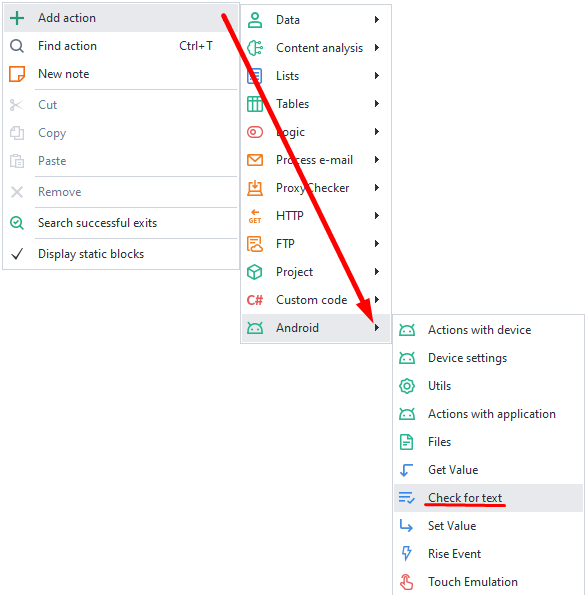
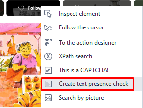
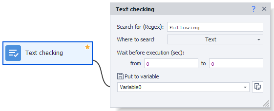

---
sidebar_position: 7
title: Text Check
description: Checking for text on the screen.
---

:::info **Please read the [*Material Usage Rules on this site*](../../Disclaimer).**
:::
_______________________________________________
## Description
This action **checks if specific text is present** on the screen. You can also use it to confirm successful login or completion of a particular task.

### How to add it to your project?
There are two ways:

- Through the canvas right-click menu:  
**Add Action → Android → Text Check**.

- Through the emulator window right-click menu:  
**Hover your mouse over the text → Right-click → Create text check**.

_______________________________________________
## Working with the action

### What to look for (Regex)
Type in the text you want to find. The field supports [**regular expressions**](../../Tools/RegEx_Tester).

### Where to look
Choose the data you want to search in:
- **Source**  
The full structure of elements on the screen. It's the same as what you get in the action [**Get element structure (XML)**](./Utilities#get-ui-structure-xml).
- **Text**  
An array of strings that contains text displayed on the screen, meaning the values of the `text` and `content-desc` attributes.

### Wait before execution
Set the number of seconds for the action to wait before it starts.
_______________________________________________