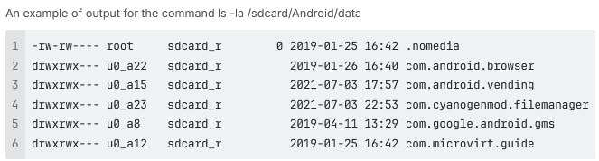

:::info **Please review the [*Terms of Use for Materials on this Resource*](../../Disclaimer).**
:::
_______________________________________________
This action offers a collection of different functions that will come in handy when working on your project.

## How do you add utilities to your project?
***Right-click → Add Action → Android → Utilities***

_______________________________________________
## Available utilities
### Console Command (ADB Shell)

:::info **This action isn’t a literal ADB command.**
Think of it more like a console or terminal for the emulator. You enter all commands without 'ADB Shell' at the start.
:::

This utility works a lot like the [**Terminal Emulator for Android**](https://apkpure.com/terminal-emulator-for-android/jackpal.androidterm) app. Basically, it lets you run built-in Android console Linux commands.

There's a 10-second timeout for this action. If your command hasn’t finished in that time, the action will end with an error (it’ll exit via the red branch).

Example commands:
- **`ls -la /sdcard/Download`** — lists all files and directories at *`/sdcard/Download`*.
- **`pm list packages`** — lists all installed apps.
- **`pm list packages -3`** — lists only third-party apps.

#### Save the result to a variable
Here you’ll need to specify an existing variable or create a new one to store the result.

#### Sending/receiving files and folders
This utility also lets you run commands for sending and receiving files to and from the device:
- Send a folder: *`adb push`* **`"c:\MyFolder"`** **`/sdcard/`**.
- Send a file: *`adb push`* **`"{-Project.Directory-}myFile.txt"`** **`/sdcard/myFileNewName.txt`**.
- Get a folder: *`adb pull`* **`/sdcard/myFolder`** **`c:\Users\Public`**.
- Get a file: *`adb pull`* **`/sdcard/myFile.txt`** **`"{-Project.Directory-}myFileNewName.txt"`**.
:::tip **The first path in your command is where you’re copying from, the second is where you’re copying to.**
:::
_______________________________________________
### Set Geo-location

This utility lets you spoof the device’s location.

#### Available options:
- *Latitude*. Allowed values: -90 to 90.
- *Longitude*. Allowed values: -180 to 180.
You can use decimals, either with a period [**.**] or comma [**,**] as the separator.
For example, New York's latitude and longitude: *40.7143* and *-74.006*
_______________________________________________
### WiFi Settings

This action lets you change the WiFi network name (SSID) the emulator is "connected" to.
_______________________________________________
### Reset Google Advert ID

This utility resets the device’s advertising identifier.
_______________________________________________
### Get UI Structure (XML)

Lets you get the on-screen element structure as an XML string. It’s the same info as you see in the  
*Element Tree Window*, just as a **single XML string**. You can then process this with the *JSON and XML Handling* action.

#### Some useful attributes you can get from an element:
- position and size (the **bounds** attribute),
- displayed text (the **text** attribute),
- whether the element is visible (**displayed** attribute).
_______________________________________________
### Pinch/Zoom

This action lets you scale: **Zoom Out** (shrink) or **Zoom In** (enlarge).

#### Available options:
- *Coordinates*. The point relative to which the scaling will happen.
- *Factor*. How much you want to zoom in/out.
_______________________________________________
### Send SMS to Device

This utility fakes sending an SMS to the device.

#### Available options:
- *Phone*. Sender’s phone number.
- *Message*. The message text you want to send.
:::info **There needs to be a messaging app installed on the device.**
For example, Google Messages, LineageOS Messaging, or any other.
:::
_______________________________________________
### Get Device ADB Connection Info

This action lets you get the address and port of the connected device. Useful if you need to run specific ADB commands: `adb -s serial mdns services`
_______________________________________________
### Get Device Clipboard

Lets you save the device’s clipboard contents to a variable.
_______________________________________________
### Set Device Clipboard

Lets you set the clipboard contents on the device.

Then, using the [**Keyboard Emulation**](./Keyboard) action, you can paste the clipboard into any field with the `{AndroidKeys.PASTE}` macro.
_______________________________________________
### Run SQLite3 Query

This action lets you run a SQL query on the device database. The first time you run it, all the necessary files will be automatically installed on your device depending on its architecture.

#### Available options:
- *Database path*. The full path to the file. For example: `/data/data/com.android.providers.contacts/databases/contacts2.db`.
- *Query*. The SQL query, like `SELECT * FROM contacts`.
- *JSON-formatted response*. If you enable this, the query result will come back as JSON (which you can read using the [**JSON and XML Handling**](../../Data/JSON_XML) action). Otherwise, you’ll get an array of strings separated by a pipe (**|**) character.
_______________________________________________
### Run Frida Script

A utility for running a Frida script. On the first launch, all required files will be installed on your device automatically, depending on architecture. Then, the Frida server will start.

#### Available options:
- *App name*. The app you want to inject the script into.
- *Script*. The script’s contents. Macros are supported.
_______________________________________________
## Useful links
- [**Frida Server**](../../Tools/Frida).
- [**X/JSON Path Tester**](../../Tools/JSON_Tester).
- [**Configuring SMS Modules**](../../Settings/SMS).