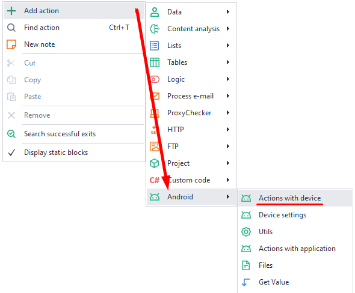
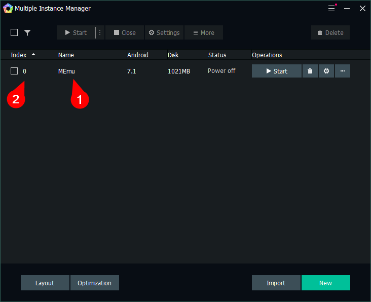
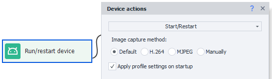

:::info **Please read the [*Material Usage Rules on this site*](../../Disclaimer).**
:::
_______________________________________________
export const VideoSample = ({source}) => (
  <video controls playsInline muted preload="auto" className='docsVideo'>
    <source src={source} type="video/mp4" />
</video>
);

## How do I add an action to my project?

To open the context menu, right-click on an empty spot.
Then select **Add Action → Android → Actions with Device**.

_______________________________________________
## How do I select a device?

With this action, you can choose which device you want to work with.

### Available options:

***Full device name or index***

Enter the device name as it appears in the Multi-Memu window (1) or its index (2).
Indexing starts from zero. If you leave this blank, a random device will be selected.

- ***Regex***  
Here, a random device will be picked from the list according to the Regex expression you set.
This way you can group devices by adding prefixes to their names (like OK_1, OK_2, VK_1, VK_2)
and pick randomly by setting a mask (like OK or VK).
- ***Save index/name to a variable***  
This option lets you save the name or index of the selected device to variables.
_______________________________________________
## How do I start or restart a device?

This action starts the device you picked earlier, or restarts an already running device.

***Apply profile settings on startup***  
If you check this box, the settings from the current profile will be applied when starting, such as model, device ID, carrier, and more.
:::warning **Before starting, you need to *select* the device the program will work with.**
:::
_______________________________________________
## How do I stop a device?

This action stops a running device.

_______________________________________________
## How do I create a device?

With this action, you can create a new device. When you create one, new device data (IMEI, MAC, etc.) will be generated.
:::info **Creating a new device is resource-intensive.**
It might be easier to reset the current device and generate new IDs instead (see the **Reset** section below).
:::

### Available options:
- ***Version***  
Here, you need to specify the Android version for the new device.  
Available: **5.1, 7.1, 7.1 x64, 9.0 and 12.0**, or some **Random** of them.
:::tip By default, only version **7.1** is available.
*To use other versions, you'll need to download them first.*
:::

- ***Name***  
Set the name for the new device. You can leave this blank to use the default value.
- ***Put index/name to a variable***  
Lets you save the name or index of the new device to variables.
_______________________________________________
## How do I rename a device?

This lets you change the name of the current device.

:::info **Be careful.**
*You'll be renaming the device you selected using the **Select** function (described earlier).*
:::

:::warning **The device must be turned off before renaming!**
:::
_______________________________________________
## How do I clone a device?

Use this action to create a copy of the current device.

### Available options:
- ***Name***  
Enter the name for the new copy. You can leave it blank to use a default name.
- ***Put index/name to a variable***  
Lets you save the name or index of the cloned device to variables.
_______________________________________________
## How do I export a device?

This action creates a full copy of a device with all its settings and saves it to a file with the
*.ova* extension. You can then move this file to another computer and load it with the **Import** function (see below).

***Path to .ova file*** Specify where the device copy will be saved.
:::warning **The device must be turned off!**
:::
_______________________________________________
## How do I import a device?

This lets you load a device from a file you saved in the previous step.

#### Available options:
- ***Path to .ova file***  
The path to the file where the device is stored.
- ***Name***  
Set a name for the imported device. Leave blank to use the default.
- ***Put index/name to a variable***  
Lets you save the name or index of the imported device to variables.
_______________________________________________
## How do I do a full device reset?

This action resets your current device to its default state. However, device IDs generated during creation will stay the same.

*A full reset* helps you avoid deleting and recreating a device, since *creating* is very resource-heavy and slow. Doing a full reset without restoring the system partition is way faster.
:::warning **The device must be turned off to apply the settings**
All apps, files, and data will be deleted! This feature is basically like a **factory reset** on phones.
:::

***Restore system partition***  
Without superuser privileges, no app can write to the system partition.
This means that when you install a messenger, there are no traces left in the system.
Writing to the system partition is only possible after explicit user confirmation.  

For example, when installing Xposed Framework, you'll need to check the box if you want to restore the device to its original state.
:::tip **Enabling the *Restore system partition* option will make the reset take longer.**
:::
_______________________________________________
## How do I delete a device?

This action lets you delete a device.

***Full device name or index***

Enter the device name as it appears in the Multi-Memu window (1) or its index (2).
Indexing starts from zero.

_______________________________________________
## How do I get a list of devices?

This action lets you save all available devices to a list.

#### Available options:
- ***What to get***  
Choose what to save to the list: device indexes or their names.
- ***Filter***  
You can also filter the list by device state:
  - **All.** Includes all created devices, no matter their status.
  - **Busy.** Device is busy in one of the active threads. Works only in ZennoDroid (ProjectMaker doesn't see threads running in ZennoDroid).
  - **Not busy.** Device is not being used in any thread. This filter also works only in ZennoDroid.
  - **Running.** Device is running, which means there's at least one emulator process in Task Manager.
  - **Not launched.** Device is stopped. There are no emulator processes in Task Manager. 
- ***Put to list***  
This is the list where the results will be saved.

#### The difference between busy and running:
A device that's busy in a thread isn't necessarily running. It might be stopped (for example, it's being exported, settings are being applied, etc.). But a running device is always busy.
_______________________________________________
## Useful links
- [**Installing Memu**](../../ProLite/Memu_Install)
- [**App automation**](../../get-started/apps)
- [**Device window**](../../pm/Interface/DeviceWindow)