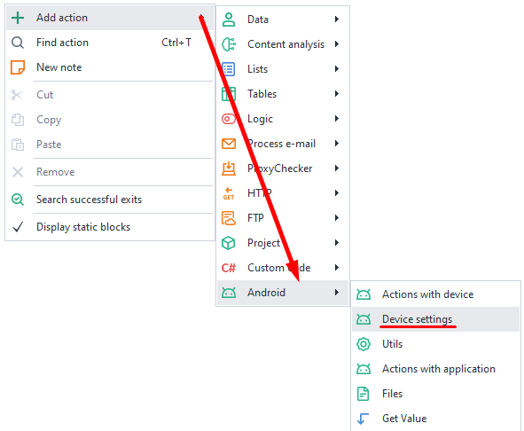
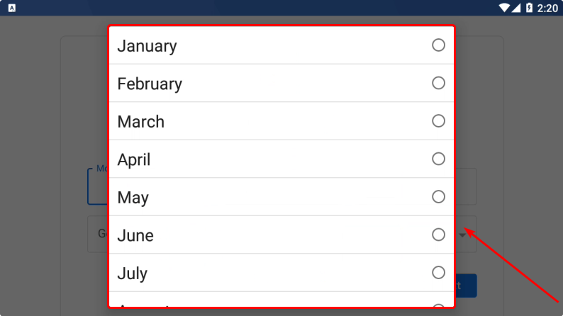
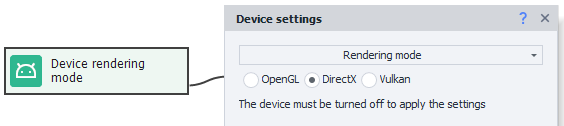
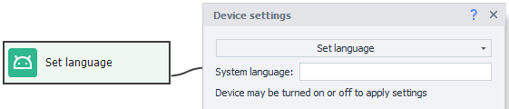
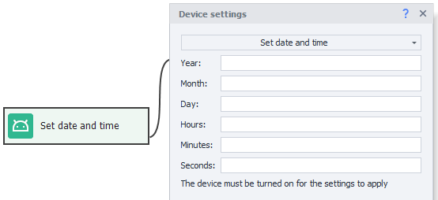
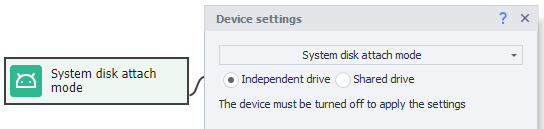

:::info **Please read the [*Material Usage Rules on this site*](../../Disclaimer).**
:::
_______________________________________________
export const VideoSample = ({source}) => (
  <video controls playsInline muted preload="auto" className='docsVideo'>
    <source src={source} type="video/mp4" />
</video>
); 
 

## How do I add an action to a project?

Right-click on an empty spot to open the context menu.  
Then choose **Add Action → Android → Device Settings**.

  
_______________________________________________ 
## How do I set up device identifiers?

With this feature, you can change things like [IMEI](https://ru.wikipedia.org/wiki/IMEI), Android ID (device ID), [IMSI](https://ru.wikipedia.org/wiki/IMSI), and Sim Serial (SIM card serial number).

  
_______________________________________________ 
## How do I add a mobile operator?

  

You can find all the info you need for this action [**on this site**](https://www.mcc-mnc.com/)

### Available settings:

 
- ***Country***: The two-letter ISO code from the table.  
- ***Operator Code***: Combine MCC and MNC columns (for example, 25002 for Megafon).  
- ***Operator Name***: The Network column (Baykal Westcom, BeeLine/VimpelCom, MTS).  
- ***Phone Number***: Start without the "+" sign, just 79*** and so on.  
_______________________________________________ 
## How do I specify the device model?

 
### Available settings:  
- ***Manufacturer***: The brand you want to emulate (Samsung, Huawei, Xiaomi, Google, Meizu, etc).  
- ***Model***: The model to use. You can find it in build.prop (see below for tips).  
- ***ro.product.brand***: If this field is empty, just copy in the Manufacturer.  
- ***ro.product.board***: For newer phones, this isn't important; you can leave it blank.  
- ***ro.hardware*** and ***ro.build.fingerprint***: Get these from build.prop.  

### Where to find data in build.prop:  
Search in Google like this:  
***build.prop phone_model*** *(for example, build.prop Samsung s10)*.  
Click on any result and look through the post to find the info you want:  
`ro.product.brand=samsung`  
`ro.hardware.chipname=exynos9820`  
`ro.product.board = none`  
`ro.product.model` or `ro.product.system.model`  
:::info **How do I check my own phone info?**
*You'll need to run the *getprop* command in the terminal (for example, [Terminal Emulator for Android](https://apkpure.com/terminal-emulator-for-android/jackpal.androidterm#google_vignette)).*
:::
 
_______________________________________________
## How do I set the Wi-Fi MAC address?  
  
Format – use colons: XX:XX:XX:XX:XX:XX, or without them: XXXXXXXXXXXX (12 characters)  
_______________________________________________ 
## Performance settings:  
Here you can set how much of your computer's resources will be allocated to the device.
    
### Available settings:
:::warning **Before changing settings, make sure the device is powered off.**
:::  

- ***Processors***: Number of CPU cores dedicated to the emulator.  
- ***RAM (MB)***: Amount of RAM in megabytes you can allocate to the emulator. *Minimum is 512MB, maximum is 65,636MB.*  
**Important!** More than 4GB can only be given to Android x64. On x86, 4GB is the limit.  
:::info **Usually, 1-2 CPU cores + 1-2GB RAM is enough.**
Since your PC's resources are being used for the emulation, if you set the numbers too high, things might start to lag. We recommend starting with the minimum and increasing as needed.
:::    
_______________________________________________
## Set screen resolution:  
In this setting, you can set the **Width** and **Height** of the screen as well as the pixel density (**DPI**).  
**DPI** — you can choose any value between 40 and 640, but it's better to stick to Memu's standard ranges.  
  
:::warning **Be careful.**
Changing DPI can mess up how some app elements are displayed. Things may become too large, covering other elements, or too small.
:::   
#### For example:  
| 1280х720, density - 640    | 1280х720, density - 240 |
| -------- | ------- |
|   |     |

   
_______________________________________________
## Rendering mode selection:  
Switching between OpenGL and DirectX. This setting mostly matters when you're running games in the emulator. The best setting depends on trial and error or what others say online. Some games work better with OpenGL, others with DirectX. Your graphics card and its drivers also affect performance.  


:::warning **Before changing settings, make sure the device is powered off.**
:::  
_______________________________________________ 
## Root user mode:  
Lets you turn **root access** on or off for your device.  

  
:::warning **Before changing settings, make sure the device is powered off.**
::: 
_______________________________________________
## Shared folders access:  
You can set up paths to shared folders in Windows here. This makes it easy to move files into and out of the emulator.
:::info **You can set up no more than 4 shared folders for one virtual machine.**
:::
 
  
### Examples:  
- **In Memu**: */sdcard/Download*, **in Windows**: *C:\Users\USERNAME\Downloads\MeEmu Download*  
- **In Memu**: */sdcard/Movies*, **in Windows**: *C:\Users\USERNAME\Videos\Memu Video*  
- **In Memu**: */sdcard/Music*, **in Windows**: *C:\Users\USERNAME\Music\Memu Music*  
- **In Memu**: */sdcard/Pictures*, **in Windows**: *C:\Users\USERNAME\Pictures\Memu Photo*  
 
 ***USERNAME** — use the Windows account name you're logged in as.*
:::warning **Before changing settings, make sure the device is powered off.**
:::   
_______________________________________________
## System language selection:  
This setting changes the emulator's language.  
Available values: ***en, ko, de, ja, fr, ru, es, pt, hr, cn, sr, it, cs, th, in, pl, tr, uk, ar, vi, fil***  

  
:::warning **Before changing settings, make sure the device is powered off.**
:::
_______________________________________________
## Set time zone:  
Lets you choose the device's time zone.  
Use this format: ***Europe/Moscow*** or ***America/New_York*** etc.  

  
You can see the complete list of time zones [**here**](https://en.wikipedia.org/wiki/List_of_tz_database_time_zones)  
_______________________________________________ 
## How do I set the date and time?  
You can set whatever you want: **year, month, day, hour, minute, and second**.  

    
If you leave all fields empty, it will sync automatically to the current time.  
_______________________________________________ 
## Camera type:
Available options:  
- **Physical**: Your real webcam plugged into your PC.  
- **Virtual**: Used automatically if you don't have a physical one. It's built into the emulator and lets you scan QR codes from your screen.  

  
_______________________________________________ 
## How to select system disk connection type:
Available options:  
- **Shared disk**: Lets you use the same system disk for all emulators, which saves space. In this mode,  
*it's read-only*, so you can't write to it.  
- **Independent disk**: With this setting, you can write info to the emulator's system section (*/system*).  

  
_______________________________________________ 
## How to set up a proxy:  
This setting lets you set a proxy for the whole emulator.


Proxy format:  
- **With authentication**: `protocol://login:password@ip:port`
- **Without authentication**: `protocol://ip:port`
 For **protocol** use: ***http***, ***socks4***, or ***socks5***. If not set, ***http*** is used by default.

:::warning **Important.**
It's better to turn the proxy on *before* you start the emulator, or some apps might send data over your real IP before the proxy kicks in.
::: 

### [Proxifier](https://proxifier.com/)

A powerful and flexible program for rerouting internet traffic through a proxy server.  

The emulator will be proxied by its PID in Windows. 

### Redsocks
Redsocks2 is used for proxying all TCP/UDP traffic transparently.

By default, DNS queries will go through the proxy server. So if your queries are blocked (can't get online or get **`DNS_PROBE_FINISHED_NO_INTERNET`**), you need to turn off DNS redirect.

:::info **C# code to disable DNS redirect:**  
```
var settings = new DroidProxySettings.Redsocks();
settings.UseDnsTcp = false;
settings.UseDnsUdp = false;
instance.DroidInstance.Proxy.SetProxy("socks5://10.20.30.40:8080", settings); 
```  
**Run this code before you set up the proxy.**
:::

#### DNS addresses
With Redsocks, you can set DNS server addresses. If there are several, separate with a comma `,`.

All DNS queries will go through the proxy.

:::info **C# code to set DNS server for each thread separately:**  
```
instance.DroidInstance.Proxy.SetDnsServers("8.8.8.8,8.8.4.4"); 
```  
**Run this code before you set up the proxy.**
:::  

### Clash
This is an advanced proxy client that lets you route traffic with rules.

 

#### DNS addresses
Here too you can set DNS server addresses. If there are several, separate with a comma `,`.

#### Local IP
Set the device's local IP address.

If you make the last digit of the address zero (for example, `192.168.20.0`), a random address will be generated from the specified subnet (`192.168.20.2-192.168.20.254`).

#### Local IPv6
Right here, you can set the device's local IPv6 address.

Example: `fdfe:dcba:9806::1/126`. If you use something like `fdfe:dcba:0::1/126`, the **`0`** will be swapped for a random hex value.

#### Whitelist
A list of apps whose traffic *will* go through the proxy (list each one separated by a comma). All other apps will use a direct connection (no proxy).

You can find the app's package name using [Installed Apps](../../Tools/Installed_App).

#### Blacklist
Conversely, use this to specify which apps *won't* use the proxy. Their traffic will go direct, while all others use the proxy.

You can find the app's package name using [Installed Apps](../../Tools/Installed_App).

:::warning **You can only use either the whitelist or the blacklist at the same time.**
If you fill in both, only the whitelist will be used.
::: 
_______________________________________________  
## Useful links      
- [**Launching the emulator**](../../ProLite/Memu_Start)   
- [**Device window**](../../pm/Interface/DeviceWindow)