import DisclaimerNotice from '@site/src/components/DisclaimerNotice';

# Actions with Application
<DisclaimerNotice />

Let's go over the available functions for working directly inside the virtual machine. For example: installing apps, launching, stopping, running console commands (ADB Shell), and more.

## How to add it to the project?
***Right-click → Add action → Android → Actions with Application***

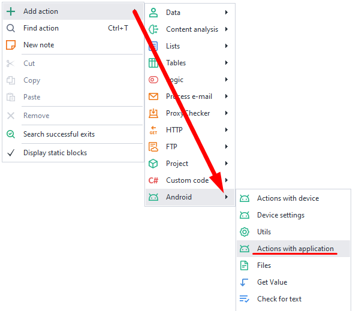
_______________________________________________
## Available actions.
### Install application.
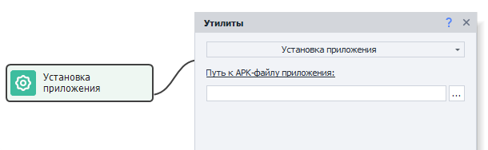  

This action lets you install an app from an APK file. Supported formats: ***.xapk, .apkm, .apks***
_______________________________________________
### Uninstall application.
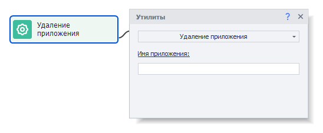  

This action removes an installed app by its name, which you can find using the [**Installed Apps**](../../Tools/Installed_App) tool.
_______________________________________________
### Open application.
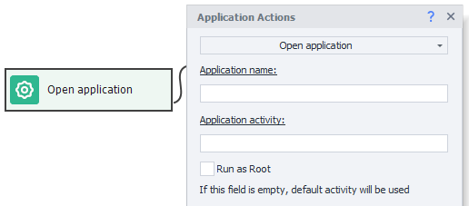  

Lets you launch an app you've already installed.
_______________________________________________
### Open URL.  
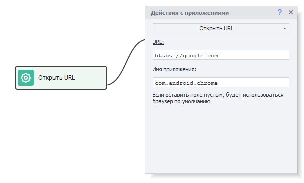  
Lets you open a web page in a browser.  
- *URL.* This is where you enter the web page address you want to open.  
- *App name.* Put in the name of the app that can open links. You can find it using the [**Installed Apps**](../../Tools/Installed_App) tool. If you leave it blank, the page will open in the default browser.  
_______________________________________________  
### Close application.
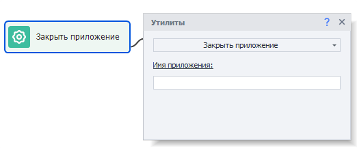  

Closes an app (similar to the command `adb shell am force-stop com.package`).
_______________________________________________
### Application cleanup.  
Use this action to wipe all user data.  

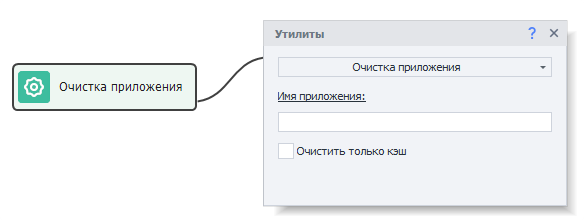  

If you check ***Clear only cache***, only the cache will be deleted, leaving everything else intact.
_______________________________________________
### Saving of application's data.  
This action saves all app data.  

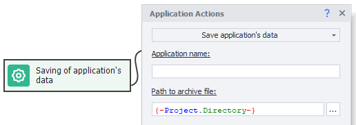  

#### Available parameters:
- *Application name*. You can find it using the [**Installed Apps**](../../Tools/Installed_App) tool.
- *Path to archive file*. Here you need to enter the path where the archived app data will be saved (archive format is ***tar.gz***).
:::tip **Best practice.**
Before saving data, it's best to close the app by using the Keyboard Emulation action with this text: `{AndroidKeys.HOME}`. This emulates pressing the HOME button.
:::

#### Why close the app before saving data?
If the app is open while you're saving its data, some files might still be in memory and not in the file system, so they might not get saved. Also, you shouldn't close the app with the **Close app** action for this purpose, as it kills the process abruptly and could result in data loss.

### Restoring of application's data.  
This lets you load app data previously saved using the ***Save app data*** action.  

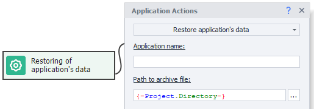  

#### Available parameters:
- *Application name*. You can find it using the [**Installed Apps**](../../Tools/Installed_App) tool.
- *Path to archive file*. Enter the path to the archive with the saved app data.
:::warning **Attention.**
The app must be installed in the system but not running when restoring its data!
:::

### Get apk of the application.
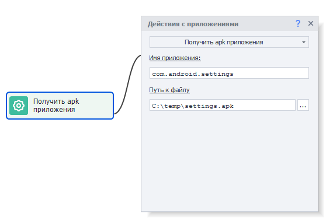  

This action lets you extract the installation file for an app in ***.apk*** or ***.apks*** format.
You can later install the app using the **Install apk** action.
_______________________________________________
### Get cookies from the app.
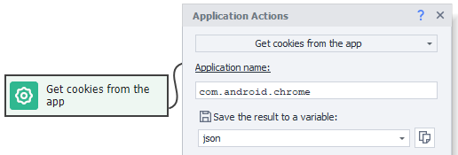  

This action collects cookies from apps that display web content; the cookies are returned in json format.
You can then work with this data using the [**JSON and XML processing**](../../Data/JSON_XML) action.
_______________________________________________
### Get notifications.
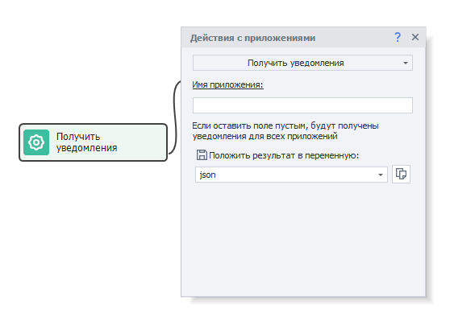  

This action fetches notifications from the app notification shade (top panel) in json format.
You can then process this data using the [**JSON and XML processing**](../../Data/JSON_XML) action.
_______________________________________________
### Clear notifications.  
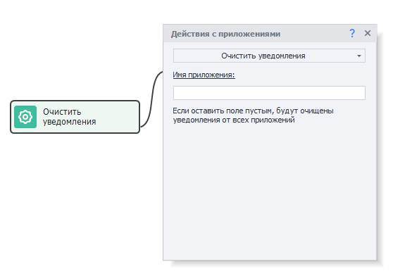  

This feature clears all accumulated notifications from the top panel.
_______________________________________________
### Name of the active application.
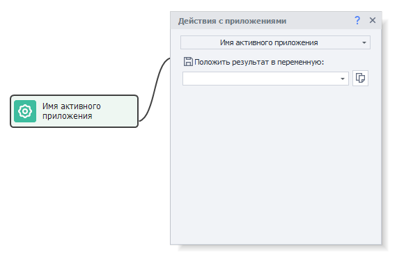  

This action lets you get the name of the app that's active and in the foreground on your device.
_______________________________________________
### Get application list.  
This action gets the names of all installed apps and saves them to a list.  

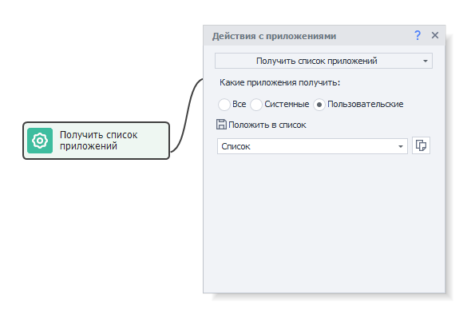

#### Filter options for apps:
- *All*. All apps installed on the device.
- *System*. Pre-installed system apps, which are usually not removable (only hidable).
- *User*. Apps you've installed yourself.
_______________________________________________
### Application already installed.
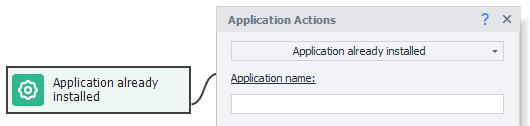  

This action checks if an app is installed on the device. If it's missing, the process will go down the error branch.
_______________________________________________
### Get accounts  
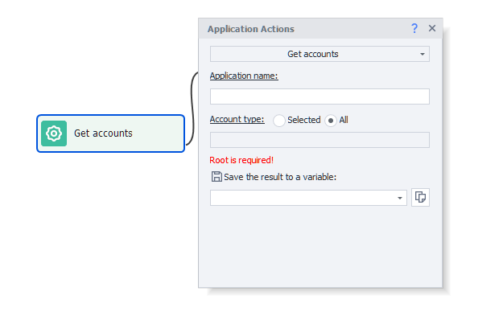  
Returns the accounts added on the device in JSON.  
#### Available parameters:  
- *Application name.* The app the accounts are asked from. The field is required. You can find the name using the [**Installed Apps**](../../Tools/Installed_App) tool.  
- *Account type.* **Selected** - accounts of the given type only, e.g. `com.google`. **All** - accounts of any type.  
- *Save the result to a variable.* Receives a JSON array with the name, type, password and metadata of every account.  
:::warning **Root is required.**
:::
_______________________________________________ 
### Add account  
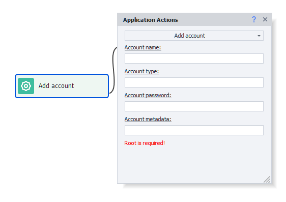  
Adds an account to the device.  
#### Available parameters:  
- *Account name.* Typically an email address.  
- *Account type.* For example `com.google`.  
- *Account password.* Fill it in when the account type needs one.  
- *Account metadata.* Extra data of the account - a token, for instance.  
:::warning **Root is required.**
:::
_______________________________________________ 
### Remove account  
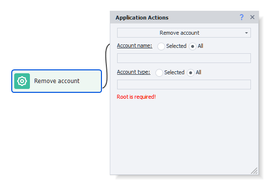  
Removes an account from the device.  
#### Available parameters:  
- *Account name.* **Selected** - one account is removed. **All** - every account of the chosen type is removed.  
- *Account type.* **Selected** - accounts of the given type only. **All** - accounts of any type.  
:::warning **Root is required.**
:::
_______________________________________________ 
## Useful links.
- [**Getting Started with the Browser**](../../get-started/browser).
- [**Debugging Projects**](../../pm/Debugging).