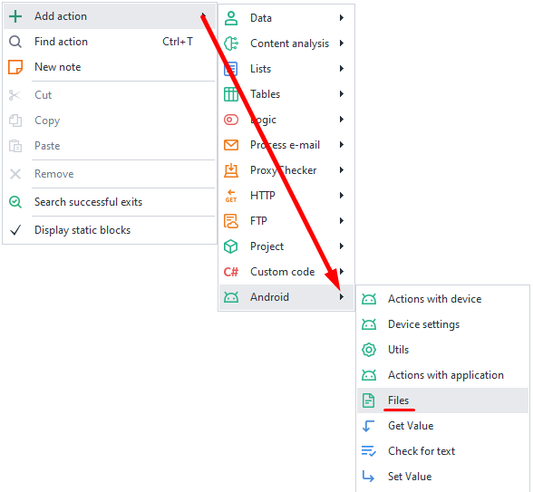
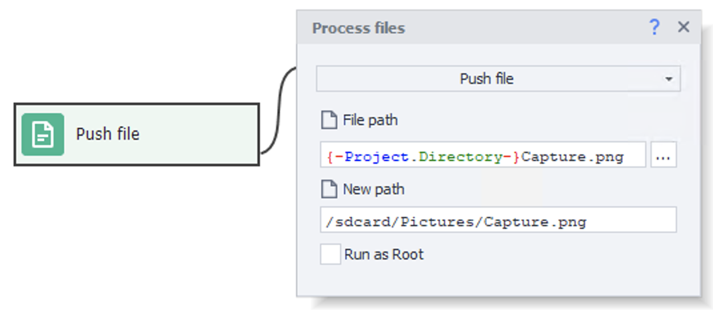
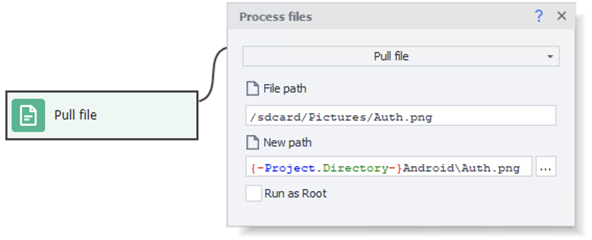

import DisclaimerNotice from '@site/src/components/DisclaimerNotice';

# Working with Files
<DisclaimerNotice />

This action lets you send files from your computer to your device and vice versa.
_______________________________________________
## How to add it to your project?
***Right-click → Add Action → Android → Files***

_______________________________________________
### Push file.  
Use this feature if you want to copy a file from your computer onto your device.  

  

#### Available options:
- *File path*. The full path to the file on your computer.
- *New path*. Where the copied file will be saved.  
You can specify the full path, including the file name: `/sdcard/Pictures/pic.png`, or just pick a folder: `/sdcard/Pictures/`. In the second case, the file will be copied with its original name.
- *Run as Root*. This setting is needed to send files to folders that require superuser access.  
When sending a file to such folders, a message containing `Permission denied` is displayed. However, if the file is sent without errors even when this setting is disabled, it is strongly **not recommended** to enable this setting.

Media files will automatically show up in your gallery after they're sent.
:::info Please note:
To send files to folders that are **Read-only** like **/system**, you need to:
- select **Independent drive** using the [**System disk attach mode**](./setting#how-to-select-system-disk-connection-type) action.
- run `mount -o remount,rw /system` first using the [**Console Command (ADB Shell)**](./Utilities#console-command-adb-shell) action.
:::

### Pull file.
This action lets you do the opposite: copy a file from your device to your computer.

#### Available options:
- *File path*. The full path to the file on your smartphone.
- *New path*. Where on your computer you want this file to go.  
Again, you can specify the full path, with the file name right away, like `c:\Images\pic.png`, or just pick a folder: `c:\Images\`. In the second case, the file will be copied with its original name.
- *Run as Root*. This setting is needed to receive files from folders that require superuser access.  
When receiving a file from such folders, a message containing `Permission denied` or `No such file or directory` is displayed. However, if the file is received without errors even when this setting is disabled, it is strongly **not recommended** to enable this setting.