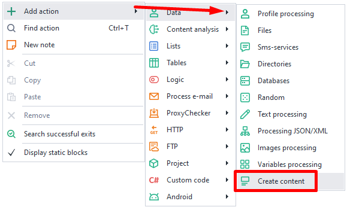
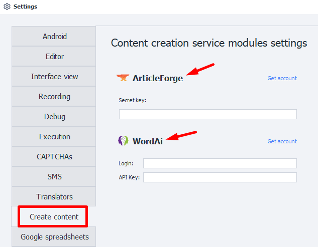
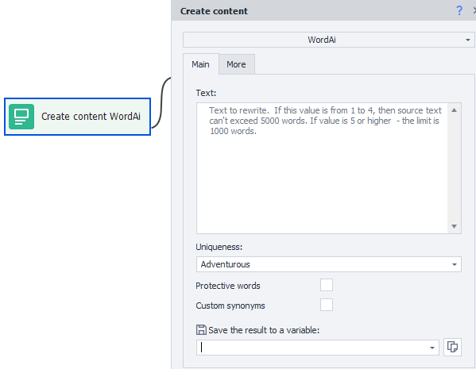
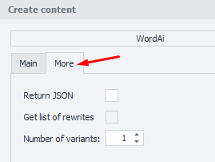
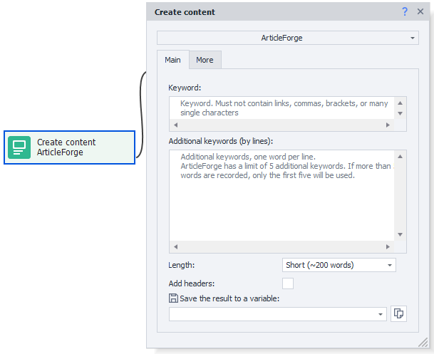
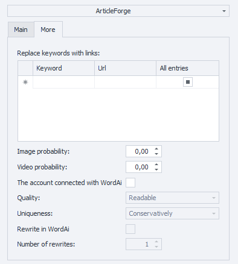
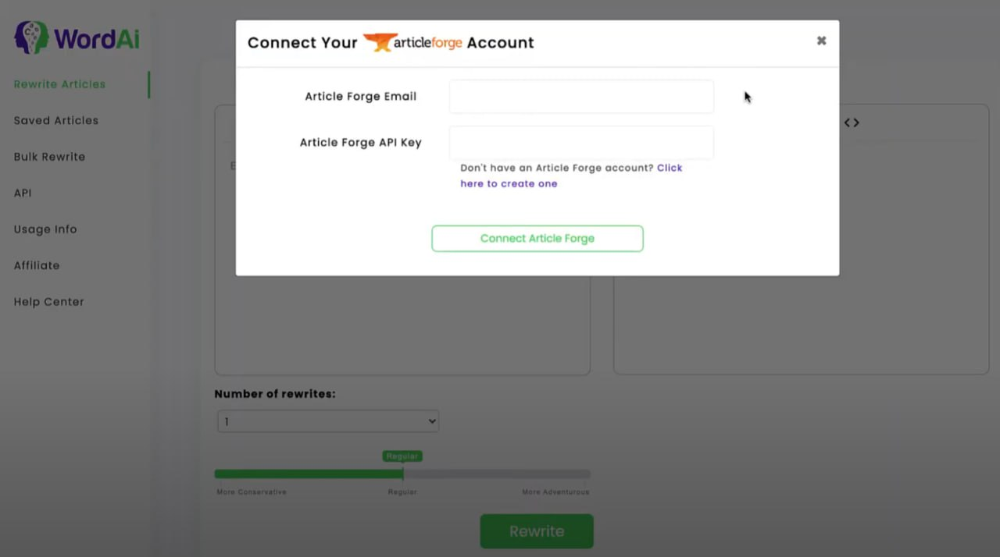
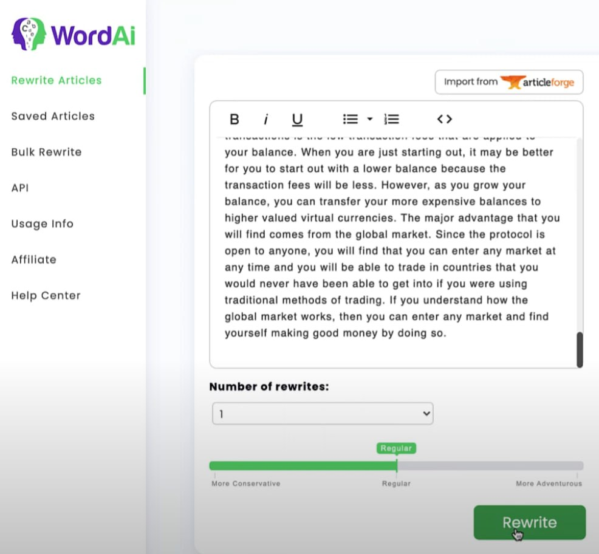

:::info **Please read the [*Terms of Use for materials on this website*](../Disclaimer).**
:::
_______________________________________________  
## Description  
**ZennoDroid** lets you connect and use services like [**WordAI**](https://wordai.com/) and [**ArticleForge**](https://www.articleforge.com/) for unique text creation.

These services use AI to understand text. They’re able to automatically rewrite content, and the result is nearly as readable as text written by a real person.

But there’s a big downside — **these services don’t support Russian**. So, they’re only relevant for those working with the English-language web.
_______________________________________________ 
## How to add it to your project  
Using the context menu: **Add Action → Data → Content Creation**.

  

:::info **Don’t forget to log in to the services through *Program Settings*.**  

:::
_______________________________________________  
## [WordAi](https://wordai.com/)  
This service rewrites existing text into a new form.

  
### The "Main" Tab
#### Text  
Here, you enter the text you want to have rewritten (in English).

| Number of Variants | Number of Words |
| :--------: | ------- |
| From **1** to **4** inclusive | No more than **5000** words |
| **5** or more | No more than **1000** words |

#### Uniqueness  
Sets how much freedom you give the AI to create new text.
- **Conservative:** The rewrite will have minimal changes.
- **Normal:** The AI works in standard mode, making occasional tweaks.
- **Adventurous:** Allows lots of creative freedom. Uniqueness goes up, but there’s a higher chance it’ll lose context.

#### Protected Words  
This function lets you list words and phrases that shouldn't be changed when rewriting. For example, you can prevent quotes, headings, and URLs from being touched.

#### Custom Synonyms  
This option lets you provide specific words and phrases you want swapped out for something else. WordAi will automatically replace them during rewriting.

:::warning **If you turn on both options above, uniqueness decreases and readability might suffer.**
:::

In ZennoDroid, it’s just a checkbox to turn these features on or off. The actual words/phrases are set directly in your WordAi profile.
_______________________________________________
### The "Advanced" Tab  

#### Return JSON  
After rewriting, you’ll get the result in JSON format.

#### Get Rewrite List  
The final JSON will also include all the changes the AI made to your original text.

#### Number of Variants  
Set how many different versions you want to get from the service — the number of times it’ll attempt the rewrite.
_______________________________________________
## [ArticleForge](https://www.articleforge.com/)  
Every article is written from scratch, so you never get duplicate or plagiarized content.
### The "Main" Tab  

#### Keyword  
Think of it like working with a freelance writer. You give a keyword, and they create a unique article based on it in under a minute.

:::warning **Links, commas, brackets, and single characters are not supported.**
:::
#### Extra Keywords (one per line)  
Here, you specify extra keywords, one per line. These have lower priority than the main keyword.

:::info **There’s a limit of 5 extra keywords.**
If you add more, only the first five are used.
:::
#### Length  
Set the desired length of the finished article, from 50 to 750 words.
#### Add Headings  
Different sections of the text will be split with relevant headings.
_______________________________________________
### The "Advanced" Tab  

#### Replace Keywords with Links  
You can enter a table of keywords and the corresponding links you want them swapped for.
#### Image Probability  
Set the chance that the AI will add a relevant image to the text. For example, `0.1` means 10%, `1` means 100%.

#### Video Probability  
Same thing here, but for videos: `0.03` means 3%, `0.75` is 75%, etc.

#### Account Linked with WordAi  
In your WordAi profile, you can link it with ArticleForge by entering your email and API key.

#### Quality  
Choose how well you want your text rewritten in WordAi.
- **Regular:** Rewrites the text while staying close to the original.
- **Unique:** Makes the output more unique, adding new details.
- **More Unique:** Can change the text a lot, even replacing whole sentences — but it may become less clear.
- **Readable:** Makes the text easier to read and understand, but removes some details.
- **Most Readable:** Really simplifies the text, good when you want to remove fluff and only keep the core info.

#### Uniqueness  
Sets how much freedom the AI gets when making new text.
- **Conservative:** Minimal changes.
- **Normal:** Standard mode, some deviation from the original.
- **Adventurous:** Lots of room for creativity and uniqueness, but may lose context more often.

#### Rewrite in WordAi  
The article generated in ArticleForge from your keywords can be sent to WordAi for further tweaking, based on the quality and uniqueness settings you chose above.

#### Number of Rewrites  
Specify how many different versions of your text you want from the service — how many times it’ll try to rewrite it.

| Number of Rewrites | Number of Words |
| :--------: | ------- |
| From **1** to **4** inclusive | No more than **5000** words |
| **5** or more | No more than **1000** words |
_______________________________________________