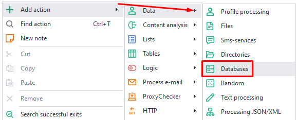
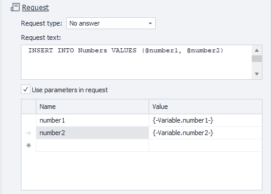
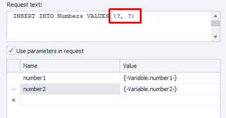

:::info **Please read the [*Material Usage Rules on this site*](../Disclaimer).**
:::
_______________________________________________  
In ZennoDroid, you can work with different types of databases, such as Microsoft SQL, MySQL, PostgreSQL, SQLite, and others. You can connect to them either from your local computer or a remote server, and then upload the necessary data.
_______________________________________________ 
## How do you add it to your project?  
Right-click context menu: **Add Action → Data → Directories**.  

    
_______________________________________________
## What the action looks like  
  
_______________________________________________
## Data source  
To make sure you work with a database properly, you need to set up the connection correctly. The required parameters will depend on the specific ***DBMS** (Database Management System)*.  

### Connection Manager  
  

It's designed to make creating a *Connection String* easier. Once you fill in the main details, the string will be generated for you. First, you need to specify the data source, and then select the database file.
 
|              | 
| :----------------: | 
| *Advanced settings are also available* |  

:::warning **You can't use variable macros in the *Builder*.**
:::

### Data Providers  
Several data providers are available:  
- **SqlClient**  
Provider for native connections to Microsoft SQL Server;  
- **MySqlClient**  
Provider for native connections to MySQL by Oracle;  
- **OleDb** *(Object Linking and Embedding Database)*  
This technology lets you access different data sources through a single interface (including SQL Server);  
- **Odbc** *(Open Database Connectivity)*  
A single interface for running SQL queries, regardless of the DBMS you're using;  

### Connection String  
Here you enter various login parameters (like username and password). Instead of building the string manually, you can use the Connection Builder described above.  

[**Examples of connection strings for different DBMSs.**](https://www.connectionstrings.com/)  
_______________________________________________
## Request  
  

### Request type  
#### No answer 
Used for operations that don't return data from the DB (for example, **INSERT** or **DELETE**). As a response, these operations return the number of rows affected.

#### Scalar 
Lets you get a single value. For example, to use an aggregate function: `select sum(price) from fruit`.

#### Normal  
Returns a table with data.

### Request text  
The field where you enter your SQL query.

### Use parameters in request  
Parameters make it easier to write queries because they can be inserted into places in the text you specify.

There are named and unnamed parameters. For named ones, their names matter; for unnamed ones, their order matters. Which type you use depends on the specific DBMS.

:::info **Text inside parameters is automatically escaped.**
:::

|     |  |
| :--------: | :-------: |
| Named parameters  | Unnamed parameters    |  
_______________________________________________
## Results processing  
Here you choose where to save the query results.

### Save result to:  
#### Variable  
All the rows and columns from the query will be saved into a single variable.

You also need to pick separators for splitting up rows and columns.

#### List  
Saves the query results into a list. It's important to specify a separator for the columns. In the end, each database row will become a new item in the list, with the chosen separator between columns.

#### Table  
When saving data to a table, the cells get filled in according to your query.

#### Variables  
This option lets you save the results in several variables at once.

  

**Line number**. Your query could return several rows, so you need to specify which row you want to use (numbering starts at zero).

In the table below, you select the cell number in the row and which variable it should go into (also numbered from zero!).

