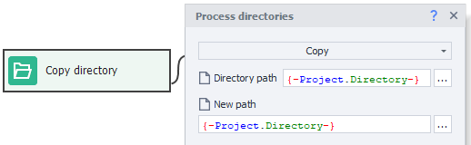

:::info **Please read the [*Material Usage Rules on this site*](../Disclaimer).**
:::
_______________________________________________  
## Description  
This action is designed for working with directories. Here's what you can do with it:
- *create*,
- *copy*,
- *move*,
- *delete*,
- *retrieve one or more files from a directory. For example:*
    - *article files for posting on a channel or blog*,
    - *a picture for an avatar when registering on apps or websites*.
- *check if a directory exists*.

When parsing, you can create a separate directory for each product, then save images, descriptions, and other info there.
_______________________________________________
## How to add it to your project  
Use the context menu: **Add action → Data → Directories**.

_______________________________________________
## How to use the action  
You can pick the needed action in the properties window when working with directories:

_______________________________________________
### Copy  
This action copies the entire directory along with everything inside it to a new location.

#### Directory path  
Here's where you enter the path to the original folder.

#### New path  
And here's where you enter the destination for the directory.

:::warning Please note  
If a directory with the same name already exists in the new location, nothing will be copied. The action will still finish successfully (green branch).
:::
_______________________________________________
### Move  
Works pretty much like the previous one, except it "takes" the directory away from its old locations, meaning it doesn't keep a copy there.
_______________________________________________
### Get list of directories  
With this action, you can get a list of all directories in the given path.

#### Directory path  
Enter the folder path here.

#### Search in subdirectories  
If you turn this option on, the search will look through all subdirectories, no matter how deep.

If you leave it unchecked, you'll just get the top-level directories.

#### Mask filter  
In this field, you can enter a search mask. You can set several, using `|` to separate them.

#### Save to list  
You can save the result to a list.
_______________________________________________
### Get list of files  
Works the same as the previous action, except this time you're looking for individual files, not directories.
_______________________________________________
### Check if directory exists  
This action lets you check if a directory exists at the specified path. If found, the process goes down the green branch; if not, it goes down the red one.

#### Directory path  
Enter the path to the folder you want to check.

#### Timeout  
Amount of time (in seconds) this action will wait while searching for the directory.
_______________________________________________
### Get file path  
This action gets the path to a file in the chosen directory.

#### Directory path  
Type in the path to the folder where you'll search for a file.

#### File  
- **By number**: Specify an exact file number (count starts at zero).
- **Random**: A random file will be chosen from what's available.

#### Sort alphabetically  
Check this if you want the file chosen from a list sorted alphabetically.

#### Search in subdirectories  
If this is enabled, the file search will go through all subdirectories, no matter how deep.

If not checked, the file will be picked only from the root of the directory you're searching in.

#### Mask  
You can specify a search mask here. You can use several, separated by `|`.

#### Save to variable  
You can assign the found file to a variable.
_______________________________________________
### Create  
This action lets you create a new directory at the specified path.

:::warning Please note  
If a directory already exists at this path, it won't be overwritten. The action will still finish successfully (green branch).
:::
_______________________________________________
### Delete  
This action deletes the chosen folder along with everything inside it. If you try to delete a folder that doesn't exist, the action will still finish successfully (green branch).

:::warning Folders deleted this way don't go to the Recycle Bin—they are gone for good!
:::
_______________________________________________
## Example of use  
When registering on different sites, you often have to upload an avatar. Imagine you've got a folder with ready-made images in *jpg*, *jpeg*, *png*, and *tiff* formats. You need to pick just one.

The site where you're making an account specifically requires a *PNG* file. So, when searching, you'll use the mask `*.png` and pick a random image.

After running this action, the absolute path to the file will be saved in the `avatar` variable.

:::tip System variable `{-Project.Directory-}`  
This holds the full path to the project's folder.
:::
_______________________________________________
## Mask search  
You can use special symbols in search masks:
- `?` stands for any single character except the dot.
- `*` means any number of any characters (including dots).
- `|` lets you set several masks at once.

### Examples
| Mask             | What it does | 
| :---------------- | :------: | 
| `*.*`        |   Any files with any extension.   | 
| `*.jpg`           |   Files with the **.jpg** extension (`image.jpg`, `avatar.jpg`, `1.jpg`).  | 
| `*.p*`    |  Files with extensions starting with **p** (`document.pdf`, `presentation.ppt`, `document.project`, `1.p`).   | 
| `car*.*` |  Files with any extension, but names starting with **car** (`carriage.jpg`, `cartoon.ico`, `carrots.html`).   |  
| `*mat?.html` |  **.html** files whose names start with any characters, then **mat**, then **any 1 character** (`automate.html`, `tomato.html`, `mate.html`).   |  
| `doc?????.xls` |  **.xls** files starting with **doc** and then **5 any characters** (except the dot) (`document.xls`, `doc-1208.xls`, `doctrine.xls`).   |  
| `???.??` |  Files with **3 characters in the name** and **2 in the extension** (`abc.ps`, `job.ai`, `123.45`)   |  
| `?????` |  Files with **5 characters in the name** and **no extension** (`house`, `image`, `tasks`) |  
| `*.xlsx` or `*.docx` |  Any **xlsx** and/or **docx** document (`invoice.docx`, `resume.docx`, `project.xlsx`, `default.xlsx`)   |