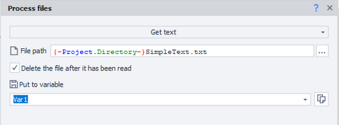

:::info Please read the [*Resource Use Policy*](../Disclaimer).
:::
_______________________________________________  
## Description  
In ZennoDroid, you can automate working with files. For example:
- insert pre-written text from a file when posting on forums, social networks, and messengers;
- add descriptions for ads on marketplaces and other websites;
- send mass comments and messages;
- save data to a file while parsing;
- keep detailed logs by writing them to a file;
- delete or move unnecessary files.
_______________________________________________ 
## How to Add to Your Project  
Using the context menu: **Add Action → Data → Files**.

 
_______________________________________________ 
## Available Actions  
  
_______________________________________________  
### Get Text  
  

Lets you copy text from a file and save it to a variable.

You can also choose to delete the file after the action is done.
_______________________________________________ 
### Write Text  
  

This action writes the specified field text to the chosen file.

#### Append to File  
If this box is checked, the new text will be **added** to the file. If not, the file will be **completely overwritten**.

#### Write Line Break at the End  
This adds a line break (`\r\n`) to the end of the text. It helps to properly save multiple lines of data to a file.
_______________________________________________ 
### Move  
Moves a file to the specified directory. You need to provide the current full path to the file, and then the new path and name after moving.

  

You can also use this action to simply rename a file.
_______________________________________________ 
### Check Existence  
Lets you check if a file exists at a given path.
- **Result:** If the file exists, the action will follow the green route; if not, it’ll follow the red route.
- **Timeout:** Enter the number of seconds to wait for the file to appear.
_______________________________________________ 
### Copy  
Works just like **Move**, but the original file remains unchanged.
_______________________________________________ 
### Delete  
Lets you delete a file at the specified path.
_______________________________________________ 
## Example  
**Let’s download an image from vk.com, rename it, and move it to the needed folder.**

Say, you’ve already got the [**direct link to the picture**](https://sun9-40.userapi.com/impf/c848528/v848528810/1bd139/xdhmnuXGxLg.jpg?size=1200x800&quality=96&sign=d821afb870ed03538e551524acb1af31&type=album). Now, using a ***GET request***, you’ll download it to your device. Use the variable `PicPath`—after the action runs, it’ll contain the direct file path.

  

Next, add the [**Random**](./Random) action to generate the file name.

  

Then, create a **Files** action with the *Move* option.

  

**File path:** `{-Variable.PicPath-}`  
**New path:** `{-Project.Directory-}Village_Kitten\{-Variable.name_file-}.jpg`  

:::tip **`{-Project.Directory-}`**
This is a macro to specify the directory where your project is located.
:::  

After this action, the file will be moved to the right folder, and you can move on to uploading the next image.

:::warning **File extension**
When working with images, make sure to use the same file extension as when you downloaded it.
:::
_______________________________________________  
## Useful Links  
- [**Working with variables**](./WorkWithVariables)  
- [**Log window**](../pm/Interface/Log_window)