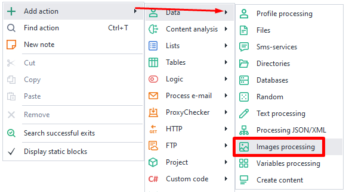
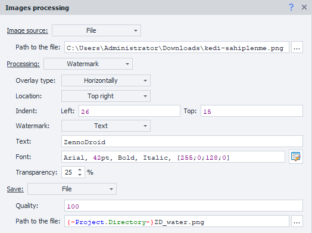

:::info Please review the [*Rules for using materials on this resource*](../Disclaimer).
:::
_______________________________________________  
## Overview  
This action is used for editing and saving images. Here’s what you can do with it:  
- visually process images;  
- edit or remove image metadata;  
- save screenshots from the app.  
_______________________________________________ 
## How to add it to your project  
Right-click the context menu: **Add action → Data → Image Processing**.  

  
_______________________________________________   
## Image Source  
  

### Instance Screenshot  
Takes a screenshot of the currently active emulator/device window.

### File  
Processes the selected file you set the path for. You can use macros here.

### URL  
The action will work with an image from the link you provide.

:::warning **The image will be downloaded using your actual IP.**
Even if proxies are set up in your project!
:::
_______________________________________________
## Processing  
### No processing  
The image won’t be modified in any way. This option is useful for saving screenshots or pictures from the internet as they are.  
_______________________________________________
### Resize  
Lets you change the size of your image. Available options:  
- **Width and Height**: Enter values for these parameters.  
- **Dimensions**: Sets whether the numbers above are *Percentages* of the original size or actual *Pixels*.  
- **Keep aspect ratio**: If you pick this, **Width** and **Height** will always stay in the original proportion, so you can't set them independently.  
- **Do not enlarge image**: If the **Width** and **Height** you set are bigger than the original, resizing won’t be applied.  
_______________________________________________
### Crop  
This lets you crop the image. Options:  
- **Area**: Choose what to crop.  
    - *Visible*: Only for **Instance Screenshot**. Crops the screenshot to the app’s open window. You get only the visible part.  
    - *Custom*: Crop the image based on the parameters set below.  
- **Left / Top / Width / Height**: Choose values in pixels or percent (pick below).   
- **Dimensions**: Sets the above type as either *Percent* of the original or *Pixels*.  
_______________________________________________
### Rotate  
Rotates the image by the specified number of degrees.  
_______________________________________________
### Watermark  
Adds text or an image to the file.

**Overlay type:**  
- *Horizontal*  
- *Diagonal*  

#### More on the Horizontal overlay type  
  

- **Placement**  
Set where the text/image should appear:  
    - *Center*  
    - *Top right*  
    - *Bottom right*  
    - *Top left*  
    - *Bottom left*  
- **Offset**  
Set the left/top offset in pixels in relation to the **Placement** you chose above.  
- **Mark**  
    - **Image**: Provide the file path.  
    - **Text**: Write your text and select the font.  
    :::tip **Visual text builder**
    Open it by clicking the button to the right of the **Font** box.  
    
    :::  
- **Transparency**  
The transparency level as a percentage for the overlay. The higher the value, the more see-through it is.  

#### Example  
  

With settings like in the screenshot above, the watermark will look like this:  

_______________________________________________
### Mirror  
Lets you mirror the image. Mirror types available:  
- **Horizontal**  
- **Vertical**  
- **Horizontal and Vertical**  
_______________________________________________
### Clear Exif  
This action can remove all metadata from the image.  
_______________________________________________
## Save  
Set up how the processed image will be saved.

### Quality  
Set the quality as a percentage: 1% is extremely compressed, 100% is original quality.

### File path  
Set the path on your computer to save the image. Make sure to add the file format at the end. You can use ***variables***.  
_______________________________________________
## Edit metadata (EXIF)  
In this section, you can change various image metadata.

  

:::info **Doesn’t work with *Clear Exif* mode.**
:::
_______________________________________________
## Usage Example  
Let’s say you made a template, but at some stage, it fails with an error. To help figure out why, you can take a screenshot at the moment of the error and take a look at what’s going on.

Create an action [**Random**](./Random) and generate a random number or name for the *thread*. Save this to a variable `{-Variable.thread-}`.

Now add a [**BadEnd**](../Project%20Editor/Logic/BadEnd) action and link it to **Image Processing**. Set the options like you see in this screenshot:

  

**File path:** `{-Project.Directory-}{-Variable.thread-}\App_screenshot.jpg`.

You can also save the page code `{-Page.Dom-}` using the [**Write to file**](../Android/ProLite/Files) action. This helps troubleshoot bugs that come up while working with the browser.