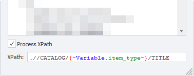
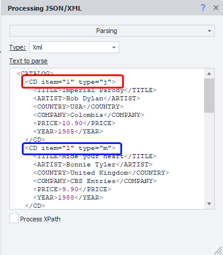

:::info **Please read the [*Material Usage Rules on this site*](../Disclaimer).**
:::
_______________________________________________  
## Description  
This action is used for working with JSON and XML. Most often, these formats are used in service [APIs](https://en.wikipedia.org/wiki/API). For example, [**Captcha recognition services**](../Settings/Captcha) or [**SMS Services**](./SMS_Services) usually work with one of these formats (or sometimes both).

:::warning **You can only process one JSON or XML object at a time in a project.**  
If you need to handle several objects, you have to do it one by one.
:::

### What is JSON?  
**JSON (JavaScript Object Notation)** is a simple and easy-to-read data exchange format. It allows you to store data as structured text that's easy for both computers and humans to read.

The main feature is that information is written as `"key": value` pairs. The key is the data label, and the value can be a string, number, array, logic, or an object.

#### Example  
```js
{
  "name": "Alexey",
  "age": 28,
  "city": "Moscow",
  "profession": "Programmer",
  "workExperience": 5,
  "languages": [
    "Python",
    "JavaScript",
    "C++"
  ],
  "remoteWork": true,
  "interests": {
    "sport": "Football",
    "music": "Rock",
    "hobbies": ["Photography", "Travel", "Reading"]
  }
}
```  

### What is XML?
**XML (eXtensible Markup Language)** is a markup language used for storing and transferring data. The main difference from JSON is that XML uses **tags** to mark data, while JSON uses *key: value* pairs.  
Unlike HTML, where you have fixed tags like `<div>`, `<p>`, in XML you create your own tags that describe your data.

#### Example  
```js
<CATALOG>
	<CD>
		<TITLE>Imperial Parody</TITLE>
		<ARTIST>Bob Dylan</ARTIST>
		<COUNTRY>USA</COUNTRY>
		<COMPANY>Columbia</COMPANY>
		<PRICE>10.90</PRICE>
		<YEAR>1985</YEAR>
	</CD>
	<CD>
		<TITLE>Hide Your Heart</TITLE>
		<ARTIST>Bonnie Tyler</ARTIST>
		<COUNTRY>United Kingdom</COUNTRY>
		<COMPANY>CBS Records</COMPANY>
		<PRICE>9.90</PRICE>
		<YEAR>1988</YEAR>
	</CD>
	<CD>
		<TITLE>Greatest Hits</TITLE>
		<ARTIST>Dolly Parton</ARTIST>
		<COUNTRY>USA</COUNTRY>
		<COMPANY>RCA</COMPANY>
		<PRICE>9.90</PRICE>
		<YEAR>1982</YEAR>
	</CD>
</CATALOG>  
```
_______________________________________________
### Beautify  
Sometimes services return text that's not formatted nicely (like in the examples above) but all in one line, which makes it hard to read. In such cases, you can use so-called *beautifiers*. For example, the [**X/JSON Path Tester**](../Tools/JSON_Tester) already has this built in — just use the **Beautify button**.


However, actions don't care whether the text is formatted nicely or all in one line. The main thing is that it's correct.

_______________________________________________ 
## How to add to your project?  
Use the context menu: **Add Action → Data → Process JSON/XML**.

  
_______________________________________________ 
## Available actions  
   
_______________________________________________
## Parsing  
This action is used to process received data.


### Variables window  
The result of the action is saved to the project variable Json or Xml. You can check the contents in the [**Variables window**](../pm/Interface/Variables). Since in our previous example we parsed XML, let's look at the XML tab:


The **Count (1)** variable stores the number of items. It's convenient to use as a limiter when looping through the data.

If our example also had `<DVD>` tags on the same level as `<CD>`, there would be a `CATALOG.DVD.Count` variable with the number of `<DVD>` tags:


You can use the **special buttons (2)** to quickly copy the variable's macro to the clipboard.

### Macros  
Here's an example macro: `{-Xml.CATALOG.CD[1].ARTIST-}`.

You can also use other variables inside this macro:


:::tip **Quick variable insertion:**  
Press `CTRL+SPACE` in any text field to bring up the drop-down menu. Then double-click on JSON or XML to select them and type a `.`, which will open a menu with the parsed variables.

  
:::

### Process JsonPath/XPath  
This option is for selecting a subset from the data you've parsed. To use it, you'll need to create an XPath (for XML) or JsonPath (for JSON) expression. Again, the [**Tester**](../Tools/JSON_Tester) can help here.



You can use macros in the expression field.
_______________________________________________
### XML Features  


XML has node attributes. To access them, use square brackets with the string value in macros: `{-Xml.CATALOG.CD[0]["item"]-}`.


### Processing speed  
Parsing large JSON or XML text while debugging in ProjectMaker can take a long time. But in ZennoDroid, parsing will be much faster.
_______________________________________________
## Add to list  
This action is used to get **one specific property** from all the data for each item. You can use ***variables*** here.

|             | 
| :----------------: | 
| *The variable `{-Variable.item_type-}` contains **CD*** | 

### Property  
Here you specify the field you want to treat as an array.

You can use nesting. Set parameters using dots, for example: `store.employees`.

If the field isn't an array, only one item will be added to the list.

### Subproperty  
Sometimes arrays contain complex objects, so you can specify what value to extract from each object for the list.
_______________________________________________
## Add to table  
This action is similar to the previous one, but here you can extract multiple properties at once. You can also use ***variables***.

|             | 
| :----------------: | 
| *The variable `{-Variable.item_type-}` contains **CD**, and `{-Variable.property-}` contains **ARTIST*** |  

The columns are named just like in Excel — capital Latin letters in alphabetical order. If you skip a column, it'll just stay empty. For example, column **C** in the screenshot:

  
_______________________________________________
## Working with code  
In C#, JSON and XML are stored in the *project* object as *dynamic* types. Because of this, the code editor can't fully show auto-complete hints.

### Example 1  
```c  
project.Xml.FromString(project.Variables["XmlText"].Value);
return project.Xml.PurchaseOrder.Address[0]["Type"];
```  

### Example 2  
```c  
var list = new List<string>();
for(int i = 0; i < project.Xml.PurchaseOrder.Address.Count; i++)
{
    list.Add(project.Xml.PurchaseOrder.Address[i].Name.Value);
}
return string.Join(", ", list);
```  

### Example 3  
```c  
var list = new List<string>();
foreach(dynamic i in project.Xml.PurchaseOrder.Address)
{
    list.Add(i.Name.Value);
}
return string.Join(", ", list);
```  

Same goes for working with JSON. Just keep in mind that you don't need to use `Value` when accessing properties.  
Like this: `return project.Json.employees[1].firstName;`
_______________________________________________
## Example with JSON  
For testing, let's use the site http://ip-api.com/, which uses a very simple API to return detailed information about your IP address. In real-life scenarios, this is useful for:  
- Checking that your project is running through a proxy, not your main IP.  
- Selecting a country/city when registering.  

This site [**can return**](https://ip-api.com/docs) data in different formats, but we'll use JSON.


To get the information, make a [**GET request**](../Project%20Editor/HTTP%20and%20FTP/GET) to http://ip-api.com/json, then process the result with the *Parse* action. After that, you can work with the data you receive.

  
_______________________________________________
## Example with XML and working with XPath  
Let's say you only need the album titles from all the data. For this, you'd compose an XPath expression: `//CATALOG/CD/TITLE`.

|            | 
| :----------------: | 
| *Action settings and result (right side)* | 
_______________________________________________  
## Useful links  
- [**C# code**](../Project%20Editor/CustomCode/С)  
- [**What is website parsing and why do you need it?**](https://blog.capmonster.cloud/ru/blog/sel-1/what-is-website-parsing-and-why-do-you-need-it)  
- [**Variables window**](../pm/Interface/Variables)