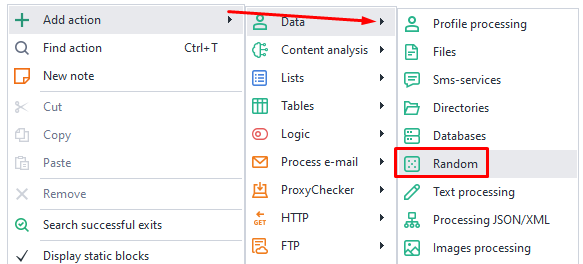
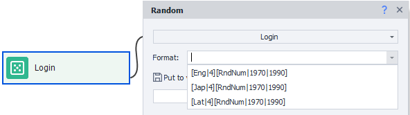
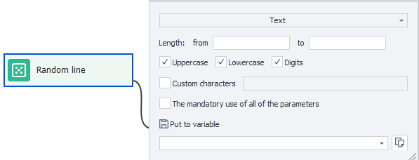
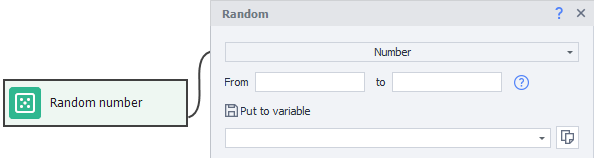

---
sidebar_position: 6
title: Random
description: Generating random numbers.
---

:::info **Please read the [*Material Usage Rules on this site*](../Disclaimer).**
:::
_______________________________________________  
## Description  
This action is for generating random data: strings, numbers, and authorization logins.

### You can use it to:  
- Pick a random item on a page  
- Generate a password  
- Generate a date of birth  
- Generate a postal code  
- Generate logins  
_______________________________________________ 
## How do you add it to your project?  
With the context menu: **Add Action → Data → Random**

    
_______________________________________________  

## Generating a login  
  

Logins are generated based on a specified formula. There are three preset formats available:  
- `[Eng|4][RndNum|1970|1990]`  
- `[Jap|4][RndNum|1970|1990]`  
- `[Lat|4][RndNum|1970|1990]`  

The only difference here is the language: `Eng` for English, `Jap` for Japanese, `Lat` for Latin.

`[Eng|4]` means a nickname will be generated that's four English syllables long. There's a chance the syllables will be combined like they are in actual words.

Let's experiment with the formula and make a more complex setup:

`[RndSym|[RndNum|0|4]|0123456789][Lat|3][RndSym|[RndNum|0|2]|-][Jap|1][RndText|2|D]`  

- `[RndSym|[RndNum|0|4]|0123456789]` — at the start, your nickname will get from 0 up to 3 (4 not included) random digits  
- `[Lat|3]` — then, 3 Latin syllables go into the login  
- `[RndSym|[RndNum|0|2]|-]` — a hyphen may appear  
- `[Jap|1]` — followed by one Japanese syllable  
- `[RndText|2|D]` — and the nickname ends with 2 random letters or digits  

*Some examples of generated nicks*
  

- 053bomenca-iem  
- 7lialeme-nozr  
- 46atbemig-poex  
- simpvido-se8f  
- 3afosuxhif6  
- frigulimdeif  
- misssefu-yucn  
- 5grasacin-maew  
- trodalcelfu88  
- 6nasercia-risc  

  
_______________________________________________ 
## Generating text  
:::info **Only English alphabet symbols are used.**
:::
  

### Length  
Here you set the minimum and maximum length for the final string. The upper limit is **not inclusive**—so, if you ask for a random string of 3 to 10 characters, you'll get at most 9.

### Extra settings  
- **Uppercase**  
- **Lowercase**  
- **Digits**  

Tick the boxes for what you want in the final string.

### Custom characters  
If you turn on this option, enter into the special field at the right any characters you want to be in the generated string. No other characters will be used.

### The mandatory use of all of the parameters  
When you check this box, the final string will contain at least one character from each category you ticked earlier *(Uppercase, Lowercase, Numbers, Custom characters)*  
_______________________________________________ 

*Examples of possible answers when all options are enabled and length is set from 5 to 9*
  

- w6ZxAw  
- 0M5oke7  
- ZlE3SY  
- Tos6KRZ  
- l5a640Pk  

   
_______________________________________________ 
## Generating a number 
  

- **From**: the lower boundary for the generated number  
- **To**: the maximum value, **NOT INCLUSIVE**  

*For example*: If you generate a number from **3** to **6**, you can only get one of these: **3**, **4**, or **5**.