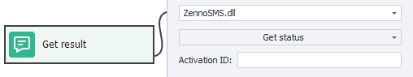
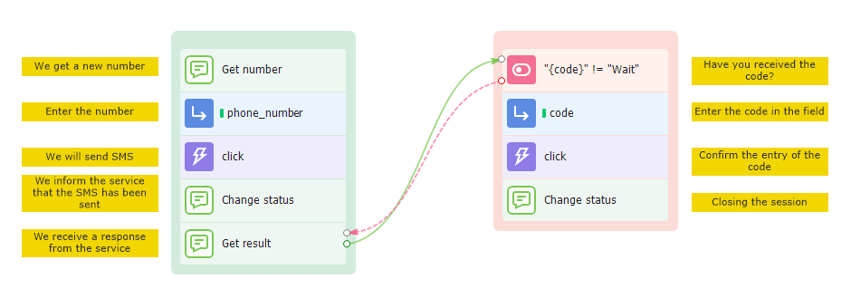

:::info **Please read the [*Material Usage Rules on this site*](../Disclaimer).**
:::

This action is used for SMS tasks. It lets you get a number from the selected service and use it as you need. For example, it's handy for registering on websites that require SMS confirmation.
_______________________________________________
## How to add it to your project?
Right-click and pick: **Add Action → Data → SMS Services**.

_______________________________________________
## How to use the action?
:::info **You'll need to connect an API key from one of the SMS services in the program settings to get started.**

:::
_______________________________________________
### SMS Service

Choose one of the available SMS services to work with.
_______________________________________________
### Action — Get Number

#### Service
Pick the site or app you need the number for. You can find out exactly how to enter this in the chosen activation service's documentation.

#### Operator (Country)
Here you set the country code for the number you want.

Country codes are different for each service, so you'll need to check the documentation.

#### Redirect
Tick this if you want the number to be forwarded. But note, not every service supports forwarding.

#### Save Activation ID in Variable
Whatever variable you specify here will store the activation ID. You'll need this later when your project is waiting for an SMS.
_______________________________________________
### Action — Change Status
Notify the service that the status of the number has changed.

#### Activation ID
Here, enter the activation ID you got from **Get Number**. You can use a variable macro.

#### Status:
- **SMS have been sent**: The message was successfully sent to the specified number.
- **Repeaded code request**: Use if you need to send another SMS.
- **Cancel Request**: Use if you no longer need the number. Some services might refund your money.
- **This number has already been used**: Lets the service know the number isn't suitable because it's already in use.
- **Completion**: Tells the service the task for this number is done.

#### Redirection
Write the number you want the messages forwarded to, if needed.
_______________________________________________
### Action — Get Status
Use this to check the status of your number.

The program will wait up to 3 minutes for the SMS to arrive. If it hasn't arrived by then, the result variable will be set to `Wait`. You'll have to try the action again. Some services can take up to 15 minutes to deliver the SMS, so take that into account.

#### Activation ID
Enter the activation ID from **Get Number**. You can use a variable macro.
_______________________________________________
### Extra Parameters
Some services have additional parameters that aren't part of the standard action settings. You can enter them in a special field like this: `parameter=value`.

You can send several parameters at once. Separate them with `&`, like this: `&parameter1=value1&parameter2=value2&parameterN=valueN`.

Each service has its own parameter names, so check their documentation.
_______________________________________________
### Save to Variable
Just like other actions, this field lets you set which variable will get the result.
_______________________________________________
## How it works — Step by Step
**1.** Request a number and get it.  
**2.** Send an SMS to that number.  
**3.** Let the service know the message has been sent.  
**4.** Wait for the message to arrive.  
**5.** End the session.  

|   |
|:--:|
| *Basic SMS service flow* |

:::warning **Don't use endless loops in your projects.**
They'll cause your template to hang and waste your money. For example, if your project gets stuck trying to get a number, it'll keep buying new ones until you run out of funds.
:::
_______________________________________________
## Useful links
- [**Set Value**](../Android/ProLite/SetValue)
- [**Trigger Event**](../Android/ProLite/RunEvent)
- [**Switch Operator**](../Project%20Editor/Logic/Switch)