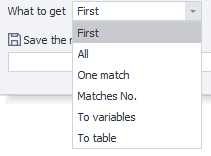
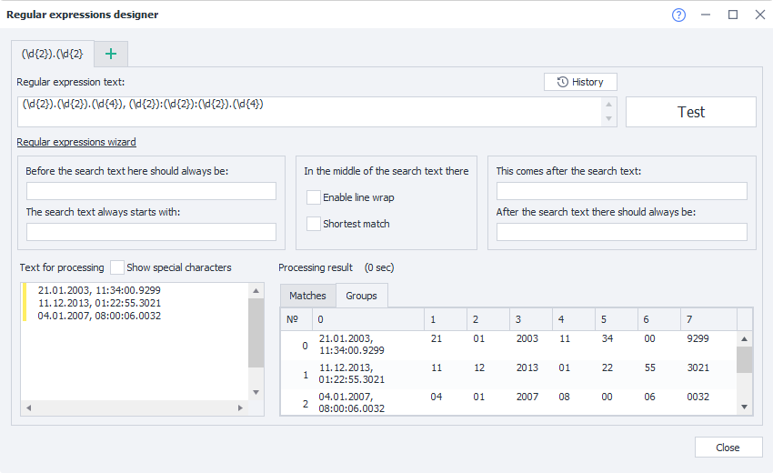
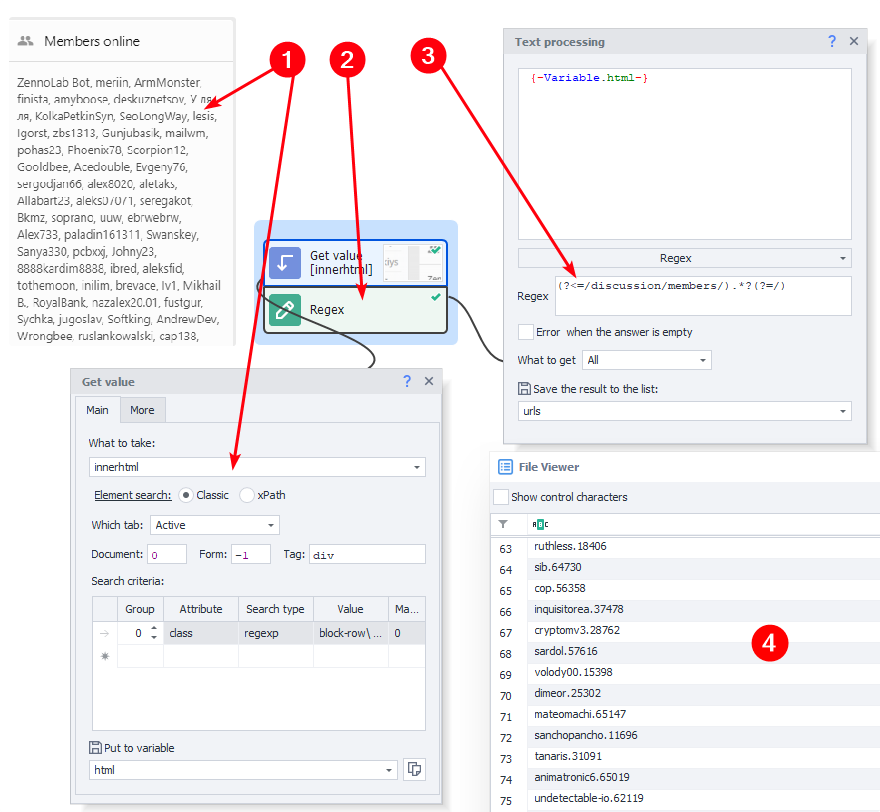
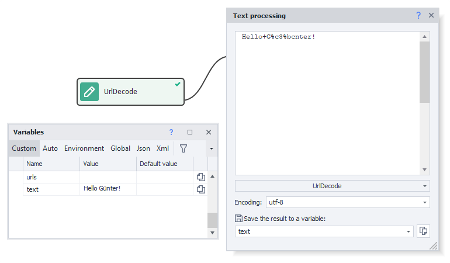
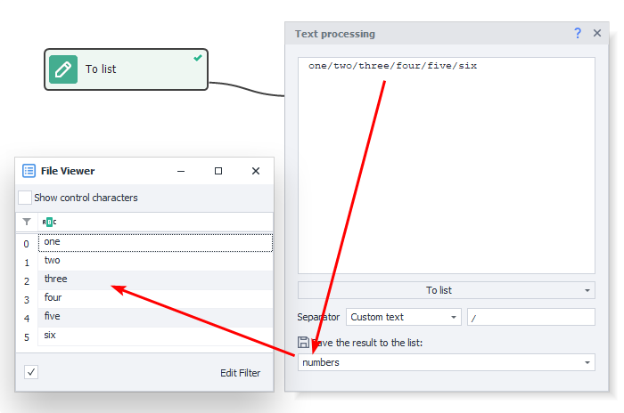
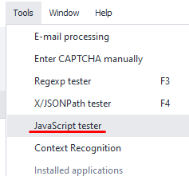

:::info **Please read the [*Material Usage Rules on this site*](../Disclaimer).**
:::
_______________________________________________  
## Description  
This action block is for various text manipulations. For example: processing scraped text, cleaning up garbage, or even translating it to another language – all this and much more is what this "cube" can do.

### How to add to your project?
Right-click and select **Add Action → Data → Text Processing**:


### What the action block looks like


The window is split into three sections:  
**1.** Input string. Here you can put text, a variable, or a combination of them.  
**2.** Actions to perform on the string, with settings.  
**3.** Output string where your result is saved to a variable.

If you put the cursor in the input field and press **Ctrl+Space**, you'll see a dropdown with useful constants and project variables.


_______________________________________________  
## String Escape (Escaping Characters)
This action escapes spaces and these characters: `*` `+` `?` `|` `{` `[` `(` `)` `^` `.` `#`. In other words, it adds a slash `\` before each of those symbols.

This is often used for query processing. It also helps the ***regular expression*** handler see characters as literals, not as commands or metacharacters.
_______________________________________________
## Regex (Text Processing with Regular Expressions)


Regular expressions are super handy for parsing strings according to a specific pattern. This action can get not just the first matching value, but the whole group, and save the values to variables or a table.

### Regex Input Field
This is where you enter your regular expression to search the text. Example: `(?<=<title>).*(?=</title>)`.

:::tip You can use the [*Regular Expression Designer*](../Tools/RegEx_Tester) to help write regexes.

:::

### Error when the answer is empty
If this option is enabled, the action will return an error if the regular expression **doesn't find anything** in the text.

**Note**: if the regex returns an **empty string**, even if this setting is on the action will **still complete successfully**. For example, if there's nothing inside a *title* tag: `<title></title>`, the regex `(?<=<title>).*(?=</title>)` matches, but just returns an empty string, and the action is considered a success. But if there's no *title* at all, you'll get an error.

### What to get


#### First
Saves the first matched value to a variable.

#### All
Saves all matches to a list.

#### One Match
Saves only one match by its index (**zero-based numbering**).

You can also select **Last** or **Random** value.


#### Match Numbers
Saves to a list only the matches whose indexes you specify as comma-separated (**zero-based numbering**).

#### To Variables
This feature is for working with group regular expressions.

<details>
<summary><b>Here's a detailed example to make it clearer.</b></summary>

Let's say you have this text:
```
21.01.2003, 11:34:00.9299
11.12.2013, 01:22:55.3021
04.01.2007, 08:00:06.0032
```
And you want to break it down. You could use this regex:
`(\d{2}).(\d{2}).(\d{4}), (\d{2}):(\d{2}):(\d{2}).(\d{4})`

Here's what the result looks like in the ***Regex Tester***:



Now let's take the day, month, and year from the second line and save them to variables. Here's how:


**Match number** is the line number. Since numbering starts at zero, write `1` for the second line.

Then specify the group number and variable to save each result to. Group **0** is the entire matched line: `11.12.2013, 01:22:55.3021`. So for the individual bits, use groups: `1` for day, `2` for month, `3` for year.
</details>

#### To Table
Pretty similar to the previous feature, except here you save all results to a table, not just one. And you can exclude some groups from the final result.

<details>
<summary><b>Example here as well.</b></summary>

Let's use the same text:
```
21.01.2003, 11:34:00.9299
11.12.2013, 01:22:55.3021
04.01.2007, 08:00:06.0032
```
And the same regex:
`(\d{2}).(\d{2}).(\d{4}), (\d{2}):(\d{2}):(\d{2}).(\d{4})`

Here's the result in the [**Regex Tester**](../Tools/RegEx_Tester):


For the final table, let's say you don't need seconds and milliseconds:


Group **0** is the whole matched line, so skip it. Also ignore groups **6** and **7** (seconds and milliseconds).
</details>

### Example of Using Regex
Here's how you could extract links using regular expressions that you build in the [** constructor**](../Tools/RegEx_Tester#regular-expression-builder).

**Goal:** Get profile links for active users on the [**ZennoLab forum**](https://zenno.club/discussion/)



**1.** Using the [**Get Value**](../Android/ProLite/GetValue) action, get the HTML code that contains links to online users.  
**2.** Add the **Regex** action. Build your pattern in the [**Regex Constructor**](../Tools/RegEx_Tester#regular-expression-builder).  
**3.** In the action properties, put the *html* variable as input, and save results to the *urls* list.  
**4.** After running, you'll get a list of unique IDs which you can use to build user profile URLs.
_______________________________________________
## Spintax (Randomizing and Varying Text)
With this tool, you can automatically create synonymized texts. It uses curly braces and vertical slashes to mix things up in random order.

A simple spintax looks like: `{option1|option2|option3}`. When run, one of the three options is randomly picked. Spintax can get much fancier with multi-level nesting — so you can easily generate thousands of variations from one template.


### Extended Syntax
- `{Red|White|Blue}` — the result will be one value, like **White**.
- `[ Red| White| Blue]` — the values will be shuffled: **White Blue Red**.
- `[+_+Red|White|Blue]` — the values will be shuffled but with a separator between them: **White_Red_Blue**.

You can nest as much as you like: `[+{_|-}+Red|White|Blue {1|2}]` = **White-Blue 2-Red**
Special symbols can be escaped for clarity: `[+\++Red|\[White\]|Blue]` = **[White]+Red+Blue**
_______________________________________________
## Split (Splitting Text)
Splitting is done using a specific symbol (delimiter). Afterward, you'll get an array out of your string. This is a simpler alternative to using RegExp for splitting by characters.

### Separators
Here you enter which symbols to split the data by.


### Allow Empty Values
Easier to show with an example:


Say you've got a line like: `name;surname;sex;birth year`. If you skip one value, like no gender: `Andrey;Pavlov;;1988`, then `1988` goes into the **sex** variable, not **year**, which might not be what you want.

To fix this, enable *Allow empty values*. Then you can have empty strings written to variables where needed.

### Example of Split
Let's break down proxy lines into parts.

Bought proxies usually look like this: `login:pass@host:port`. So you're splitting by both `:` and `@`. Your action block settings might look like this:


_______________________________________________
## ToChar (Converting Integers to Unicode)
Every Unicode symbol has its own numeric code. So you can convert any number to its assigned symbol. For example, the code for ♛ is `9819`.


_______________________________________________
## ToLower (To Lowercase)
This action makes letters lowercase depending on the setting you choose.


### All
Changes every uppercase letter in the text to lowercase.

| **Was**                    | **Now**                           |
|----------------------------|-----------------------------------|
| CHANGES REGISTER OF LETTERS TO LOWER  | changes register of letters to lower   |

### Beginning of words
Only the first character of every word is made lowercase.

| **Was**                    | **Now**                           |
|----------------------------|-----------------------------------|
| CHANGES REGISTER OF LETTERS TO LOWER  | cHANGES rEGISTER oF lETTERS tO lOWER    |

### The first character
Only the first character of the first word is made lowercase.

| **Was**                    | **Now**                           |
|----------------------------|-----------------------------------|
| CHANGES REGISTER OF LETTERS TO LOWER  | cHANGES REGISTER OF LETTERS TO LOWER    |
_______________________________________________
## ToUpper (To Uppercase)
This action makes every letter uppercase as per the setting.


### All
Changes all lowercase letters to uppercase.

| **Was**                  | **Now**                          |
|--------------------------|----------------------------------|
| lowercase text  | LOWERCASE TEXT  |

### Beginning of words
Only the first letter of each word is capitalized.

| **Was**                  | **Now**                          |
|--------------------------|----------------------------------|
| lowercase text  | Lowercase Text          |

### The first character
Only the first character of the first word is capitalized.

| **Was**                  | **Now**                          |
|--------------------------|----------------------------------|
| lowercase text  | Lowercase text          |
_______________________________________________
## Trim (Remove Characters at Start/End of String)
Use this function to remove unwanted characters at the start and/or end of a given string.

It often saves the day when you need to clear away extra spaces, line breaks or tabs left after parsing.

### What to trim
Pick which characters to delete — choose a preset for all whitespace, or specify your own.

### Where to trim
Decide where to delete characters:
- *Start of string*
- *End*
- *Start and End*
_______________________________________________
## UrlDecode (Decoding)
Decodes a string previously encoded with UrlEncode (described below).



The effect is easiest to see with Cyrillic:
**Before:** `%D0%9F%D1%80%D0%B8%D0%B2%D0%B5%D1%82%2C%20%D0%BC%D0%B8%D1%80%21`
**After:** `Привет, мир!`
_______________________________________________
## UrlEncode (Encoding)
A URL only allows Latin letters, numbers, and a handful of punctuation marks. All other symbols in HTTP requests must be encoded with **UrlEncode** or the server won't understand your request.

### Encode Only Variable Values
This option is useful when building [**HTTP requests**](../Project%20Editor/HTTP%20and%20FTP/HTTP) because you only need to encode parameters, not the site address.

Settings might look like this:


In `{-Variable.keyword-}` you have the text `что такое urlencode`, and after encoding, `{-Variable.url-}` will hold:
`https://www.google.com/search?q=%d1%87%d1%82%d0%be+%d1%82%d0%b0%d0%ba%d0%be%d0%b5+urlencode`
_______________________________________________
## To Variable
This action just saves everything you put in the input window — variables, text, symbols, project constants — into a *single* variable.


_______________________________________________
## To List
This action splits your text into lines using the chosen delimiter, then puts them in a list.



### Separator
- **Enter**. New line.
- **Space**
- **Custom text**. You can specify a single character (like `;`) or several (they'll be treated as one delimiter!).
- **Custom Regex**. Use a regex as your splitter.
_______________________________________________
## To Table
This action splits your text into lines and columns using the delimiters you specify, then fills out a table.

### Separator
- **Enter**. New line.
- **Space**
- **Custom text**. Specify as for lists (several symbols treated as one!).
- **Custom Regex**. Use your own regexp.
_______________________________________________
## Replace
This action replaces one string with another and saves the result to a variable.


### What to Search
Specify the string or a regex if you select that mode.

### What to Replace With
What text should replace what you found in the previous step.

### Search Type
- *Text*. Looks for the exact text you type.
- *Regex*. Here, you give a pattern and it'll replace matches.

### What to Replace
#### First
Only replaces the first found match.

#### All
Replaces all matches at once.

#### One Match
In this case, only the specified match (or *last* match) is replaced.

#### Match Numbers
Enter which matches to replace as a comma-separated list (*zero-based numbering*).
_______________________________________________
## Translation
This action translates strings from one language to another.


### Translation Service
Several options are available, which helps make text high-quality and unique.
- [**Baidu**](https://www.npmjs.com/package/baidu-translate-api)
- [**DeepL**](https://www.deepl.com/ru/docs-api/)
- [**Google**](https://cloud.google.com/translate)
- [**Google via web interface**](https://translate.google.com/)
- [**Microsoft**](https://www.microsoft.com/en-us/translator/business/translator-api/)
- [**Yandex**](https://tech.yandex.com/translate/)

<details>
<summary><b>API keys for these services must be added via *Program Settings*</b></summary>


</details>

### Source Language / Target Language
Here you specify which language to translate *from* and *to*.

:::tip You can set the language to "*auto*".
The system will *try* to detect the source language automatically, but **can't guarantee the result**.
:::

You should enter the *language code*, not its full name. Examples:
- *English: **en***
- *Spanish: **es***
- *German: **de***
- *Russian: **ru***
- *And so on. [**Full list**](http://www.loc.gov/standards/iso639-2/php/code_list.php).*

:::warning **Every service has its own language codes.**
For the most accurate list, always check your chosen service's docs.
:::
_______________________________________________
## Prepare JavaScript 
This action processes a string for safe use in JavaScript. It mainly escapes quotes, apostrophes, and other special symbols so your text can be used in ***JavaScript*** and ***IF*** actions.

**Before:** `<a href="https://zennolab.com/">`
**After:** `<a href=\"https://zennolab.com/\">`

:::tip You can test your code with the ***JavaScript tester***

:::
_______________________________________________
## Substring
Takes a specific section out of a string. Give it the **From** and **To** character numbers.


In this example, we're taking a substring **from character 95** to **end of string**, getting *"до другого."*.
_______________________________________________
## Transliteration
On rare occasions, you might still need to *convert* Cyrillic into Latin characters. This action does that.


_______________________________________________  
## Useful Links
- [**JavaScript Tester**](../Tools/Java_Tester)
- [**How to connect translation services**](../Settings/Translators)
- [**Get Value**](../Android/ProLite/GetValue)