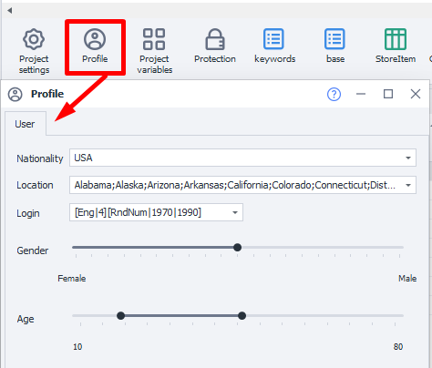
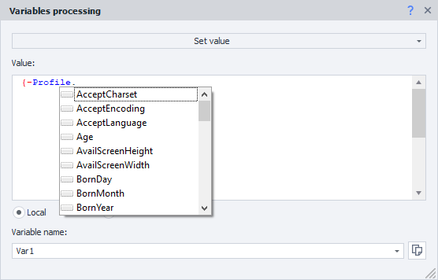

:::info **Please read the [*Material Usage Rules on this site*](../Disclaimer).**
:::

export const VideoSample = ({source}) => (
  <video controls playsInline muted preload="auto" className='docsVideo'>
    <source src={source} type="video/mp4" />
  </video>
);

_______________________________________________
## Description
To work on the internet, ZennoDroid uses a special entity called a **Project Profile**. You can save and load it in a template, and then use different identities for working with various resources. The profile stores a lot of commonly used parameters. For example:  
- **Virtual identity**:  
    - *First and last name*  
    - *Date of birth*  
    - *Location (country, region, city, postal code)*  
    - *Email and nickname*  
    - *Other parameters*  
- **Virtual phone**:  
    - *IMEI*  
    - *CPU count and RAM size*  
    - *Phone number and operator info*  
    - *Manufacturer and model*  
    - *Screen size*  
    - *Wi-Fi and Bluetooth MAC*  

:::info **A new profile is generated every time you launch/run a new project.**  
<VideoSample source={require("@site/static/video/profile_regen.mp4").default}/>
:::

### Default settings
Some parameters can be set as defaults for each new profile generation. You do this via the **Static Blocks Panel → Profile**.



### Current Profile
To see the current profile's characteristics, click the **Current Profile** button on the top panel.


_______________________________________________
## How do you add this to a project?
Using the context menu: **Add Action → Data → Profile Operations**.


_______________________________________________
## Save Profile


You can use this action if, for any reason, you want to save all current profile data for use in other projects. For example, after registering on some resource. All the identity and phone parameters are saved in a profile file (`*.zpprofile`).

:::warning **Saving variables**
If you save the profile with this option, the values of the selected variables will be overwritten the next time you load it. For your template to work properly, we recommend saving only the values you actually need.
:::
_______________________________________________
## Load Profile


This action lets you load previously saved profiles to use in your current project.

### Create missing variables
If this setting is on, any missing variables present in the loaded profile will be auto-created in the project.

### Show error when loading an incompatible profile
This feature will be removed in future updates; for now, toggling it does nothing.
_______________________________________________
## Reassign Fields
With this action, you can manually edit profile settings. For some of them, you set new values from scratch; for others, new values are generated.


### What can you do?
- **Set custom phone parameters**  
- **Specify your desired names, surnames, birthdates, and other personal info**  
- **Come up with custom logins, passwords, email addresses**  
- **Or modify profile data any other way you want to suit your needs**
_______________________________________________
## Using profile data
You can use profile data in other actions as you go. For instance, in the ***Process Variables*** action. You'll use ***environment variable*** macros for this, like `{-Profile.Name}`.



:::tip **Quick select**
Just type a fragment of a variable and ProjectMaker will suggest possible options in a dropdown.
:::
_______________________________________________
## Practical example
Say we’re using a service where subscribers matter. After finishing up, we want to save the latest date and time into a variable called `LastActivity`. For this, we use the [**Process Variables**](./WorkWithVariables) action and enter the macro `{-TimeNow.Date-}` in its field.

:::info For more about available macros, see the article on the [*Variables Window*](../pm/Interface/Variables).
:::

Moving on. We put the subscriber count received during template work into the `OldSubcribers` variable.

And we save the phone number tied to the account in `PhoneNum`.


Now, when saving the profile, you specify just the variables you want to keep:


Let’s say you don’t need variables like `token` or `UserNameLastSub` for any particular reason. You just don’t save those.

Later, you can **Load your profile** and immediately get the needed variables. You can use them for your own activity logs. Add a [**Notification**](../Project%20Editor/Logic/Notification) action and put this text in it:
```
Profile loaded.
Profile name: {-Profile.Name-};
Last profile activity: {-Variable.LastActivity-};
Number of subscribers after previous check: {-Variable.OldSubcribers-};
Phone number: {-Variable.PhoneNum-}.
```
As a result, your log will show something like this:


When saving and loading profiles, you can also use your own variables and environment variables, as well as mix them.

For example, if you put this line in *File path*:
`{-Project.Directory-}ProfilesZenno\{-Profile.Login-}.zpprofile`
the profile will be saved as `rosenhydo1987.zpprofile`.


_______________________________________________
## Useful links
- [**Profile Fill Settings**](../Settings/Profile_Setting)
- [**Profile Window**](../pm/Interface/Work_with_Profile)
- [**Profile**](../Project%20Editor/Static%20Block%20Panel/Profile)