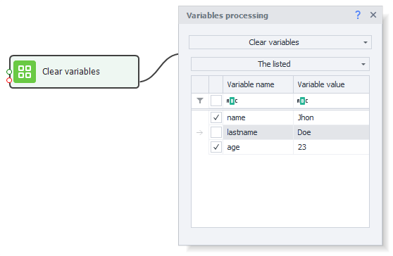
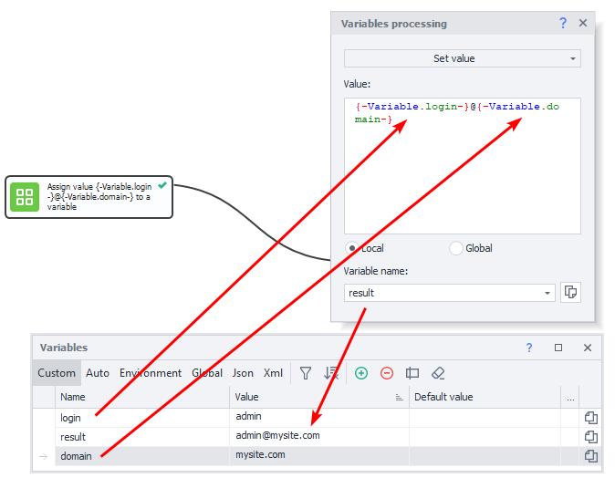

:::info **Please read the [*Material Usage Rules on this site*](../Disclaimer).**
:::
_______________________________________________  
## Overview  
A **variable** is a memory container that can hold a set or computed value. It's the foundation of any programming project.

In ZennoDroid, you can create and delete variables, rename them, and assign them different values. The most convenient way to manage them is through the [**Variables Window**](../pm/Interface/Variables).

We recommend keeping C# variables, which are strongly typed, separate from project variables, which aren't strictly typed. But you can always convert values between these two types without any loss or distortion of data.

**You can use the action to:**
- *set and change the values of variables;*
- *increase or decrease the value of a counter.*
_______________________________________________ 
## How to Add to Your Project  
Right-click to open the context menu: **Add Action → Data → Work with Variables.**

_______________________________________________  
## How to Use the Action  
### Set a Value  

You can assign static strings, numbers, values from other variables, or all of these at once.
_______________________________________________
### Increase/Decrease Counter  

The counter mode works for both increasing and decreasing the value. You can adjust it not just by one, but by any number you enter in the **Value** field.

In **Variable Name** enter the variable you want to change.
_______________________________________________
### Clear Variables  
With this action, you can clear the contents of variables.

There are three clearing modes:
- **All**
- **Listed**
- **All except listed**

For example, clearing contents can be useful before starting a new iteration, especially if your template is running in a loop and you want to make sure previous values don't carry over.
_______________________________________________
### Namespace  
**Local** variables are only visible **within the same thread**. So if your project runs in multi-threaded mode, each thread will have its own independent variable.

**Global** variables, on the other hand, **are available to all projects and their threads**.

The **namespace** was introduced as an extra property to prevent confusion. You need to specify this when creating global variables and when accessing them.
_______________________________________________
## Examples  
Let's look at two practical examples of using variables in projects.
_______________________________________________
### Setting a Value
You can assign or change the values of variables. You can do this in the [**Variables Window**](../pm/Interface/Variables), or using this **Work with Variables** action.

In this example, an email address is created using two string variables: *login* and *site domain*.
_______________________________________________
### Working with the Counter  
Let's say you need to make a list of ten current timestamps.

**1.** Create a variable called `count` to act as a counter. Set its value to `0`.
**2.** Next, get the current timestamp using the ***environment variable*** called `{-TimeNow.TimeNow-}`. Add it to the `time` variable and save the result back to it.
**3.** Now, you need to repeat the previous step **9 more times**. To do this, use the ***IF*** action to compare the value of your `count` counter with the max value `9`.
**4.** If the condition is not met (the counter is less than or equal to `9`), increase `count` by `1` (the **Increase Counter** action) and repeat *step 2*.
**5.** When the condition is met (counter is greater than `9`), finish processing and print the value of the `time` variable to the log. You can see the project's result in the [**Variables Window**](../pm/Interface/Variables).
_______________________________________________  
## Useful Links  
- [**IF Operator**](../Project%20Editor/Logic/IF)
- [**Notification**](../Project%20Editor/Logic/Notification)