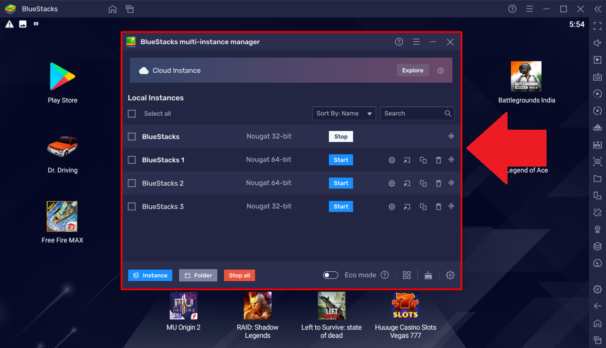
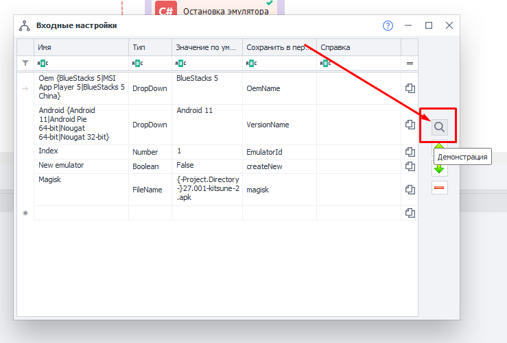

:::info **Please read the [*Material Usage Rules on this site*](../Disclaimer).**
:::

________________________________________________
## What is BlueStacks?
It's an Android emulator that creates a virtual environment similar to an Android smartphone or tablet. You can use it on Windows and macOS.

Available **only in the Enterprise version**.  
There's no official support, so it might work unstably.

### How is it different from Memu?
The main difference is performance. [BlueStacks](https://www.bluestacks.com/features.html) needs more system resources since it uses virtualization technology. At the same time, it's more stable and optimized for demanding tasks. To use it comfortably, you'll need a powerful computer.

It also has a more user-friendly interface and gets updated often to support the latest apps.

________________________________________________
## Connecting to ZennoDroid
1. Download the emulator from the official site: [BlueStacks](https://www.bluestacks.com/features.html)
2. After installation, open the shortcut named *BlueStacks Multi-Instance*.

3. You can add new virtual machines by clicking: Window → New.

Tip: **Don't use the first added VM for work.**  
It can cause errors that can only be fixed by fully reinstalling BlueStacks. That's just how the emulator works.  
So, it's best to create one or more additional VMs and use those instead.

4. Download [this archive](./assets/BlueStacks_5_Root_ver.2.zip) and extract it.
5. Open Project Maker for ZDE and load the project from the archive called *Bluestacks5RootMagisk_v2*.
6. Go to the project's input settings:

7. Click the **Demonstration** button:

8. In the **Index** field, enter the index of the virtual machine you plan to use. This is the number that the emulator automatically adds to the name when creating a VM, starting from **0**.
9. Save your settings and start the project to run it.
10. Wait until the project finishes successfully. After that, the emulator will be visible in the program and ready for you to use.

If the project fails at any step, try running it again.  
If, after several tries, the template still doesn't work, contact our [Support](https://helpdesk.zennolab.com/ru/conversation/new).

________________________________________________
## Working with the emulator
The included project features custom C# code blocks you can use in your work.  
They have clear names so you know exactly what each one does:

#### Start Emulator
This block starts an emulator you've already created.

#### Connect to Emulator
Connects to a running emulator.

#### Stop Emulator
Stops a running emulator.

#### Create Emulator
Creates an emulator using default settings.

#### Create Emulator with Settings
Creates an emulator with your chosen settings. In the block's settings (marked green), you'll see which values you can adjust: rendering mode, device profile, name, available RAM and CPU, graphics engine, and system bitness.

#### Delete Emulator
Removes the emulator you specify in the code. You write the value as `DeleteByName("Rvc64_2")`, where `2` is the index of the emulator you want to delete.

#### Start Manager
Opens the BlueStacks window manager.

#### Unlock System Disk
Lets you write files to the emulator's system disk. By default, it's set to **Read Only**, so you can't write anything there.

#### Restore System Disk
Returns the emulator's system disk to its original state.

#### System Patch for Magisk Installation
Preps the system so you can later install Magisk on the device.

#### Install Magisk
Installs the Magisk manager app, which lets you control root access.

#### Write Magisk to System Partition
Runs a script to install Magisk into the system partition (binaries, scripts, and all necessary files).

#### Enable Zygisk
Turns on a Magisk utility module that allows you to install and run LSPosed.

LSPosed lets you:
- Hide root access from other apps
- Spoof device parameters
- Bypass app restrictions
- And much more

________________________________________________
## Useful links
- [Root Setup](./Root)
- [LSPosed Setup](./LSPosed)
- [C# Code](../Project%20Editor/CustomCode/С)