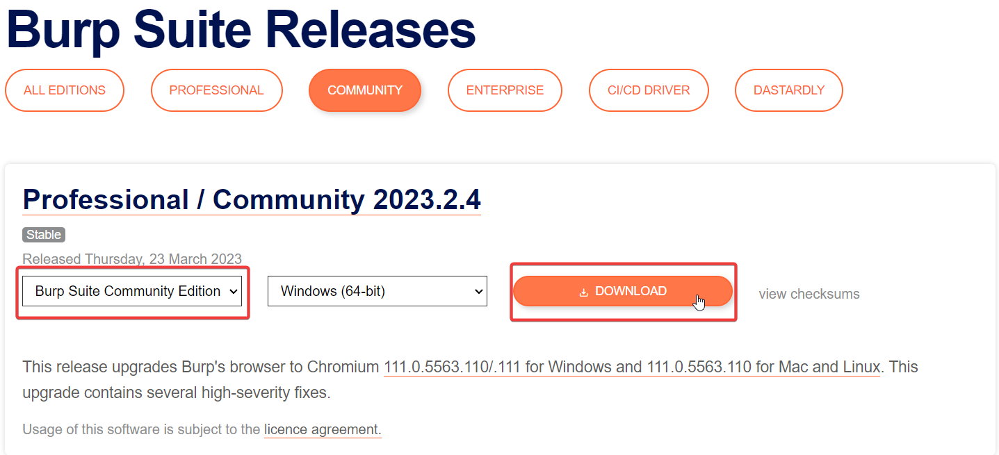
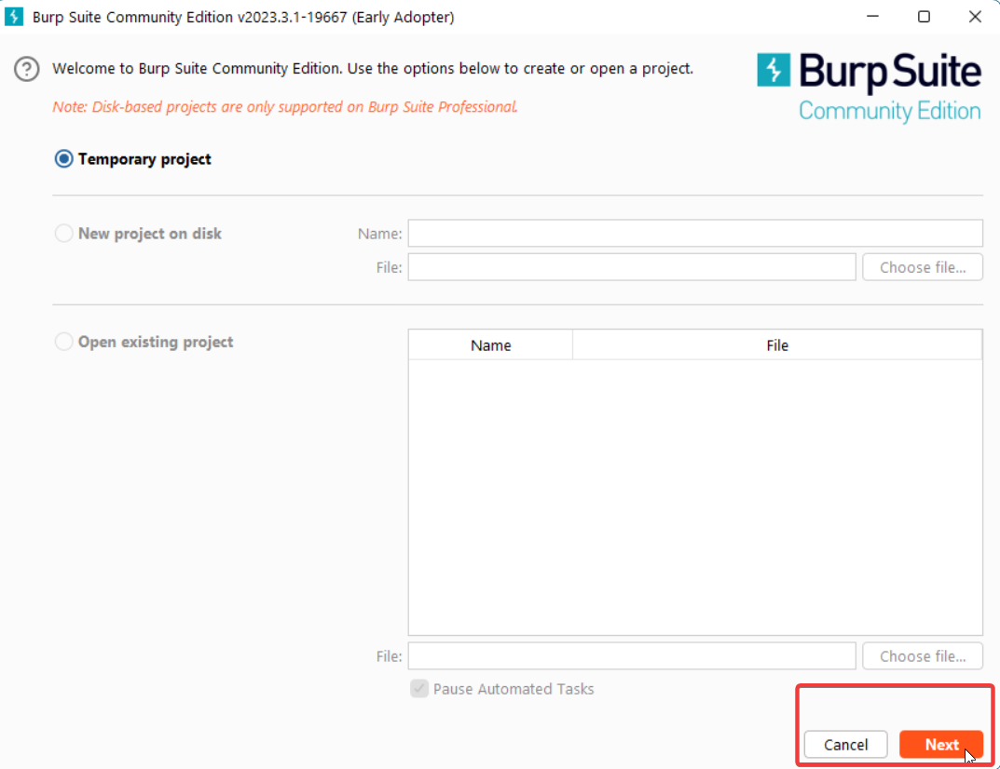
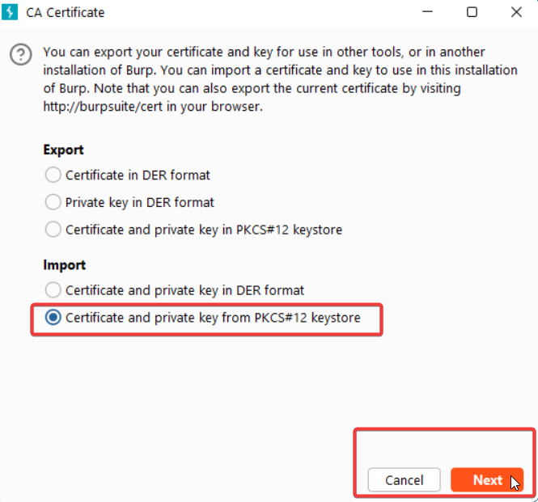

import DisclaimerNotice from '@site/src/components/DisclaimerNotice';

# Intercepting traffic with Burp Suite
<DisclaimerNotice />

export const VideoSample = ({source}) => (
  <video controls playsInline muted preload="auto" className='docsVideo'>
    <source src={source} type="video/mp4" />
</video>
);

For traffic analysis, you can use [**Burp Suite Community Edition**](https://portswigger.net/burp/communitydownload) from PortSwigger.

## Setting up Burp Suite
:::info **You can download all the required files here:**
[Frida\_Burp\_HttpToolkit.zip](https://www.dropbox.com/scl/fi/1vp7g23me9ekr34aacsfh/Frida_Burp_HttpToolkit.zip?rlkey=8ykdpi0jve6aplqpfpoh0rcoq&st=lac44ugj&dl=0) (password for `zenno.pfx`: `123`)
:::
_________________
### 1. Download and install

1. Select **Burp Suite Community Edition** and click **Download**.

2. Create a **Temporary** project.

3. Use **Burp defaults** for the project.

### 2. Configure Burp Suite to process traffic from your computer's local network

1. Open **Settings**.

2. Go to **Tools → Proxy** and click **Import / Export CA certificate**.

3. Select **Certificate and private key from PKCS#12 keystore**, then choose the **zenno.pfx** file (*password: **123***).

_________________

## Intercepting traffic using Frida
_________________
### Setting up Burp Suite and disabling certificate checks with Frida scripts
:::info **You can download all the required files here:**
[Frida\_Burp\_HttpToolkit.zip](https://www.dropbox.com/scl/fi/1vp7g23me9ekr34aacsfh/Frida_Burp_HttpToolkit.zip?rlkey=8ykdpi0jve6aplqpfpoh0rcoq&st=lac44ugj&dl=0) (password for `zenno.pfx`: `123`)
:::

<VideoSample source={require("./assets/BurpSuite/Frida_SSL_Pinning_Demo.mp4").default}/>
_________________
### Installing a custom certificate for traffic interception in Chrome
:::info **You can download all the required files here:**
[Frida\_Burp\_HttpToolkit.zip](https://www.dropbox.com/scl/fi/1vp7g23me9ekr34aacsfh/Frida_Burp_HttpToolkit.zip?rlkey=8ykdpi0jve6aplqpfpoh0rcoq&st=lac44ugj&dl=0) (password for `zenno.pfx`: `123`)
:::
> *The initial Burp Suite setup is shown in the previous video.*

<VideoSample source={require("./assets/BurpSuite/FridaChrome.mp4").default}/>
_________________
## Intercepting traffic without using Frida
### Setting up Burp Suite and disabling certificate checks with the ZennoDroid module
:::warning **This method is only supported in ZennoDroid Enterprise**
:::
:::info **You can download all the required files here:**
[TrafficCapture.zip](https://www.dropbox.com/scl/fi/gs7la6k2cs1xpkt7jo6sf/TrafficCapture.zip?rlkey=jwu7u81gy040v1hk6vz0g0gc9&st=be8hpjyq&dl=0) (password for `zenno.pfx`: `123`)
:::

<VideoSample source={require("./assets/BurpSuite/TrafficCapture.mp4").default}/>
_________________
### Setting up Burp Suite and patching an app to intercept Flutter requests
:::info **You can download all the required files here:**
[Flutter_Patch_Restore.zip](https://www.dropbox.com/scl/fi/1yx6s8yg2x1nuk0c7a4l6/FlutterPatchRestore.zip?rlkey=9ui6an51gcqppta9uq7o7op5t&st=065bqtiv&dl=0)
:::

<VideoSample source={require("./assets/BurpSuite/Flutter_Patch_Restore.mp4").default}/>

_________________
## Useful links
- [**Installing and setting up Frida**](../Tools/Frida).
- [**Frida\_Burp\_HttpToolkit.zip**](https://www.dropbox.com/scl/fi/1vp7g23me9ekr34aacsfh/Frida_Burp_HttpToolkit.zip?rlkey=8ykdpi0jve6aplqpfpoh0rcoq&st=lac44ugj&dl=0) (password for `zenno.pfx`: `123`).
- [**TrafficCapture.zip**](https://www.dropbox.com/scl/fi/gs7la6k2cs1xpkt7jo6sf/TrafficCapture.zip?rlkey=jwu7u81gy040v1hk6vz0g0gc9&st=be8hpjyq&dl=0) (password for `zenno.pfx`: `123`).
- [**Flutter_Patch_Restore.zip**](https://www.dropbox.com/scl/fi/1yx6s8yg2x1nuk0c7a4l6/FlutterPatchRestore.zip?rlkey=9ui6an51gcqppta9uq7o7op5t&st=065bqtiv&dl=0)
- [**android-ssl-pinning-demo.apk**](https://github.com/httptoolkit/android-ssl-pinning-demo/releases/latest)
- [**Connecting a real device to ZennoDroid**](../Enterprise/Connection).
- [**Managing LSPosed**](../Enterprise/LSPosed_Control).
