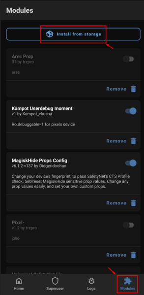
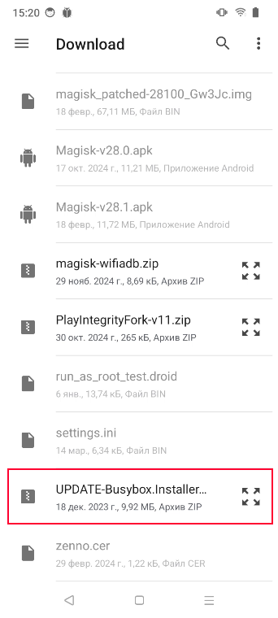
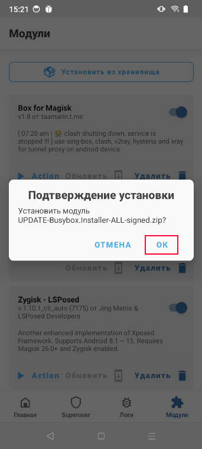
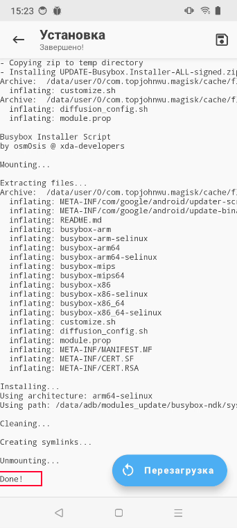
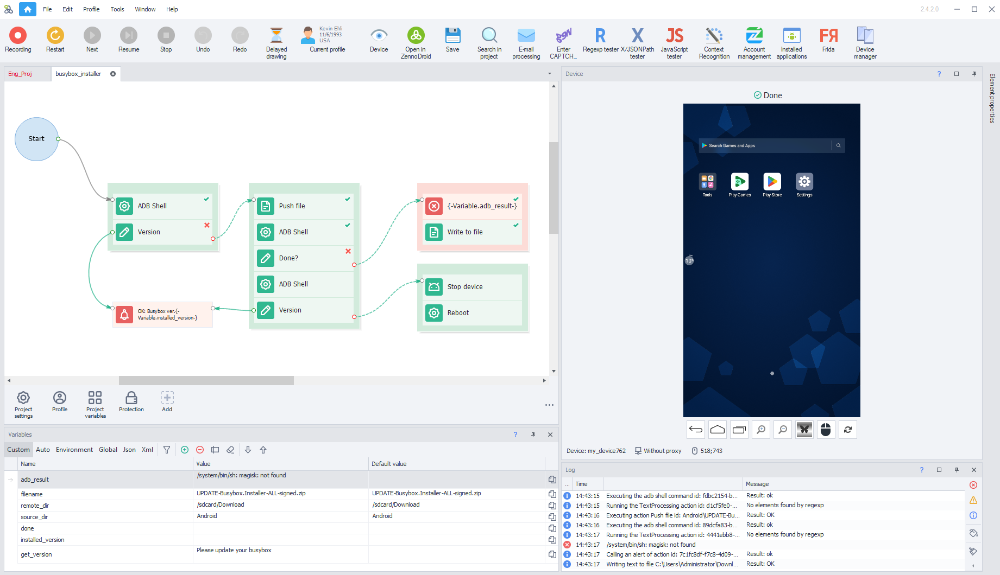

:::info **Please read the [*Material Usage Rules on this site*](../Disclaimer).**
:::
_______________________________________________
## Description.
BusyBox is a collection of UNIX command line utilities. It's used for:
- [Saving and restoring app data](../Android/Enterprise/App#save-app-data)
- [Setting up a proxy in Clash mode](../Android/Enterprise/setting#clash) *(BusyBox version 1.36.1 or newer required)*
_______________________________________________  
## Manual installation.
To install the module, you'll need a smartphone with [**Magisk**](https://github.com/topjohnwu/Magisk).

Download the [Busybox for Android NDK 1.36.1](https://www.dropbox.com/scl/fi/079hbifq0keal5gmu9d1i/UPDATE-Busybox.Installer.v1.36.1-ALL-signed.zip?rlkey=r76ihn7ez64lo0a2j6zq8zoph&st=h8da6r8y&dl=0) module to your phone's `sdcard/Download/` folder and install it using the standard menu.

### **1. Open Magisk → Modules → Install from storage.**

### **2. Find the installer among your downloaded files.**

### **3. Confirm the installation.**

### **4. If the installation is successful, you'll see `Done!` in the log.**

:::warning **After installation, you need to reboot your device.**
:::
_______________________________________________ 
## Automatic installation (ZennoDroid 2.4.2+).
We've prepared a [**template for installing Busybox 1.36.1**](https://www.dropbox.com/scl/fi/s4era4cezuoykkf8ieh3r/busybox_installer.droid?rlkey=1nbwrvj4ko93jaakf6h9hxbei&st=cqy8narq&dl=0) to make it easier for you to install BusyBox on a large number of devices. It checks your current version, and if it's lower than 1.36.1, it'll automatically install the current module for Magisk.

:::info **After installation, your phone will automatically reboot.**
:::

After that, just connect to the device again and run the template.

|     | 
| :--------: | 
| **The log message `OK: Busybox ver. 1.36.1` means BusyBox is installed and working correctly.**  |