import DisclaimerNotice from '@site/src/components/DisclaimerNotice';

# LSPosed Setup
<DisclaimerNotice />

export const VideoSample = ({source}) => (
  <video controls playsInline muted preload="auto" className='docsVideo'>
    <source src={source} type="video/mp4" />
</video>
);

## Description
The ZennoDroid module is needed to spoof key device parameters: IMEI, Android ID, mobile operator, model, WiFi, Bluetooth, and others.
:::info Important.
Supported phones: Android 8.1-14. **Root access** is required for the module to work.
:::
_________________
## Installing the LSPosed Framework

Starting with ZennoDroid 2.5.0.0, you'll need a phone with [**Magisk**](https://github.com/topjohnwu/Magisk) and a working [**LSPosed Framework v2**](https://www.dropbox.com/scl/fo/bve4et0ilt6bocnbi7ba9/AI0JuEpsjOHkKKlYMgx9aM0?rlkey=je4fi8u0np6267i0e5iblsyu3&st=rlrsg76a&dl=0) to install the module.
  

|   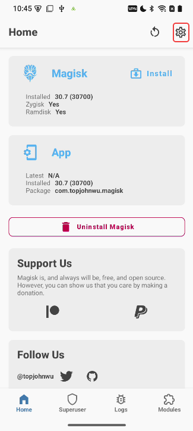   | 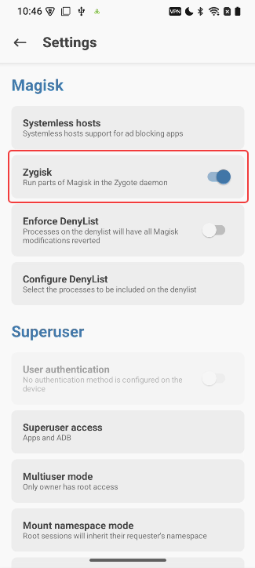 |
| :--------: | :-------: |
| *Magisk Setting*  | *Turn On Zygisk*    |
 

The current official version of LSPosed is distributed through the official [**Telegram channel**](https://t.me/LSPosed). You can also download the latest version of LSPosed via [**this link**](https://www.dropbox.com/scl/fo/bve4et0ilt6bocnbi7ba9/AI0JuEpsjOHkKKlYMgx9aM0?rlkey=je4fi8u0np6267i0e5iblsyu3&st=rlrsg76a&dl=0)

Download this build to your phone in the *sdcard/Download/* folder and install it using the standard menu.
  

 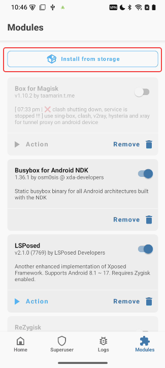 

:::warning **By default, LSPosed Framework has no icon and opens through a notification.**
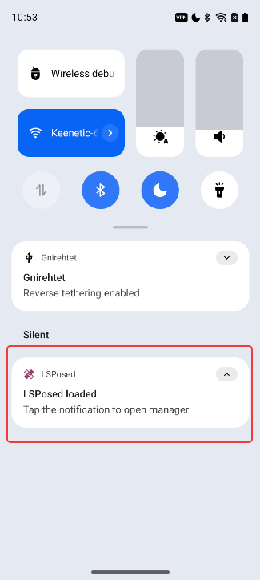
:::

_________________
## Installing the ZennoDroid Module
The ZennoDroid module is installed automatically when you first try to change device parameters or when you run any action from the [LSPosed Management](./LSPosed_Control) group.
On the first launch, your device will ask for superuser rights.
You'll need to tap the **"Allow"** button (when using Magisk, permission is granted automatically).

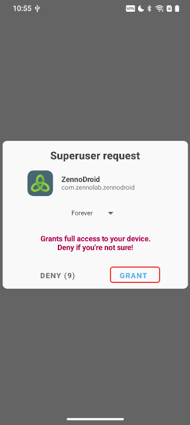
_________________
If you missed this or accidentally tapped **"Deny"**, just open **Magisk**, go to the **Superuser** tab, and turn on *automatic superuser rights for ZennoDroid*.

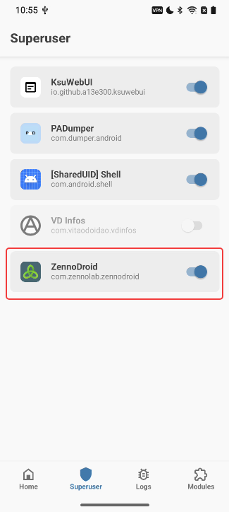
_________________
After you launch the module, a notification will appear on your device screen saying it's turned off.

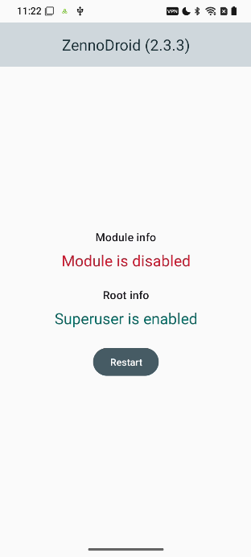
_________________
To fix this, open LSPosed from the notification panel, switch to the *Modules* tab, and turn on the *ZennoDroid module*.

 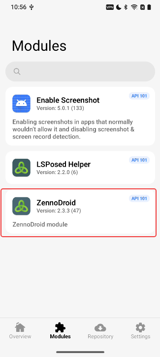 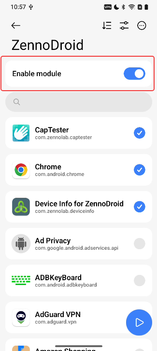

Now you can pick which apps will get spoofed device parameters.
_________________
#### Important Information
- You should only add the apps to the spoof list that actually need their data changed. There’s no need to add the system framework.
- If you delete an app after activating it, then reinstall it, you must re-activate it in the spoof list (uncheck and check the box).

:::tip LSPosed has a visual bug.
When you remove an app, it disappears from the spoof list. If you reinstall it, it won’t show up in the list automatically (the box might be checked, but spoofing won’t work).
:::

- Not all apps appear in the list by default. If you don’t see the app you need (like Google Chrome), go to the *Settings* menu and select the right group.

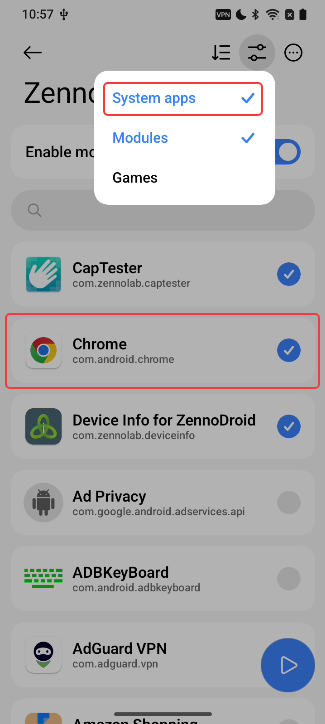

- After picking the apps for spoofing, go back to ZennoDroid and tap **“Restart”**. Once it restarts, a notification will show that the module is ready to use. Now you can change device parameters with actions.

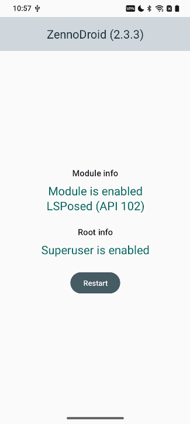
- After spoofing device parameters, close the necessary apps. It’s best to do this with the **“Close app”** action.  
:::tip You can close apps before spoofing.
But some system apps will restart themselves right after, so they might see the old parameters.
:::
_________________
## API for managing LSPosed
In **ZennoDroid 2.4.0**, we added an API for managing LSPosed.

Main functions:
- enable and disable the required module;   
- select apps in the replacement list of the required module, and also add or remove them from the list;     
- create and restore a settings backup (saving to both the phone and a computer is supported);    
- get information about LSPosed.

### Video tutorial   
> Setting up the ZennoDroid module and the [DisableFlagSecure](https://github.com/LSPosed/DisableFlagSecure/releases/latest) (`io.github.lsposed.disableflagsecure`) module, which allows viewing secured pages.  

<VideoSample source={require("@site/static/video/LSPosedAPI.mp4").default}/>  

Examples of working with the API are also included in the archive [LSPosedAPI.zip](https://www.dropbox.com/scl/fi/xsw5q8ej1wtmhpg5695we/LSPosedAPI.zip?rlkey=menqd2q7a0g6qnmc1l3omq4fr&st=0byf2hwb&dl=0&roistat_visit=1429674).  

_________________
## **Managing LSPosed using actions**
In version 2.4.6, a convenient way [**to manage LSPosed**](./LSPosed_Control) was added through a group of actions.
_________________
## Useful Links
- Template for spoofing device parameters via actions and API: [**fakeDeviceBrief.droid**](https://www.dropbox.com/scl/fi/xkyhg4e72l9su4xvqsdn9/fakeDeviceBrief.droid?rlkey=583ltzuficlyh0kxrma83qodb&dl=0)
- [**Latest version of LSPosed Framework v2**](https://www.dropbox.com/scl/fo/bve4et0ilt6bocnbi7ba9/AI0JuEpsjOHkKKlYMgx9aM0?rlkey=je4fi8u0np6267i0e5iblsyu3&st=rlrsg76a&dl=0)
- [**Connecting a real device to ZennoDroid**](./Connection)
- [**Device settings**](../Settings/Settings_for_Enterprise)