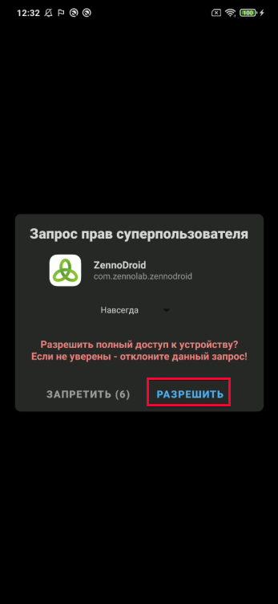
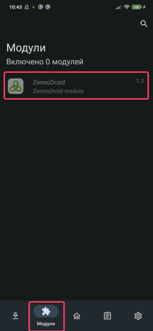
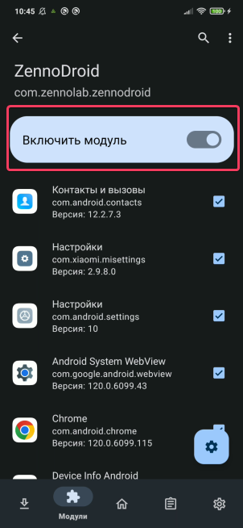

:::info Please read the [*Terms of Use for Materials on this Resource*](../Disclaimer).
:::
_______________________________________________
export const VideoSample = ({source}) => (
  <video controls playsInline muted preload="auto" className='docsVideo'>
    <source src={source} type="video/mp4" />
</video>
);

## Description
The ZennoDroid module is needed to spoof key device parameters: IMEI, Android ID, mobile operator, model, WiFi, Bluetooth, and others.
:::info Important.
Supported phones: Android 8.1-14. **Root access** is required for the module to work.
:::
_________________
## Installing the LSPosed Framework

You’ll need a phone with [**Magisk**](https://github.com/topjohnwu/Magisk) and a working [**LSPosed Framework**](https://github.com/LSPosed/LSPosed) to install the module.
  

  

:::tip Use the *zygisk* version. *riru* is no longer supported.
:::

Download the [**latest version of LSPosed**](https://github.com/LSPosed/LSPosed/releases/tag/v1.9.2) to your phone in the **sdcard/Download/** folder and install it using the standard menu.
  

 

:::warning **By default, LSPosed Framework has no icon and opens through a notification.**

:::

_________________
## Installing the ZennoDroid Module
The ZennoDroid module is installed automatically when you first try to change device parameters.
On the first launch, your device will ask for superuser rights.
You’ll need to tap the **“Allow”** button.

_________________
If you missed this or accidentally tapped **“Deny”**, just open **Magisk**, go to the **Superuser** tab, and turn on *automatic superuser rights for ZennoDroid*.

_________________
After you launch the module, a notification will appear on your device screen saying it’s turned off.

_________________
To fix this, open LSPosed from the notification panel, switch to the *Modules* tab, and turn on the *ZennoDroid module*.

  

Now you can pick which apps will get spoofed device parameters.
_________________
#### Important Information
- You should only add the apps to the spoof list that actually need their data changed. Often, for everything to work correctly, you also need to add *Google Play Services (com.google.android.gms)* to the spoof list. There’s no need to add the system framework.
- If you delete an app after activating it, then reinstall it, you must re-activate it in the spoof list (uncheck and check the box).

:::tip LSPosed has a visual bug.
When you remove an app, it disappears from the spoof list. If you reinstall it, it won’t show up in the list automatically (the box might be checked, but spoofing won’t work).
:::

- Not all apps appear in the list by default. If you don’t see the app you need (like Google Play Services or Chrome), go to the *Hide* menu and uncheck the right group.

- After picking the apps for spoofing, go back to ZennoDroid and tap **“Restart”**. Once it restarts, a notification will show that the module is ready to use. Now you can change device parameters with actions.

- After spoofing device parameters, close the necessary apps. It’s best to do this with the **“Close app”** action. If Google Play Services (com.google.android.gms) are included in the spoof list, they need to be closed too.
:::tip You can close apps before spoofing.
But some system apps will restart themselves right after, so they might see the old parameters.
:::
_________________
## Useful Links
- Template for spoofing device parameters via actions and API: [**fakeDeviceBrief.droid**](https://www.dropbox.com/scl/fi/xkyhg4e72l9su4xvqsdn9/fakeDeviceBrief.droid?rlkey=583ltzuficlyh0kxrma83qodb&dl=0)
- [**Latest version of LSPosed Framework**](https://github.com/LSPosed/LSPosed/releases/tag/v1.9.2)
- [**Connecting a real device to ZennoDroid**](./Connection)
- [**Device settings**](../Settings/Settings_for_Enterprise)