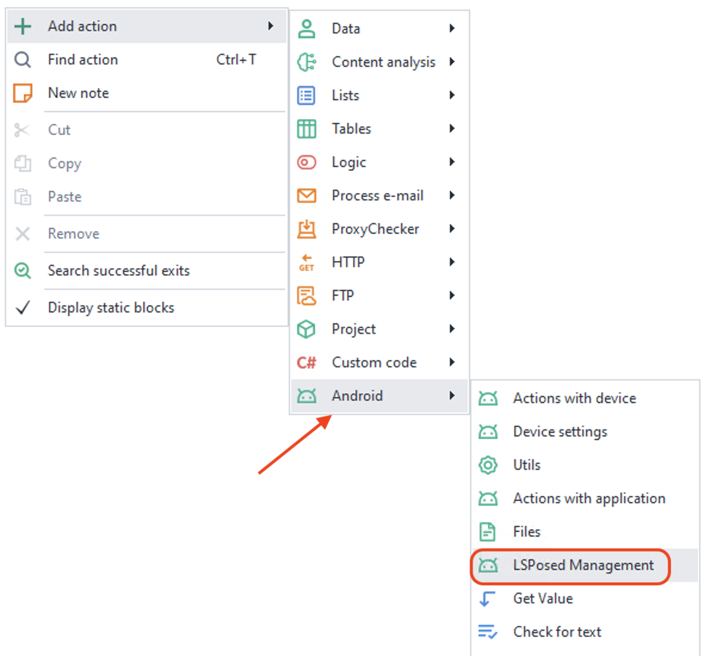
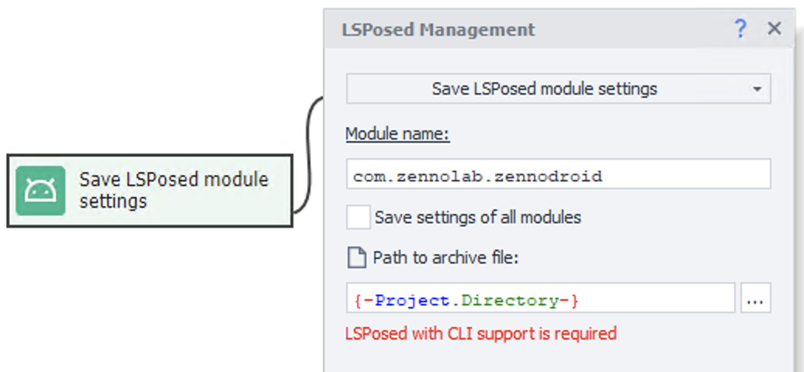
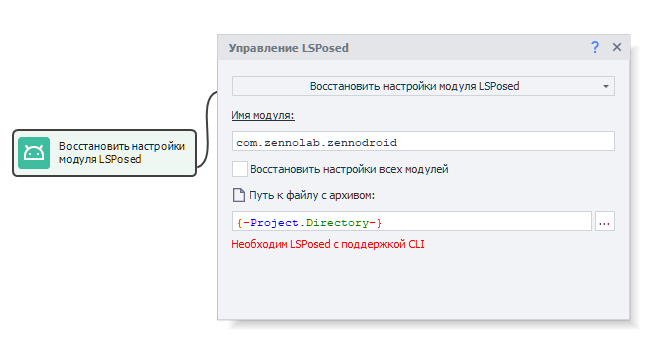
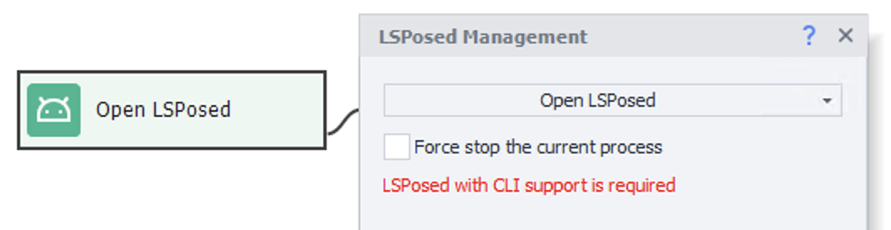

import DisclaimerNotice from '@site/src/components/DisclaimerNotice';

# LSPosed Management
<DisclaimerNotice />

## Description 
This action is used to manage various LSPosed modules that are used to spoof parameters on devices.  

> To work, you need to use our [**Special build v1.10.2**](https://github.com/AnatolyJacobs/LSPosed_CLI/releases/tag/v.1.10.2_cli_auto).  

### How to add it to a project? 
Via the context menu: **Add Action → Android → LSPosed Management**  

  
_________________ 
## How it works
### LSPosed info
With this action, you can obtain various service information about the installed LSPosed version, as well as check that it is working properly.  

  

The data is returned in JSON format and can be processed using the [JSON and XML Processing](../Data/JSON_XML) action.  

Response example:  
```json
{
  "API version": "100",
  "Injection Interface": "Zygisk",
  "Framework version": ".1.10.2_cli_auto(7201)",
  "System version": "15 (API 35)",
  "Device": "Realme RMX3834",
  "System ABI": "arm64-v8a"
}
```  

### LSPosed module settings
Here you can specify the list of applications for which parameter spoofing should be applied.  

 

By default, the standard ZennoModule (`com.zennolab.zennodroid`) is specified, but you can set any other one. For example, if a black screen is displayed instead of content, you can install the [FLAG_SECURE](https://github.com/VarunS2002/Xposed-Disable-FLAG_SECURE/releases/tag/2.0.0) module (`com.varuns2002.disable_flag_secure`), which allows you to view protected pages.  

#### Available parameters  
- **Module name**.  
Since an LSPosed module is an application, you need to specify its identifier here. You can find it using the [Installed Applications](../Tools/Installed_App) tool.  
- **Enable LSPosed module**.  
Determines the module status. When disabled, no spoofing is performed.  
- **Applications**.  
The list of applications for which spoofing is applied. At least one application must be specified. If there are several, separate them with commas or line breaks. Identifiers, again, can be obtained via [Installed Applications](../Tools/Installed_App).  

### Save LSPosed module settings  
This saves the module settings (or the settings of all modules) so that you can restore them later.   

 

#### Available parameters  
- **Module name**.  
Since an LSPosed module is an application, you need to specify its identifier here. You can find it using the [Installed Applications](../Tools/Installed_App) tool.  
- **Save settings of all modules**.  
The settings of all installed modules will be saved, not just a specific one.  
- **Path to archive file**.  
Here you specify the path where the application data will be saved in a `.gz` archive. You can specify a path on a computer or a smartphone (for example: `/sdcard/com.zennolab.zennodroid.gz`).  

### Restore LSPosed module settings  
This same action restores previous settings from the selected file.  

  

#### Available parameters  
- **Module name**.  
Since an LSPosed module is an application, you need to specify its identifier here. You can find it using the [Installed Applications](../Tools/Installed_App) tool.  
- **Restore the settings of all modules**.  
The settings of all installed modules will be restored, not just a specific one.  
- **Path to archive file**.  
Here you specify the path to the `.gz` archive from which the application data will be restored. You can specify a path on a computer or a smartphone (for example: `/sdcard/com.zennolab.zennodroid.gz`).  

### Open LSPosed
Opens LSPosed for manual configuration or visual verification of the installed parameters.  

 

#### Available parameter  
- **Force stop the current process**.  
We recommend enabling this option if a module was previously enabled or disabled. Otherwise, a visual bug may occur: the checkbox will not reflect the actual module status. 
_________________
## Useful links.  
- Template for spoofing device parameters using actions and API: [**fakeDeviceBrief.droid**](https://www.dropbox.com/scl/fi/xkyhg4e72l9su4xvqsdn9/fakeDeviceBrief.droid?rlkey=583ltzuficlyh0kxrma83qodb&dl=0)  
- [**Latest version of LSPosed Framework**](https://github.com/AnatolyJacobs/LSPosed_CLI/releases/tag/v.1.10.2_cli_auto)  
- [**Connecting a real device to ZennoDroid**](./Connection).  
- [**Device settings**](../Settings/Settings_for_Enterprise).