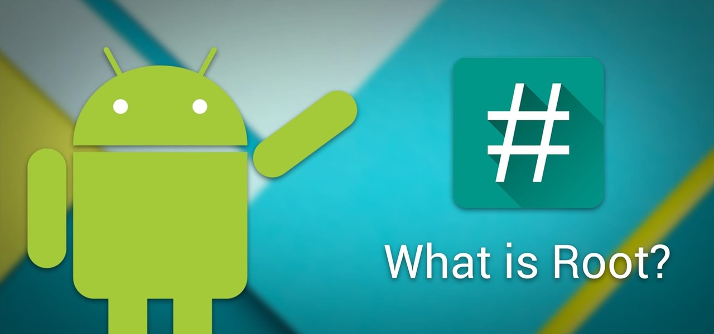

:::info **Please read the [*Material Usage Rules on this site*](../Disclaimer).**
:::
_______________________________________________
## What is Root Access and Why Do You Need It?

To put it simply, root access gives you superuser rights, letting apps use the `su` command to bypass Android's normal restrictions, access system files and folders, inject themselves into other processes' memory, and more.

Usually, the root setup has two parts — a **server** that does the behind-the-scenes work, and a **client** that lets you interact with the server, giving you flexible control over root permissions.

But as the saying goes, with great power comes great responsibility. If you use root carelessly, you can damage your system or even turn your phone into a "brick."

#### When Should You NOT Root Your Phone?
- If your phone is still under warranty.
- If you don't have a clear reason for needing root.
- If you use your phone for sensitive data like banking, government, or confidential info.
- If you can't make a full backup of your system partitions, or you wouldn't be able to recover your device if something goes wrong during rooting.
_________________
## ADB and How to Use It
ADB is a tool that lets you control your Android device from your computer. You can install and uninstall apps, transfer files, and view logs.

1. First, install the Android SDK tools on your computer from the [**official website**](https://developer.android.com/tools/releases/platform-tools).

2. Then, enable developer mode on your phone: **Settings → System → About phone → tap Build Number several times in a row**. Now you'll see a new "**Developer options**" section under "System". Find **USB Debugging** and turn it on.

3. Open the folder where you installed ADB (usually the ***platform-tools*** folder in your Android SDK directory). Hold ***Shift*** and right-click on an empty area, then choose "**Open PowerShell window here**". Plug your phone into your computer, and set the USB mode to "**File Transfer (MTP)**". In the command window, type `adb devices`.

A pop-up will show on your phone — tap ***Allow USB debugging***. Then run `adb devices` again. If everything's working, you'll see your device's serial number in the command window. Now you can run any ADB command on your device.
#### Useful Commands:
- `adb install <path to APK file>` — Installs an APK on your device.
- `adb uninstall <app package>` — Uninstalls an app from your device.
- `adb shell` — Opens a terminal (command line) on your Android device from your computer.
- `adb reboot` — Restarts your device.
- `adb pull <remote path> <local path>` — Copies files from your device to your computer.
- `adb push <local path> <remote path>` — Copies files from your computer to your device.
- `adb reboot recovery` — Boots your device into Recovery mode.
_________________
## Unlocking the Bootloader
What's a bootloader and why unlock it? The **bootloader** is a small chunk of code that loads the OS. It's essential, but it also enforces **Verified Boot** — this tech prevents installing unauthorized OS variants by checking file signatures. Our goal is to disable Verified Boot.

Unfortunately, there's no universal guide for all phones. On some devices, you can't unlock the bootloader at all; others ship unlocked by default. To check if yours is locked, use ***adb*** in **fastboot** mode: `fastboot oem device-info`. (We'll explain fastboot below.) If it says `true` for locked, then the bootloader is locked; if not, it's unlocked.

If yours is locked, search online for instructions specific to your phone. Check your phone manufacturer's website, the [**4PDA**](https://4pda.to/forum) forum, or use Google, DuckDuckGo, etc.
_________________
### Installing Custom Recovery
The **Recovery** partition is like the **BIOS** on a computer, also called "*Recovery Mode*". It's a subsystem that helps restore your device if things go wrong. You need to replace the stock recovery because it usually blocks you from installing anything.

#### What Recovery Options are There?
There are two main custom recovery projects — [***TWRP***](https://twrp.me/) and [***CWM***](https://www.clockworkmod.com/) — plus various forks of both. If your device isn't listed on their official sites, try searching your device's thread on **4PDA**.

:::tip **We recommend using TWRP-recovery.**
It's much more capable and user-friendly than CWM.
:::

_________________
Once you've downloaded your Recovery, you'll have a partition image file with a *.img* extension. To flash the new Recovery, you need to boot your phone into a special mode — ***fastboot***. On most devices, hold **Power + Volume Down** while turning on the phone. If you see a black screen with a white "***fastboot mode***" line, you've done it right. Connect your device to your computer via USB.

To flash the Recovery partition, you need only one ADB command:
`fastboot flash partition PathToFile`.
- `fastboot` — the path to fastboot.exe (included with ADB)
- `partition` — the Android partition you want to flash (here it's recovery)
- `PathToFile` — the path to your downloaded recovery .img file
For example: `C:\adb\fastboot flash recovery C:\recovery.img`
:::tip **By the way**
*Some recoveries come with an auto-installer and ADB — just run the .bat file.*
:::

After you see a "success" message in the console, you can try booting into the new Recovery, either by the ADB command `adb reboot recovery` or by pressing **Power + Volume Up** while turning on the phone.
_________________
## Getting Root Access
### Installing Magisk

First of all, make a full backup of your system partitions onto external storage (like an SD card). That way, if anything goes wrong, you can restore everything.

Then download [**Magisk**](https://github.com/topjohnwu/Magisk/releases). This is an open-source project that lets you modify your system "systemlessly", using modules. That means if you disable a Magisk module, any changes it made disappear. Magisk creates a *mirror* of the data partition (called ***data_mirror***), and changes are made by linking to that.

If your Recovery lets you flash **APK** files as **zip archives**, just copy the downloaded file onto your device's external storage. (Your internal storage is often encrypted, so you may not be able to access the file otherwise.) If your Recovery can't open APKs, rename Magisk.apk to **Magisk.zip** and copy it over.

Now boot into Recovery and make a separate backup of the ***boot.img*** partition. If some module breaks your system and you can't boot, you won't be able to disable the bad module or even Magisk itself. But as long as you have your original **boot** partition (without Magisk), you can restore just that and get your phone working again.

Once you have your backups, flash the Magisk installer zip just like any other archive through Recovery. After flashing and rebooting, you'll find the **Magisk** app in your menu. When you open it for the first time, it'll update itself and be ready to go.
_________________
### Setting Up Magisk

On your device, open Magisk settings and turn on both: **Zygisk** and **DenyList**.

<!--All you need is a blank line-->

For these functions to work right, also install these two Github modules: [**Universal SafetyNet**](https://github.com/kdrag0n/safetynet-fix) and [**Shamiko**](https://github.com/LSPosed/LSPosed.github.io/releases). Now, go to **DenyList settings** and check the apps you want to hide root from (like banking apps).
:::info **If this doesn't work for some apps**
Open the app's component list and check every one of them.
:::

While you're in Magisk settings, tap **Hide Magisk app** (some apps, like MirPay, can detect it easily in your app list). Enter any new name and tap *OK*. After all this, reboot your phone. Booting up might take a bit longer than usual.

:::warning **Make sure to hide root from any app BEFORE you open that app for the first time!**
:::
_________________
## Useful Magisk Modules
- ***Busybox*** — Gives apps access to Magisk's built-in busybox. It's a compact program bundling several command-line utilities (like ls, cp, mv, rm, etc.) into a single executable, handy on resource-limited systems.
- ***No Storage Restricts*** — Removes folder selection limits in file managers.
- ***LuckyPatcher*** — Lets you move apps to the system partition.
- ***Move Certificates*** — Moves user certificates into the system partition.
- ***NFC Screen Off*** — Lets NFC work even when the screen is off.
________________
## Useful Links
- [**What's Root Access?**](https://journal.tinkoff.ru/android-root/)
- [**Busybox and its role in booting**](https://www.reddit.com/r/linux/comments/1p4tb9/what_is_busybox_and_what_is_it_used_for_in_the/)
- [**Detailed Magisk installation guide**](https://topjohnwu.github.io/Magisk/install.html).