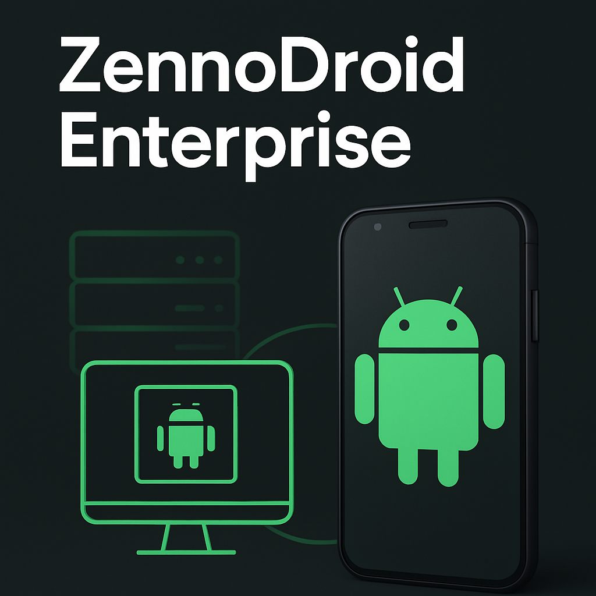

:::info Please read the [*Terms of Use for Materials on This Site*](../Disclaimer).
:::
_______________________________________________  
ZennoDroid Enterprise is the most powerful solution for corporate needs. The main difference from other versions is that it works **with real physical Android devices**, which gives you the fastest job execution and total compatibility with any app.

:::tip You can also use the BlueStacks emulator for tasks that require virtualization.
:::

The Enterprise version supports unlimited multithreading. The license lets you link up to three computers, with only one allowed to be used at a time—giving you just the flexibility you need in a corporate environment.

| Supported Devices | Project Execution | Number of Linked PCs | Task Complexity | Demo Version Available | Our Support Level |
| :----------------: | :------: | :----: |:----: |:----: |:----: |
| Physical Android + BlueStacks |   Unlimited multithreading   | 3 PCs | Any |[✅](https://zennolab.com/ru/products/zennodroid/download/)   |[We always respond and help](https://helpdesk.zennolab.com/ru/conversation/new) |

This is the go-to choice for organizations where high performance and reliable automation are mission-critical.

