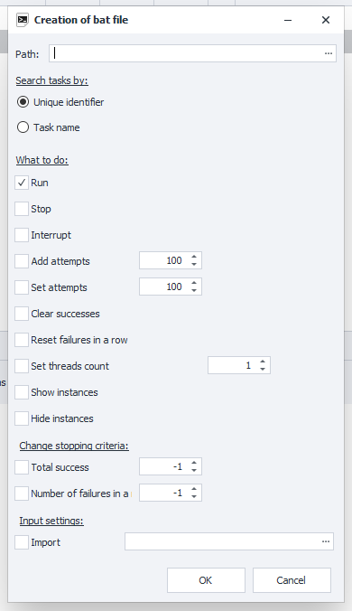
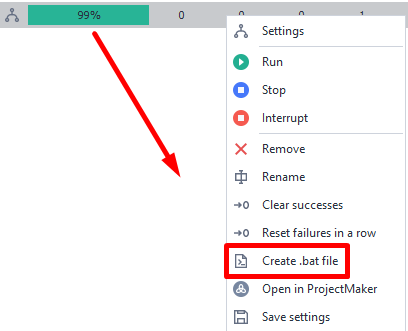

---
sidebar_position: 7
title: Create a .bat File
description: Create a .bat File
---  
:::info **Please read the [*Material Usage Rules on this site*](../Disclaimer).**
:::
_______________________________________________  
## Description  
  

For every project you add to ZennoDroid, you can create a separate .bat file. With it, you can, for example:  
- Start and stop the template;  
- Add attempts;  
- Change the number of threads;  
- Set new input settings.  

You can assign several functions at once to one .bat file.  

:::warning **.bat files do not work in the program's [*Demo Version*](../Installation/ZD_Demo).**
:::  

### How to create one?  
In the **Project Table**, right-click on the template you need, and in the [**Context Menu**](./Context_menu) select **Create bat file**.  

_______________________________________________
## Working with the window  
### Path  
Here, you choose where on your computer you want to save the bat file.  

### Search task by  
In this section, you need to pick what criteria the bat file will use to find the project to work with.  

- **Unique identifier**  
Every project you add to ZennoDroid has a unique identifier (for example, `81ca46b9-8eaa-94e3-92be-33b22ba4ca1a`).  
:::warning **A new identifier is generated each time.**  
If you add and remove the same template in the program several times, each time a new id will be created for it.  

Keep this in mind while you work.
:::  

- **Task Name**  
The search for the template will use its name.  

If you add several projects with the same name at once, the settings will apply to the first one.  

### What to do  
- **Start/Stop/Interrupt**. Lets you start the project or, smoothly or abruptly, stop its work.  
- **Add attempts**. The number you enter here will be added to the current number of attempts.  
- **Set attempts**. This will set the number of execution attempts for the selected template.  
- **Reset successes/failures in a row**. Resets the counter for the number of successive successes or failures.  
- **Set threads count**. Sets the number of threads for the template.  
- **Show/hide instance**. These options let you display running instances for active threads.  

### Change stopping criteria  
Here, you can set the conditions under which the template will stop working. This works just like the functions in the [**Stopping**](./Stopping) tab.  

### Input settings  
Here, you need to specify the location on your disk where the file with the saved [**Input Settings**](../Project%20Editor/Project/InputSetting) is located.  
_______________________________________________