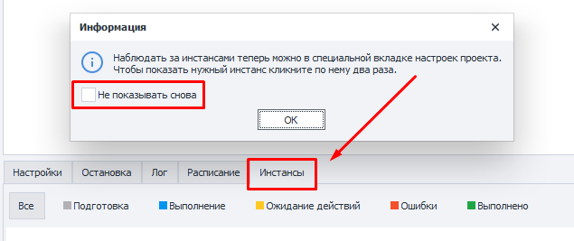

:::info **Please read the [*Terms of Use for materials on this resource*](../Disclaimer).**
:::
_______________________________________________  
## Description.
You can open the context menu by right-clicking on any task in the table.


You can even select several projects at once—then the chosen action will apply to all of them.

_______________________________________________
## Menu Items.
### Settings.
This option opens the project's [**Input Settings**](../Project%20Editor/Project/InputSetting).

You can also open them by double-clicking on the task.

### Run.
Starts executing the template.

:::info **In the [*Project Settings*](../Project%20Editor/Static%20Block%20Panel/ProjectSettings) tab, you need to set the number of threads and repetitions beforehand.**
:::

### Stop.
Allows you to gently stop the process.

After clicking, all running threads will finish their current step and won't restart. They will only start again when you click **Run**.

### Abort.
Immediately interrupts the task. The project will stop running right away, no matter what stage it’s at.

### Delete.
Deletes the selected task from the **Projects Table**.

### Rename.
This function lets you change the project’s name.


You can also do this by clicking the task and hitting **F2**.

### Reset Successes/Failures in a Row.
Resets the counter for successes or failures to zero.

This can be useful when you have **Stop** set based on their number.

### Create .bat File.
Creates a separate file to launch the template.

How this works is described in the article [**Create .bat File**](./BatFile).

### Open in ProjectMaker.
Opens the selected project in ProjectMaker so you can edit it.

:::warning **You need to have permissions to open and edit this project.**
:::
_______________________________________________
### Save Settings.
This function saves all project settings and data. Things like the number of threads and their executions, tags, stop conditions, current status, ID, schedule, and more.

The saved file will have the `.zptsk` extension. You can open it with any text editor (Notepad++, SublimeText, etc.). The data inside is in XML format.

<details>
<summary>**Example of data in XML format.**</summary>
<!--All you need is a blank line-->
```xml
     <Id>e6a601d1-fd0e-4198-a667-80614726186f</Id>
  <Name>ProjectZ</Name>
  <IsNewbie>True</IsNewbie>
  <IsEnable>True</IsEnable>
  <CreateTime>08/08/2021 12:14:32</CreateTime>
  <SettingsType>InputSettings</SettingsType>
  <BrowserType></BrowserType>
  <FilterLogSettings></FilterLogSettings>
  <ShowAutoFilterRow>False</ShowAutoFilterRow>
  <ExecutionSettings>
    <Id>552d0abb-9629-4521-a960-c11ac9274676</Id>
    <LimitOfThreads>1</LimitOfThreads>
    <MaxAllowOfThreads>0</MaxAllowOfThreads>
    <DoneSuccessfully>1</DoneSuccessfully>
    <DoneAll>1</DoneAll>
    <NumberOfTries>0</NumberOfTries>
    <LastNumberOfTries>1</LastNumberOfTries>
    <Priority>100000</Priority>
    <Proxy>UseProxyWithoutRemove</Proxy>
    <Status>Complete</Status>
    <ProxyLabels></ProxyLabels>
    <ShouldBeExecutedRandomly>False</ShouldBeExecutedRandomly>
    <GroupLabels>sometag</GroupLabels>
    <GroupStates>Completed</GroupStates>
    <MaxNumOfSuccessStop>1024</MaxNumOfSuccessStop>
    <Timeout>-1</Timeout>
    <MaxNumOfFailStop>128</MaxNumOfFailStop>
    <NumOfFailStop>0</NumOfFailStop>
    <ShowTask>False</ShowTask>
    <TraceTask>False</TraceTask>
    <PerformBadEndOnInterrupt>True</PerformBadEndOnInterrupt>
  </ExecutionSettings>
  <Scheduler7Settings>
    <Id>e6a601d1-fd0e-4198-a667-80614726186f</Id>
    <IsActive>False</IsActive>
    <ExecutePeriod>EveryDay</ExecutePeriod>
    <StartDateType>Immediately</StartDateType>
    <AttemptsRange>12</AttemptsRange>
    <IsClearSuccess>False</IsClearSuccess>
    <Intervals>09:00 - 17:00</Intervals>
    <StopExecutionOutsideOfIntervals>True</StopExecutionOutsideOfIntervals>
    <RepeatType>Continued</RepeatType>
    <EndDateType>Count</EndDateType>
    <RepeatCountTotalRange>525252</RepeatCountTotalRange>
    <LastScheduleTime></LastScheduleTime>
    <NextScheduleTime></NextScheduleTime>
    <TaskName>ProjectZ</TaskName>
    <GroupName></GroupName>
    <IsOneTimeRunning>False</IsOneTimeRunning>
    <IsTaskRunning>False</IsTaskRunning>
  </Scheduler7Settings>
  <Project>
    <ProjectFileLocation>C:\ProjectZ.zp</ProjectFileLocation>
    <ProjectType>Assembly</ProjectType>
  </Project>
  <SchedulerSettings>
    <Id>4095f5b5-141f-43a1-888e-fa809fe3404d</Id>
    <StartDate>08/08/2021 12:14:00</StartDate>
    <SchedulerOnDate>01/01/0001 00:00:00</SchedulerOnDate>
    <EndDate>08/08/2022 12:14:00</EndDate>
    <RepetitionCount>1</RepetitionCount>
    <ScheduleType>EveryMinutes</ScheduleType>
    <RepeatType>FinishAfter</RepeatType>
    <ActivateTime>01/01/0001 00:00:00</ActivateTime>
    <ActivateWorkTime>01/01/0001 00:00:00</ActivateWorkTime>
    <IsActive>False</IsActive>
    <NumberOfTries>0</NumberOfTries>
    <Minutes>1</Minutes>
    <Days>1</Days>
    <LastScheduleDate>01/01/0001 00:00:00</LastScheduleDate>
    <NextScheduleDate>null</NextScheduleDate>
    <IsClearSuccess>False</IsClearSuccess>
    <GroupName></GroupName>
  </SchedulerSettings>
  <PurchaseState>None</PurchaseState>
  ```
</details>
>

#### How do I load these settings?
You can do this using a `.bat` file with the following contents:

`"%ZennoPosterCurrentPath%\TasksRunner.exe" -o LoadSettings -o "c:\path\to\file.zptsk"`

#### When would this come in handy?
- **Dynamically changing project settings**.  
You can create several settings files ahead of time, and then load them with the [**Run Programs**](../Project%20Editor/CustomCode/RunningPrograms) action. Or use the [**Work with Files**](../Android/ProLite/Files) action to dynamically create a file, save all the data you need there, and load it as necessary.

- **Restoring a template deleted from the table**.  
To add settings, click **Add** in the main menu.


Then, in the window that appears, search for all files (*`All files (*.*)`*), not just `.zp` files.


After that, select the file you need and open it. The table will have the template added with all its settings.
_______________________________________________
### Project Directory.
When you click, it’ll open the folder in Explorer where the project's file is saved.

### Show/Hide Instances.
Takes you to the **Instances** tab and brings up an info window, which you can hide permanently.



### Trace Execution.
Starts **Project Tracing**.
_______________________________________________