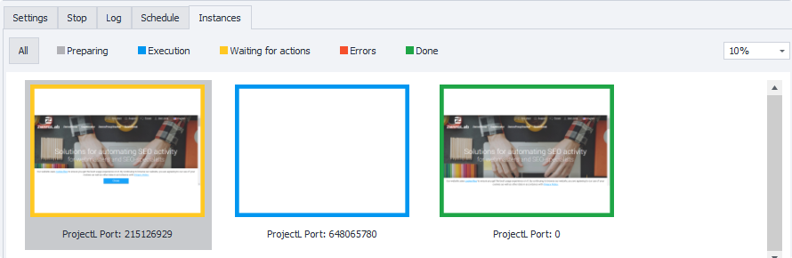
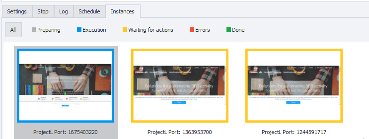
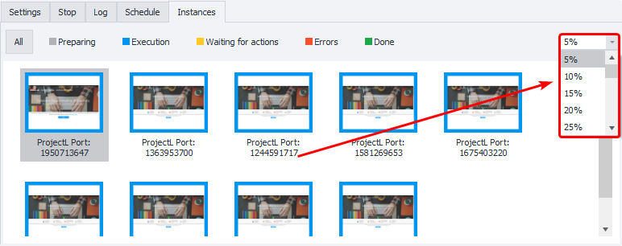
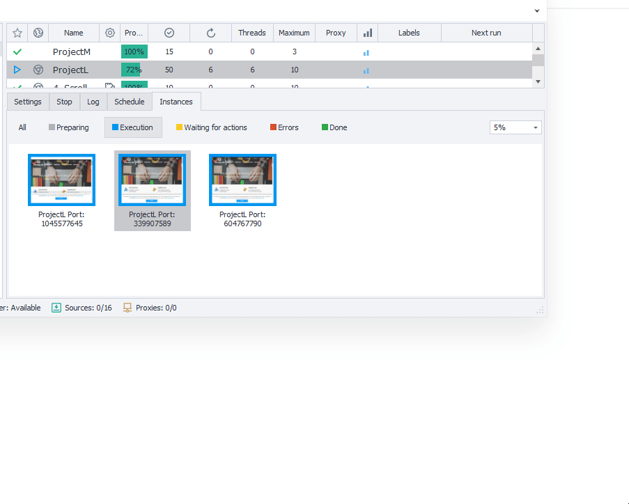
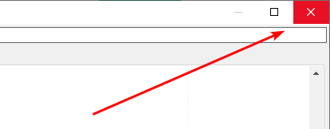
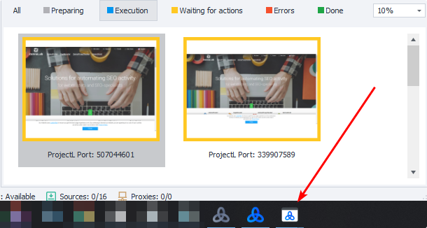
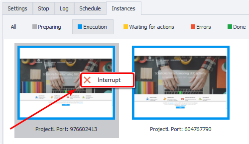

:::info **Please read the [*Material Usage Rules on this site*](../Disclaimer).**
:::
_______________________________________________
## Description.
In this tab, you can monitor the activity of all instances in real time.

### Statuses
The color of an instance's border shows its current status:
- **Gray** — initializing;
- **Blue** — running;
- **Orange** — waiting for user actions;
- **Red** — an error occurred;
- **Green** — completed successfully.

#### Filtering by status
You can also filter instances by their current status:

_______________________________________________
## Working with the window
### Changing the scale
You can change the display scale using the drop-down menu on the right side of the tab.

|     |
| :--------: |
| *Instances in this screenshot are displayed at 5% scale*  |

### Opening an instance
Double-click on any thumbnail to open the instance window at its actual size.

To close the window, just click the X in the top right corner.

_______________________________________________
### Waiting for user actions
Windows in **Waiting for user actions** mode will also appear on your computer's taskbar. You can minimize or maximize them as needed. When the instance's input timeout runs out, it'll disappear from the taskbar.

_______________________________________________
### Stopping an instance
You can stop an instance at any time. Just click its thumbnail and press **Stop**.

