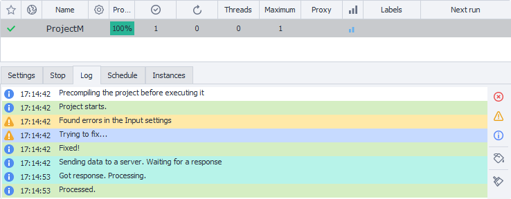

:::info **Please read the [*Terms of Use for materials on this resource*](../Disclaimer).**
:::
_______________________________________________  
All project progress notifications are recorded on this tab:  
- *errors*;  
- *successful action notes*;  
- *notifications about unsuccessful project completion*.  

  

With the buttons on the right panel, you can:  
- **clear the log**;  
- **enable auto-scroll**;  
- **filter messages by type or color**.  

:::tip **Log Window.**
The way it works is exactly the same as described earlier in the [article about the Log window](../pm/Interface/Log_window).
:::