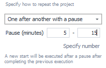

---
sidebar_position: 4
title: «Schedule» Tab
description: Working with the Scheduler
---  
export const VideoSample = ({source}) => (
  <video controls playsInline muted preload="auto" className='docsVideo'>
    <source src={source} type="video/mp4" />
</video>
); 

:::info Please read the [Rules for Using Materials on this Resource](../Disclaimer).
:::
_______________________________________________
## Overview  
This tab is where you work with the **Schedule Planner**. It's a tool that lets you fine-tune and automate your project execution according to a schedule.

**Here’s what it can do:**  
- **Create simple schedules.**  
Run tasks a single time.
- **Set up advanced schedules.**  
Take into account time intervals, number of attempts, and repetitions.
- **Debug schedules.**  
Make sure everything is set up and running as expected.

:::tip No matter how complex your schedule needs to be.
Planning tasks with our **Scheduler** is available to users of any experience level. The interface steps make the process clear and logical.
:::

### Getting Started  
By default, the scheduler is off, and if you try to turn it on right away, you’ll get an error. **You need to set up a schedule first** according to your needs.

Once you use the debugger to make sure everything is set up properly, you can move the slider to **Enable**.

:::warning If there are any errors in your schedule settings,
they’ll be highlighted with a red frame, and the enable slider will be grayed out.
:::

### Scheduler Menu  

- **Copy**. Copy the entire schedule of a project to use it in another one.
- **Paste**. Paste a schedule from another project.
- **Load**. Load a file from your computer containing schedule settings.
- **Save**. Save your current settings to an external file.
- **Show log**. Show the history of attempt additions by the scheduler.
- **Schedule Debugger**. Launch a utility to calculate approximate task timings. *More details below.*
_______________________________________________
## Main Features  
### How to Run  

This section sets up how often the task runs. There are 5 options:
- **One time**. The task will run exactly once.
- **Every day**. The project runs every day, Monday through Sunday.
- **Every week**. With this, the task runs on specific days of the week.

- **Every month**. Set the project to run monthly on certain dates. List individual dates separated by commas, and ranges with a dash.

|     | 
| -------- | 
| *The project will run on the 1st to 5th of each month, and also on the 10th and 20th.*  | 

- **By trigger**. The task will start whenever a file is uploaded.
*If you want the file to be deleted after the task starts, check the **Delete file** box.*

### Start  

Here you choose how tasks start:
- **Immediately**. Runs as soon as you turn on the scheduler.
- **On a set date**. The task will run at a specified date and time.

### How Many Times  

Here you set how many times to try running the task.

You can enter a specific number or a range (with the **Set range** button). In the second case, the system will randomly pick a number within that range.

The **Reset successes** option controls whether the success counter in the *Stop* tab will reset.

### When to Repeat  

Here you set time slots for repeating the project.

Click **Add interval** to enter a time span. If you need more slots, just click it again. There's **no limit** to the number of intervals you can add.

:::tip If you don’t set any intervals, the project will run 24/7.
*This applies only for the **Every day**, **Every week**, and **Every month** modes.*
::: 

### How to Repeat  

This is where you set how the project repeats.

:::info This option is available in **Every day**, **Every week**, and **Every month** modes.
:::

You have **four repeat options**:
- **Back to back**. The task restarts as soon as the last run finishes.
- **Back to back with pause**. Now there’s a pause between repeats. You can set a specific number of minutes, or **Set range** and let the system pick a random value.

- **Regularly**. The task runs again after a set period, unrelated to the previous run.
- **Spread out over the interval**. Repeats are automatically distributed within the intervals you set in **When to Repeat**.

### End  

In this section, you set up conditions for ending the task.
:::info This option is available in **Every day**, **Every week**, and **Every month** modes.
:::

You can finish tasks in **three ways**:
- **By date**. The project keeps running **until** the specified date and time.
- **After N repeats**. The project stops when it’s been run the specified number of times. You can set an exact number or **Set range**.

- **Without end**. The project keeps running indefinitely, until you stop it manually.
_______________________________________________
## Example Setups  
### One time  
| Run the project *one time* on a certain day at 12:30. | 
| -------- |
|  |
### Every day
| Run the task *every day* from 10:00 to 15:00, only once per day, with a 10-minute pause between runs.    | 
| -------- | 
|   |  

### Multiple Attempts
| Run the template every day from 8:00 to 12:00 and 13:00 to 19:00, repeating it every 20-40 minutes, *doing between one and seven attempts*.    | 
| -------- | 
|   | 

### Random Distribution
| Run the project every Tuesday, Wednesday, and Thursday from 16:00 to 23:00, *randomly distributing* 50 repeats across the time slot.    | 
| -------- | 
|   |  
_______________________________________________
## Example Video  
<VideoSample source={require("@site/static/video/Schedule.mp4").default}/>
_______________________________________________
## Schedule Debugger
### General Info  
:::info The Schedule Debugger helps you estimate how long your tasks will take to run.
And shows you an example of how the project will run according to the schedule.
:::

You can open it from the **project schedule menu**:  

:::tip Make sure to use the schedule debugger every time.
It gives you confidence that your tasks will run as you expect.
:::

### How the Schedule Debugger Works  
#### Step 1  
First, you’ll need to enter a rough estimate (in seconds) of how long running the project once will take. This helps the debugger make a realistic prediction of how things will run. The more accurate your estimate, the better the calculations.

#### Step 2  
After you’ve entered a duration, click **Calculate** and wait a few seconds. The debugger will then show you an estimated run of your project according to your schedule. You’ll see how the process will go, from the planned start to the end of the project or the end of the emulation period.

The final calculation will show the progress in this format:
**Run date** + **Run time** + **Number of attempts**.

With this data, you can check how the schedule will actually work and see if the intervals and repeats are set correctly.

Just keep in mind, the debugger only shows an approximate run. When tasks actually run according to the schedule, the real time may differ from what you entered in the debugger.