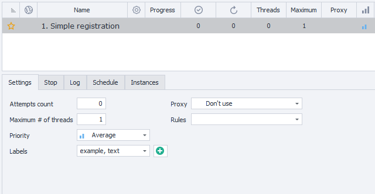

:::info **Please read the [*Terms of Use for materials on this site*](../Disclaimer).**
:::
_______________________________________________
## Description.
In this tab, you can set the number of runs and threads, as well as proxy usage.

It's on the main ZennoDroid page—just click on the job you're interested in.

_______________________________________________
## Available parameters.
### How many to do.
Here you set the number of runs for the selected project.

You can enter **`-1`**, which means the job will run endlessly until you stop it. You can stop the job with the **Stop** button, or by changing the value from `-1` to `0`. It will also stop if ***one of the special conditions*** occurs.

### Maximum threads.
Set the maximum number of threads that can run at the same time in the project.

:::tip **Further in this article, we'll give a few examples**
That show the connection between the "How many to do" and "Maximum threads" parameters.
:::

### Priority.
Here you set the priority for this template compared to other jobs.

Priority threads, for example, can interrupt an instance request from lower-priority ones (if the right option is enabled).

### Tags.
Basically, these are tags for grouping projects together. You can select several tags for a single job.

If you already have tags, you can pick them from the drop-down list. Or create new ones by clicking the ✙ button.

### Proxy.
Set whether you want to use built-in proxies from [**ProxyChecker**](../get-started/ProxyCheckerZD) in the project.

#### Options:
- **Don't use**.
The job will run on your real IP, no proxy.
- **If possible**.
Proxies will be used only if there are any **Live** ones.
- **Use (without removal)**.
After using a proxy, it stays in the **Live** list.
- **Use**.
When a proxy is used in the project, it's immediately removed from the **Live** list.

:::info **Options with "Use".**
In the last two options, proxies are definitely used for this job. If there's no suitable proxy, the project will wait for one to show up.
:::

### Rules.
Choose [**Rules**](https://zennolab.atlassian.net/wiki/spaces/RU/pages/848560252) for picking proxies from the **Live** list. They're made not in ZennoDroid, but in [ProxyChecker](../get-started/ProxyCheckerZD_Interface).
_______________________________________________
## Multithreaded mode.
If you have a **Professional** or **Enterprise** plan, you can run several threads for a single project at the same time.

Just set how many threads you want in **Maximum threads**, and how many runs in **How many to do**.

:::tip **If your project is showing "Stopped".**
Press **Start** to apply changes.
:::

### What's a thread?
It's a separate run with its own data set (variables, lists, tables, and so on). Running several threads is like having several people do the same actions.

#### Tip.
**We don't recommend trying to run 100+ threads right away.**

Each thread uses your PC resources—mainly RAM and CPU, but also the hard drive.

:::tip **Usage load depends on how your template works.**
:::

Launching a lot of threads at once can lead to the program freezing up, or even crashing your system. Sometimes, your computer might unexpectedly shut down.

### Example #1.
**How many to do: `60`.**
**Maximum threads: `1`.**

**Result:** Only **one thread** starts, and does **60 runs** one after another.

### Example #2.
**How many to do: `60`.**
**Maximum threads: `10`.**

**Result:** Here, 10 threads start at once and work in parallel. Suppose one run takes one minute—then all 60 runs finish in 6 minutes, not 60. That's because 10 runs are happening each minute.

### Example #3.
**How many to do: `-1`.**
**Maximum threads: `10`.**

**Result:** Again, 10 threads run at once, but now they'll keep going until you stop the project. If you press **Stop** or change runs to `0`, the active threads will finish, and new ones won't start.