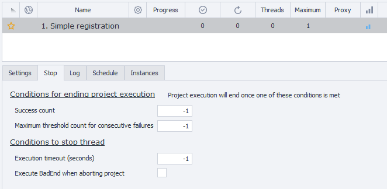
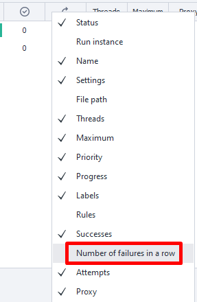
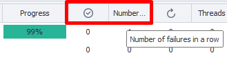
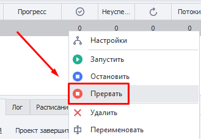

:::info **Please read the [*Rules for using materials on this resource*](../Disclaimer).**
:::
_______________________________________________  
## Description
This tab contains the settings for the conditions under which your project will stop running.

You can find it on ZennoDroid's main page—just click on the task you’re interested in, then go to the **Stopping** section.

_______________________________________________
## Available parameters
### Number of successes
Here you set the number of times the project should run successfully before it stops.

By default, it’s set to **`-1`**, which means unlimited. Successes won’t be counted—the project will keep running until you stop it manually.

:::tip **In the Projects Table, you can see the total number of successes and errors for any given task.**

:::
### Number of consecutive failures
The project can only fail as many times in a row as you specify here—after that, it’ll stop.

The counter for unsuccessful runs resets as soon as the task is completed successfully once.

By default, the value is **`-1`**, which means endless. Errors won’t be tracked, and the project will keep going until you stop it by hand.

:::tip **The *Projects Table* doesn’t show the “Consecutive Failures” column by default.**
But you can enable it **by right-clicking any table header**.

:::

### Execution timeout (seconds)
Here, you set the max time allowed for a single run of the project.

If the task isn’t finished within this timeframe, it’ll be stopped, no matter what stage it’s on.

:::tip **Let’s say our project usually takes about 6–8 minutes to run.**
In that case, set the **Execution Timeout** to 600 seconds (10 minutes, with a bit of a buffer).

If, for some reason, the template hangs right in the middle of running, it’ll get interrupted exactly 600 seconds from the start—so you don’t waste resources or time.
:::

### Run BadEnd when stopping the project
If you turn this setting on, when you stop the project with the **Stop** button or the **Execution Timeout** runs out, it will follow the red line (BadEnd).

