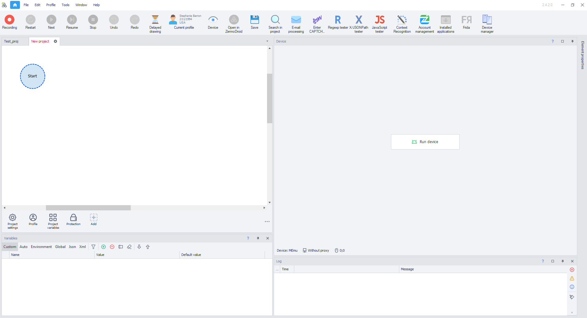
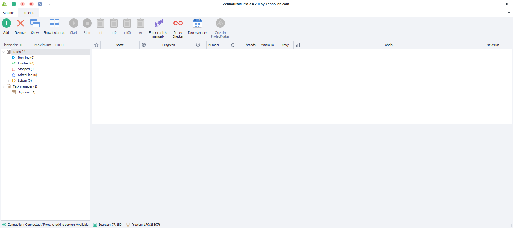
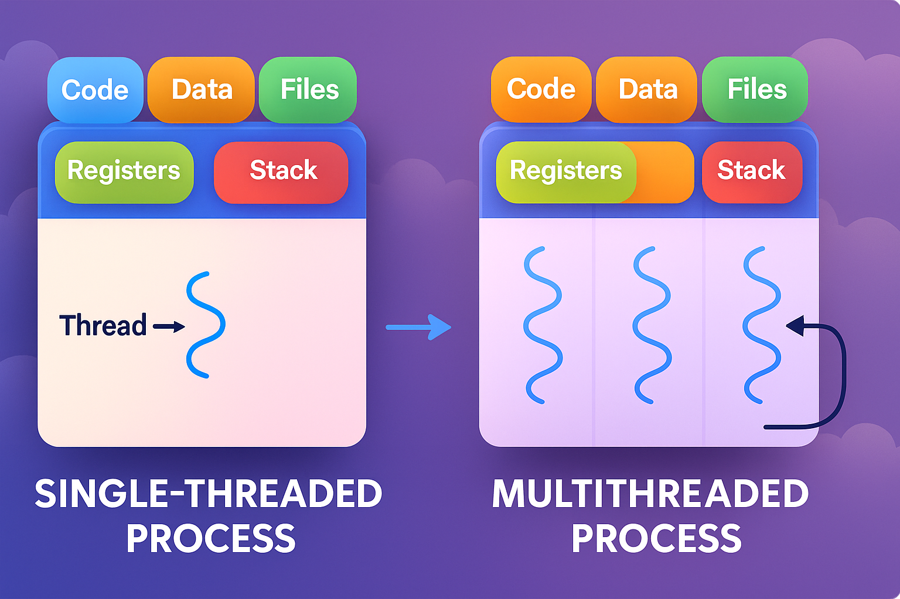
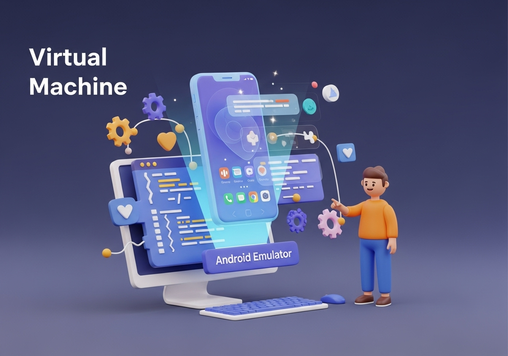
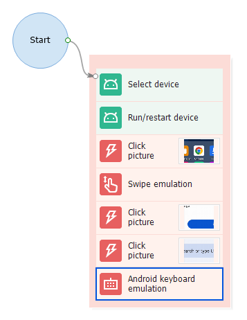
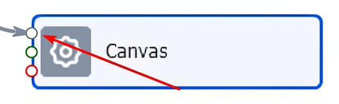
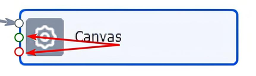
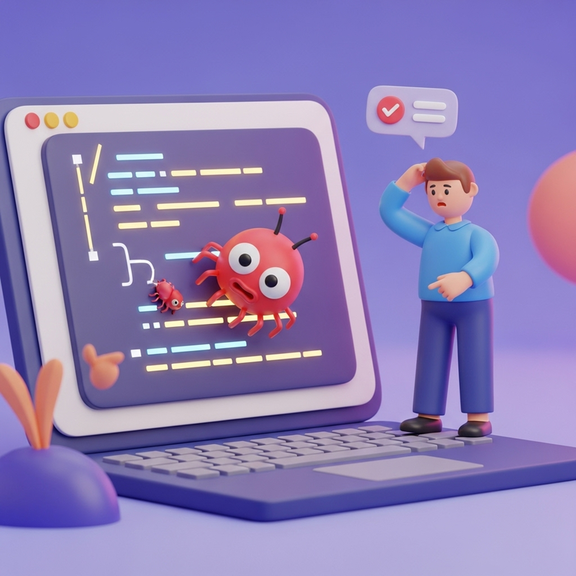
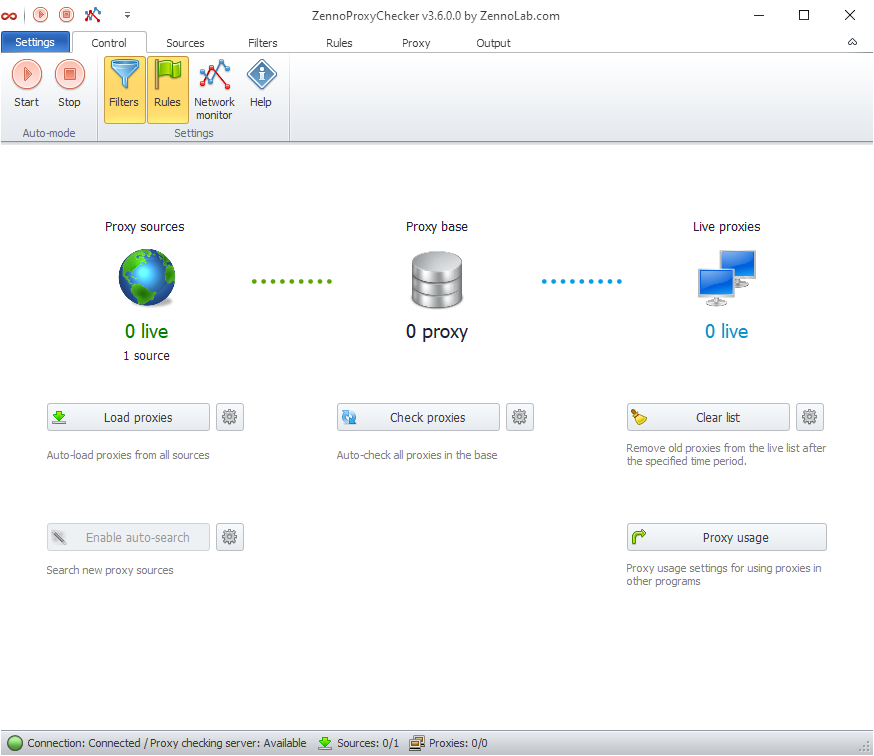
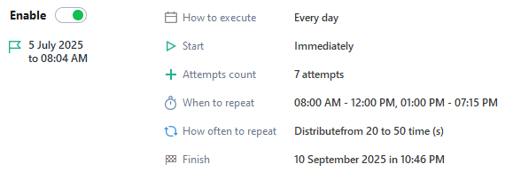

---
sidebar_position: 3
slug: /basicterms
title: Basic Concepts
description: The main terms in ZennoDroid.
---  

:::info **Please read the [*Material Usage Rules on this site*](./Disclaimer).**
:::
_______________________________________________
In this article, we'll break down the terms you'll come across when working with ZennoDroid. Some of them you probably already know, and some you might have wanted to learn about. Use this article as a cheat sheet and return to it whenever you don't understand a term.

## ProjectMaker (PM for short).
  

This is the environment where you build your projects and templates. You perform actions on the Android emulator or your real device, and the program records them. After that, you can edit the template, add new steps, and set up logic.  
We'll be talking about PM a lot from now on. Even though it's a separate app, it's closely connected with ZennoDroid and ZennoPoster.
_______________________________________________
## [ZennoDroid](https://zennolab.com/ru/products/zennodroid/) (ZD for short).
  

It doesn't really need an introduction, but in case you landed here by accident—this is the main app where projects are launched and executed. In the Pro version, you can also run templates using multiple threads and set up a schedule for launching them.
_______________________________________________
## Thread.
  

This is what we call a separate instance of execution. Each thread gets its own set of data (variables, lists, tables), as well as its own emulator. You can think of a thread like a worker on an assembly line doing a specific set of tasks. When a project runs with several threads, it's like a full production line where each worker has their own job.
_______________________________________________
## Virtual Machine (VM for short).
  

This is a single running instance of the emulator where actions take place. Basically, it's like a real phone, but virtual—hence the name.
_______________________________________________
## Action (block, cube, step).
  

An action block in ProjectMaker is what templates are made from. PM uses a node-based structure, so you need to connect each action together with a line ("thread"). They run one after another in order. If you don't link an action to the main flow, it simply won't run.

What you can do with an action block:
- [get a value](Android/ProLite/GetValue),
- [emulate a touch](Android/ProLite/Touch_Emulation),
- [save an element's value](Android/ProLite/SetValue),
- [write text to a file](Data/Text), list, table, or database,
- and a lot more :)
_______________________________________________
## Action port (input).
This is how action blocks connect to other steps. Usually, an action has three ports (one input and two outputs), but the Switch action can have more than two output ports.
- Input port.
  

Here you connect the arrow coming from a previous action (one input port can take in several actions at once).
- Output ports.
  

There are two: green for success, and red for errors.
_______________________________________________
## Branches (arrows, threads, lines) of logic.
All actions in a project need to be connected together using arrows. If an action isn't hooked up to a branch, it's not going to be part of the flow.
### Green arrow, means:
- got a string from a list or table,
- found an element and got its value,
- the expression inside an if action returned true,
- other successful cases.
### Red arrow, means:
- didn't find the requested element,
- file for reading was missing,
- tried to get a string that doesn't exist,
- and other errors.
_______________________________________________
## Template (project).
A file you make in PM and run in ZD. Usually, it contains instructions for the emulator. Basically, it's a program or script for automating certain actions. A template consists of actions that are all linked together with logic arrows.
_______________________________________________
## Proxy (or proxy server).
  

A proxy is a sort of middleman between you and the internet. When you send a request through a proxy, it doesn't go directly from your device but passes through this mediator. Proxies let you change your IP address, so you can access different resources, hide personal info, and stay unique online.

They can be paid or free. Free proxies, as you might expect, tend to be slow or stop working quickly. That's why if you're using free proxies, it's best to have a big list so you can swap them out as needed.

In ZD, you set a proxy using a special action. The program also has some built-in services for finding proxies.
_______________________________________________
## Variable.
This is a space in the computer's memory holding data: numbers, text strings, logic values. Programs use variables to temporarily store and work with data as they run. Each variable has its own unique name and can be changed or read during template execution.
_______________________________________________
## Snippet.
A small fragment of source code that does one specific thing. Most often it's a commonly used algorithm you can use in different scenarios.

Snippets help you write code faster because you can drop in pre-made code instead of writing everything from scratch. They could be simple—like making a loop or condition—or more complex, like building a user interface.

In ZennoDroid, we mostly use snippets written in C#.
_______________________________________________
## Bug.
  

This is when a program does something wrong—not how the developer intended—which leads to weird results. For example, the program might give wrong results, freeze, crash, or just behave oddly in certain situations.

Bugs can happen because of mistakes in the code, using third-party libraries incorrectly, or not following the app's requirements. To find and fix bugs, we use different testing, debugging, and code analysis methods.
_______________________________________________
## Diagnostics.
Special software that collects info about ZennoDroid's current state. This might include finding errors, checking the status of system components, analyzing logs and error messages, and performance testing. Diagnostics are usually needed when you contact support if the program is having issues.
_______________________________________________
## ProxyChecker.
  

One of our apps that regularly checks proxies by lots of criteria and exports them in a handy format. Regular proxy checking keeps them reliable and efficient. Using good proxies lets you load pages faster and speed up your applications.
_______________________________________________
## Scheduler.
  

A part of ZennoDroid that lets you set up and automate project execution on a schedule. What it can do:
- create simple one-time job schedules,
- set up complex repeating schedules with time intervals, attempts, and repeats,
- debug your schedules to make sure your template will run as expected.
_______________________________________________
## Useful links.
- [**Project Maker**](pm/Welcome_PM).
- [**ProxyChecker**](get-started/ProxyCheckerZD).
- [**Project Editor**](category/редактор-проектов).