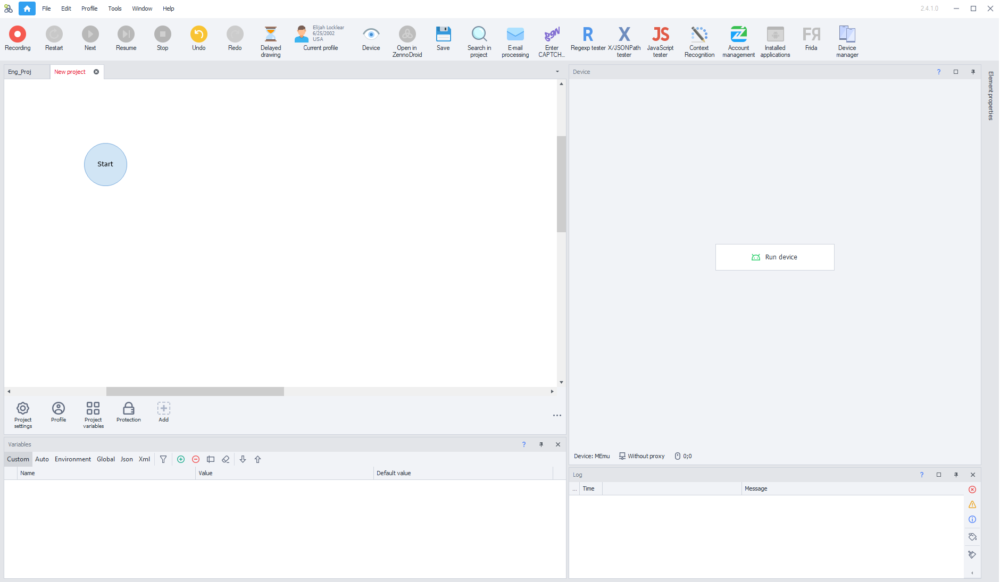
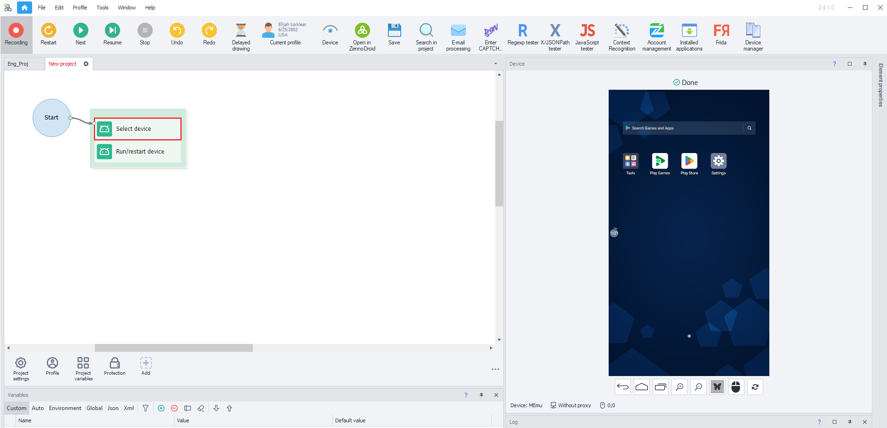

:::info **Please read the [*Material Usage Rules on this site*](../Disclaimer).**
:::
_______________________________________________
export const VideoSample = ({source}) => (
  <video controls playsInline muted preload="auto" className='docsVideo'>
    <source src={source} type="video/mp4" />
</video>
);   

To connect your smartphone to ZennoDroid, you'll need to follow a few simple steps.

Unfortunately, there's no way to make one universal guide, since the setup process can vary depending on your phone's manufacturer, Android version, and UI.

This article is based on tests with several types of devices. If you run into trouble, just write to our support team.
_______________________________________________
## Turn on Developer Mode
### 1. Open your device settings.
### 2. Find and open **"About phone"**/**"Phone information"**.

### 3. Find the **"Build number"** line.
:::tip **If you don't see it, tap **"Software information"** — the right section will appear.**
:::

### 4. Tap **"Build number"** several times.
You'll get a pop-up message on your device saying:
**`Developer mode is on`**

### 5. Developer options.
Now you'll see a new menu item in your phone's settings: **"Developer options"**.

_______________________________________________
## Turn on USB Debugging
### 1. For Developers.
Find the menu you just unlocked: **"Developer options"** or **"For developers"**. The name may be different, depending on your device.

### 2. USB Debugging.
Find **"USB debugging"**, turn it on, and confirm.

:::info **Any other way?**
*If your device is rooted, you can turn on these settings using the action*
***"ADB Shell Console Command":***
`su -c setprop persist.security.adbinstall 1`
`su -c setprop persist.security.adbinput 1`
:::
_______________________________________________
## Connect Your Device to ZennoDroid
### 1. Connect your phone to your computer.
After turning on USB debugging, plug your phone into the computer where you have ZennoDroid installed.
### 2. Allow debugging.
Your phone will ask something like: *"Allow USB debugging from this computer?"* Check the box and tap *Allow*.

### 3. Start [**ProjectMaker for ZennoDroid**](../category/project-maker).
Go to [**Settings → Android**](../Settings/Settings_for_Enterprise) to make sure your connected device is available for selection.

:::info **If there's nothing in the dropdown menu, hit Refresh.**
If nothing changes, please contact [**Support**](https://helpdesk.zennolab.com/ru).
:::
### 4. Create a project or open an existing one.
| Click *"Start device"* in the **Device** window    | Or use *"Select"* and *"Start"* actions |
| :--------: | :-------: |
|   |  |

:::tip **A few apps will also be installed in the background:**
- ***com.genymobile.gnirehtet** for using proxies*
- ***com.android.adbkeyboard** external keyboard*
- ***io.appium.settings** for GPS spoofing*
- ***io.appium.uiautomator2.server** for proper element tree operation*
:::
>

### 5. You see a prompt to install an unknown app—what do you do?

On some phones, background installation of these apps isn't possible. If a prompt pops up asking for permission to install, just allow it for each app so ZennoDroid works right.

_______________________________________________
## Starting the Device:

### 1. Select your device.
After connecting, you need to add actions to your project:
**"Select device"** and **"Start/Restart device"**.

### 2. Record the project.

_______________________________________________
## Useful links:
- [**Device Actions**](../Android/Enterprise/action)
- [**Root Access Setup**](../Enterprise/Root)
- [**Android Settings**](../Settings/Settings_for_Enterprise)