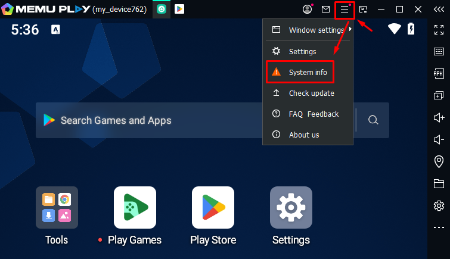
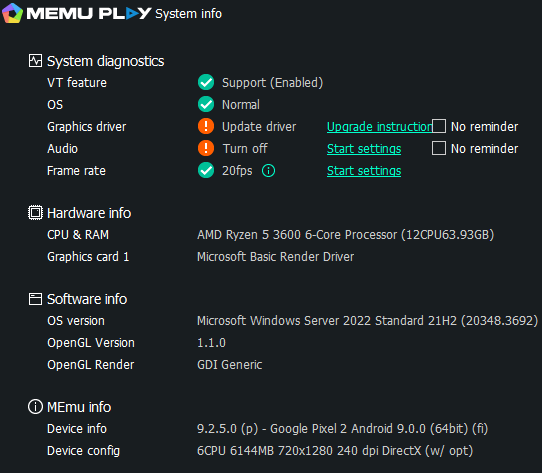

:::info **Please read the [*Material Usage Rules for this Resource*](../Disclaimer).**
:::
_______________________________________________
## For Lite and Professional versions.  
### At a minimum, you’ll need:
- **Processor:** Intel or AMD with at least 2 cores, each at 2 GHz or faster.  
- **RAM:** at least 4 GB.  
- **Storage space:** at least 6 GB free.  
- **Video memory:** at least 1024 MB.  
- **Direct X 11+ or OpenGL 2.0 required.**  
- **Operating system:** Windows 10 x64 or later (Server Core is not supported).  
- **.Net Framework 2.0, 3.5, and 4.6.2+ are required.**  
- **Visual C++ redistributables for 2008, 2010, 2013, 2015, 2017, 2019 (x86 or x64) are also needed.**  
- **Administrator rights.** You’ll need them to install and run the program.  
- **Hardware virtualization.**  
- **Internet connection.** Mandatory. The program won’t work without it.  
:::warning **[Hyper-V must be disabled!](../ProLite/Hyper-V)**
:::
_______________________________________________  
## For the Enterprise version.  
### At a minimum, you’ll need:  
- **Processor:** Intel or AMD with at least 2 cores, each at 2 GHz or faster.  
- **RAM:** at least 4 GB.  
- **Storage space:** at least 6 GB free.  
- **Video memory:** discrete graphics card required.  
- **Operating system:** Windows 10 x64 or later (Server Core is not supported).  
- **.Net Framework 4.6.2+ required.**  
- **Visual C++ redistributables for 2013, 2015, 2017, 2019, and 2022 also needed.**  
- **Administrator rights.** You’ll need them to install and run the program.  
- **Internet connection.** Mandatory. The program won’t work without it.  
_______________________________________________   
## How do you check your system with Memu?  
Launch the emulator, go to the menu, and select **System Info**. 

   

It will look like this:  

  
_______________________________________________
## Useful links  
- [**Installing Memu**](../ProLite/Memu_Install)  
- [**Installing ZennoDroid**](./ZD_Install)  
- [**ZennoDroid Demo Version**](./ZD_Demo)