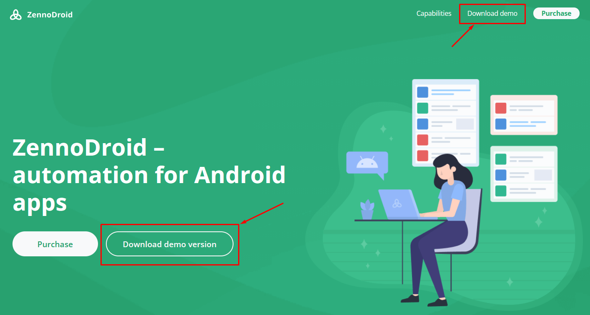
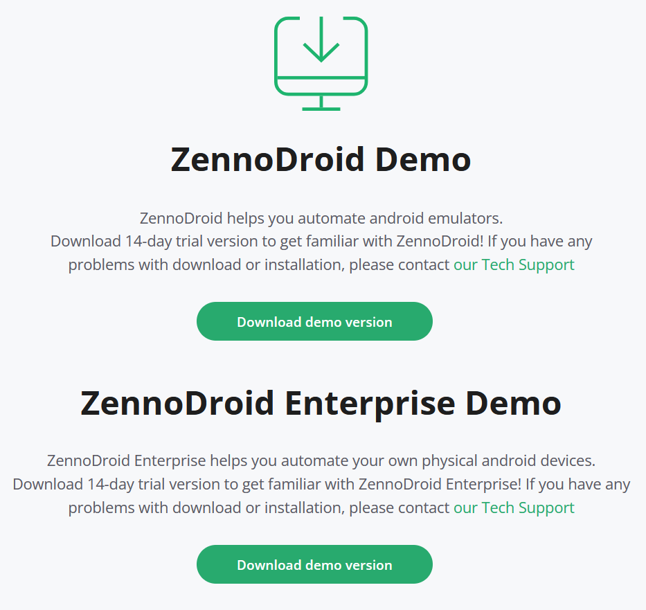
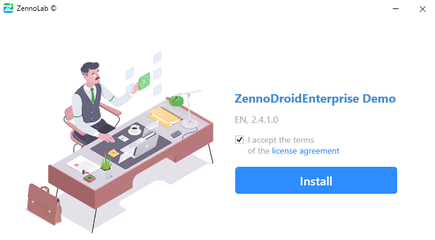
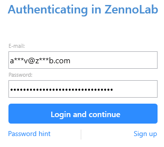

:::info Please read the [*Rules for using materials on this site*](../Disclaimer).
:::
_______________________________________________
## How do you get the Demo?
**1.** Go to the [**ZennoDroid website**](https://zennolab.com/ru/products/zennodroid/) and click **Download Demo**.

_______________________________________________
**2.** You’ll be redirected to a separate demo page where you’ll need to click **Download Demo Version** again.

_______________________________________________
**3.** The installer file will start downloading. Once it’s done, run it.
Check out the [***License Agreement***](https://zennolab.com/ru/terms-of-service/) and tick the box if you agree.

_______________________________________________
**4.** Choose the installation path and enter your [**ZennoLab account**](https://account.zennolab.com/personal-area-main) details.

_______________________________________________
**5.** That’s it! The installation is finished.
_______________________________________________
## Demo Version Limitations
- The program only works for 14 days.
- Only 1 thread can be run at a time.
- Proxy usage is blocked.
- Captchas have to be solved manually, you can’t use services for automatic recognition (like [CapMonster.Cloud](https://capmonster.cloud/ru/)).
- If you didn’t log in to your account during installation, you won’t be able to transfer your projects to other users. After the demo expires, all projects will become unavailable.
- You can’t use .bat files to launch projects.
_______________________________________________
### How is this different from the Lite version?
Lite is a full program and the demo can’t replace it. For example, when running a project (or debugging), a 10-minute timer starts counting how long the automation runs. When this time’s up, you’ll need to manually enter a captcha to keep going. But you can test features and write templates without those kinds of limits.
_______________________________________________
### How do you extend the demo period?
When the trial ends, the program will stop working. You won’t be able to launch or create new projects. If your demo license period has expired, you’ll be able to try again after 16 days.
_______________________________________________
### Can you keep working with demo projects after buying a license?
Yes, but only if you logged in during the demo installation.

:::info Write to us.
If your demo version projects won’t open in the new demo or the licensed version, you can email them to **support@zennolab.com**. We’ll help you get access back.
:::