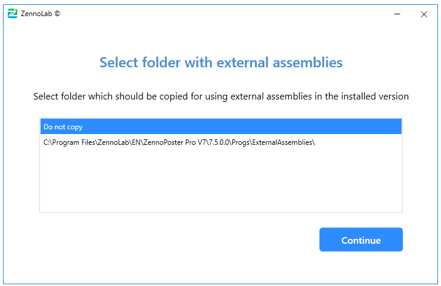

:::info **Please read the [*Material Usage Rules on this site*](../Disclaimer).**
:::
_______________________________________________
## Let's break it down step by step:  
**1.** Download the installer from your [**Personal account**](https://account.zennolab.com/personal-area-main/my-products) and run it.

  
_______________________________________________
**2.** Carefully read the [***License Agreement***](https://zennolab.com/ru/terms-of-service/) and tick the box if you agree. Then click **Install**.

  
_______________________________________________
**3.** If you already have older versions of ZD on your computer, the installer will suggest updating one of them. You can also do a separate installation since multiple versions of the program can be installed at the same time.

  
_______________________________________________
**4.** Choose the installation path or leave it as default, then click **Continue**.
:::info For fewer issues, it's better to leave the default path.
:::
  
_______________________________________________
**5.** If you used external `dll` libraries with one of the previous versions and put them in the **ExternalAssemblies** folder, at this step you'll be offered to automatically copy them into the new installation.

  
_______________________________________________
**6.** Next, enter your *email* and *password* for your [**Personal account**](https://auth.zennolab.com/auth/realms/zennolab/account/password) and click **Continue**.

:::tip Forgot your account password?
Click **Remind password**. Your default browser will open the [password recovery page](https://auth.zennolab.com/auth/realms/zennolab/login-actions/reset-credentials).
:::
_______________________________________________
**7.** If you've bought more than one copy of the program, you can choose the needed license at this step.

  
:::info Number of installed instances.
Shown in brackets for each license. **2/3** means the program is already installed on **two computers**, and the max allowed is 3 (for the **Lite** version, it's 1).
:::
_______________________________________________
**8.** Once installation is complete, you can launch the program right away.

  
_______________________________________________
## Where are program and project settings stored?
Most settings are stored in the **AppData** folder. For quick access, open the **Run** utility by pressing `Win+R`, then enter `%appdata%\ZennoLab` and click **OK**.

  
_______________________________________________
## Useful links  
- [**System requirements**](./SysReq). 
- [**ZennoDroid Demo Version**](./ZD_Demo).     
- [**Installing Memu**](../ProLite/Memu_Install).