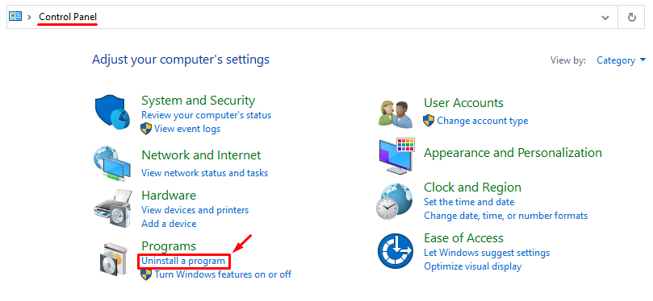
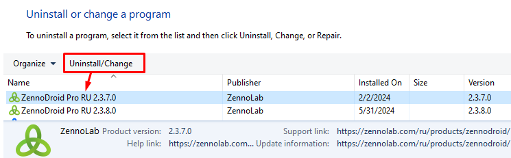
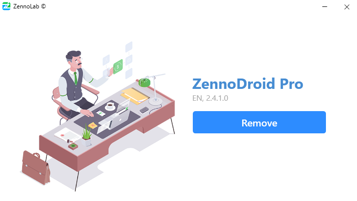
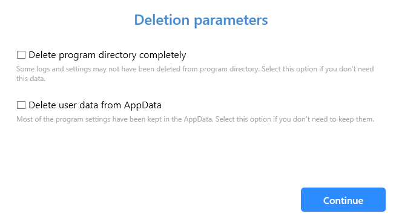
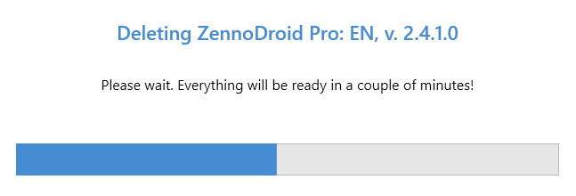
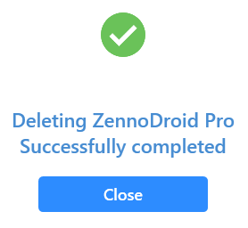

---
sidebar_position: 12
title: Uninstalling ZennoDroid
description: How do I remove the program from my computer?
---  
:::info **Please read the [Terms of Use for materials on this site](../Disclaimer).**
:::  
_______________________________________________
## Let's go through the removal process step by step:
1. Open the **Control Panel** and go to **Uninstall a program**.

  
_______________________________________________
2. Find **ZennoDroid**, select the version you want, and click **Uninstall/Change**.

  
_______________________________________________
3. The uninstaller will launch with a **Uninstall** button.

   
_______________________________________________
4. Now you can choose extra removal options.

 

- **Remove the entire program directory**  
If you turn this option on, the whole program folder will be deleted, including the log folder and **ExternalAssemblies** (this is where any external dll libraries used in your projects are stored).  
- **Delete user data in AppData**  
Most of the program’s settings are stored at `C:\Users\USERNAME\AppData\Roaming\ZennoLab`. This is where your project and program settings are, as well as your schedules. If you check this option, all these settings will be lost forever.  
:::warning **CAREFUL!**
If you delete the AppData folder, you’ll lose the settings for all program versions, not just the one you’re uninstalling now!
:::  
_______________________________________________
5. Once you’ve chosen the options you want (you don’t have to check anything if you don’t want), click **Continue**.

 
_______________________________________________
6. Done! The program is removed.

