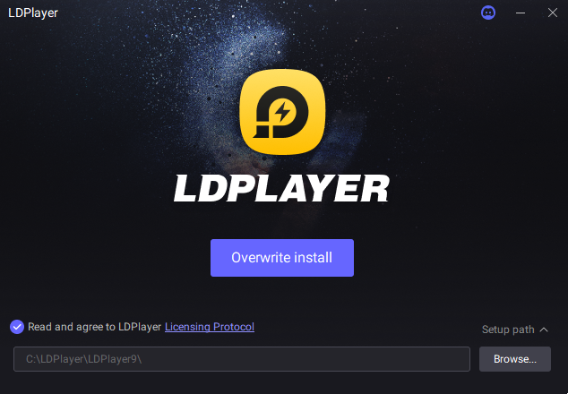

:::info **Please read through the [*Terms of Use for materials on this site*](../Disclaimer).**
:::
_______________________________________________
## What is LDPlayer?  
It’s a free Android emulator that lets you run mobile apps right on your computer. People praise it for its high performance, flexible settings, and easy controls with keyboard and mouse.

LDPlayer supports several versions of Android (5.1, 7.1, and 9.0), so it works well with a wide range of apps. You can tailor the installation to your computer’s capabilities — for example, set the number of CPU cores, pick the amount of RAM, choose a screen resolution, FPS, or graphics engine (OpenGL or DirectX). This is especially useful for stable and fast operation.

It can run multiple emulators at once (multi-instance), sync actions between them, record macros, and simulate GPS. LDPlayer also supports ADB connections, root access (optional), file transfers between Windows and Android, APK installation manually or straight from the built-in Play Market. And if you have things set up right, it stays pretty lightweight and doesn’t overload your system.  
_______________________________________________  
## System Requirements  
### Minimum:  
- **Processor**: Any Intel or AMD x86 or x64 chip  
- **Operating System**: Windows XP SP3, 7, 8, 8.1, 10 (Windows 11 is usually supported, too) 
- **Drivers**: Latest DirectX 11 or OpenGL 2.0  
- **Hardware Virtualization (VT) enabled**  
- **RAM**: 2 GB for x86 and 4 GB for x64  
- **Free space**: At least 36 GB

### Recommended (for smooth operation, gaming, and multi-instance use):  
- **Operating System**: Windows 10 (or Windows 11) with virtualization enabled  
- **Processor**: Intel Core i5‑10500 (or similar AMD) or better  
- **Graphics Card**: NVIDIA GeForce GTX 1660 Ti or better  
- **Drivers**: Latest DirectX 11 or OpenGL 4.5  
- **RAM**: At least 16 GB  
- **Free space**: At least 100 GB    
- **Internet**: Low-latency connection

#### Note: 
- The higher the Android version you emulate, the more RAM and disk space you’ll need  
- Running LDPlayer on another virtual machine is not recommended  
- Update your graphics driver or change your graphics card if you run into compatibility problems  
_______________________________________________   
## How to Install LDPlayer  
### 1. Choose the right version [**on the official website**](https://www.ldplayer.net/versions).
 

### 2. Complete the LDPlayer installation using the downloaded .exe file (it’s best to install it on an SSD).

### 3. Launch LDPlayer and look for the app you need in Google Play.  
 
_______________________________________________
## Enabling Virtualization  
Technically, LDPlayer creates a virtual Android device using virtualization technology (works via Hyper-V, VT-x/AMD-V), so you’ll need to enable virtualization in your BIOS for everything to work smoothly.

|     |  |
| -------- | ------- |
| The "VT" icon lets you know **virtualization is disabled** on your computer.   | Now virtualization is enabled, everything’s great!   |
_______________________________________________
## Useful Links   
- [**How to enable virtualization**](./Virtualization)       
- [**How to disable Hyper-V**](./Hyper-V)