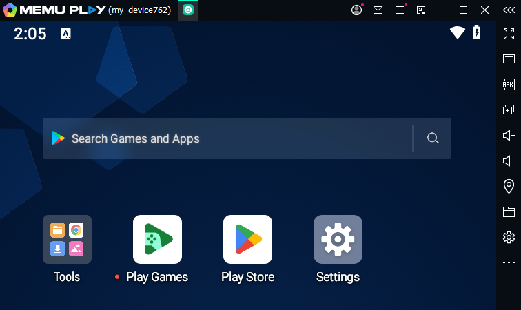
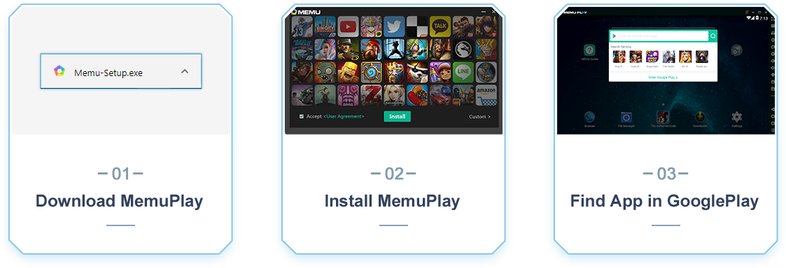
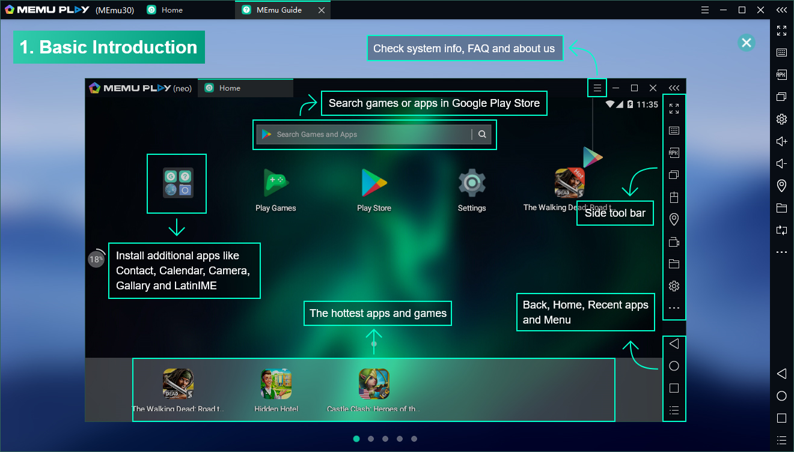

:::info **Please read the [*Terms of Use of Materials on This Site*](../Disclaimer).**
:::
_______________________________________________
## What is Memu?
Memu is an Android emulator that lets you install, use, and delete any apps, just like you would on a real device. It's packed with features like smart controls, instance creation, key-mapping for macros, controller support, game and app automation, screen recording, GPS spoofing, and even command line support.

From Android's point of view, MEmu fully emulates a device’s work: processor, memory, screen orientation, ROM, SD card, WiFi, battery, camera, GPS, accelerometer, and so on. All this is simulated by software.

As far as Windows is concerned, it’s just another app, like Notepad. All the data from the virtual Android device is stored in a few files in a specific Windows folder. For example, the SD card’s contents are likely just a 10GB file.
_______________________________________________
## System Requirements
### Minimum:
- **Processor:** Dual-core x86 or x64 AMD or Intel chip
- **Operating System:** Windows 7 or later. Not recommended for Server/Enterprise versions
- **Drivers:** Latest DirectX 11 or OpenGL 2.0
- **Hardware virtualization (VT) enabled**
- **RAM:** 2 GB for x86 and 4 GB for x64
- **Free space:** 5 GB

### Recommended:
- **Operating System:** Windows 10 with virtualization enabled
- **Processor:** [**PassMark**](https://www.cpubenchmark.net/singleThread.html) single-thread score of at least 1500
- **Graphics card:** [**PassMark**](https://www.cpubenchmark.net/singleThread.html) score of at least 750
- **Drivers:** Latest DirectX 11 or OpenGL 4.5
- **RAM:** At least 8 GB
- **Drive:** SSD with at least 10 GB free space
- **Internet:** Low latency connection

#### Note:
- The newer the Android version you emulate, the more RAM and disk space you’ll need.
- It’s not recommended to run Memu inside another virtual machine.
- If you run into compatibility issues, try updating your graphics driver or swap out your graphics card.
_______________________________________________
## How do you install Memu?

1. Download the official [**Memu installer**](https://www.memuplay.com/download.php?file_name=Memu-Setup&from=official_release).
2. Run it as Administrator.
3. Start Memu and search for the app you want in Google Play.
_______________________________________________
## Is Memu safe?
|   Statement   | Fact |
| ------------- | ---- |
| Is Memu safe? | Yes  |
| Can you get a virus through Memu? | No |
| Can you use Memu on different PCs? | Yes |
| Is it safe to use your Google account? | Yes |
| Can you get banned for using Memu? | No |
| Does Memu mine crypto in the background? | No |
| Does Memu sell your data? | No |
_______________________________________________
## Quick overview of the interface

_______________________________________________
## Useful links
- [**How to enable virtualization**](./Virtualization)
- [**How to disable Hyper-V**](./Hyper-V)