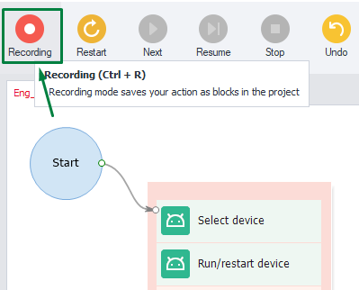

:::info Please familiarize yourself with the [*Terms of Use for materials on this resource*](../Disclaimer).
:::
_______________________________________________
## Description
From here on out, we’ll refer to each open virtual machine as an **Instance**. It doesn’t become available right when you start the program – only after you turn on the emulator. One working instance is shared across all your open projects.

### Starting Memu
Out of all the available emulators, ZennoDroid only works with Memu. So that’s the one we’ll use in our examples.

In the **Device Window**, click the **Start Device** button and wait for the emulator to be ready:

Once it launches successfully, you’ll see the main screen of the virtual Android machine:

:::tip Before you hit the start button, you can enable Recording right away so your actions are saved in a template for future use.

:::
_______________________________________________
## Useful Links
- [**Installing Memu**](./Memu_Install)
- [**Device Window**](../pm/Interface/DeviceWindow)
- [**Project Debugging**](../pm/Debugging)