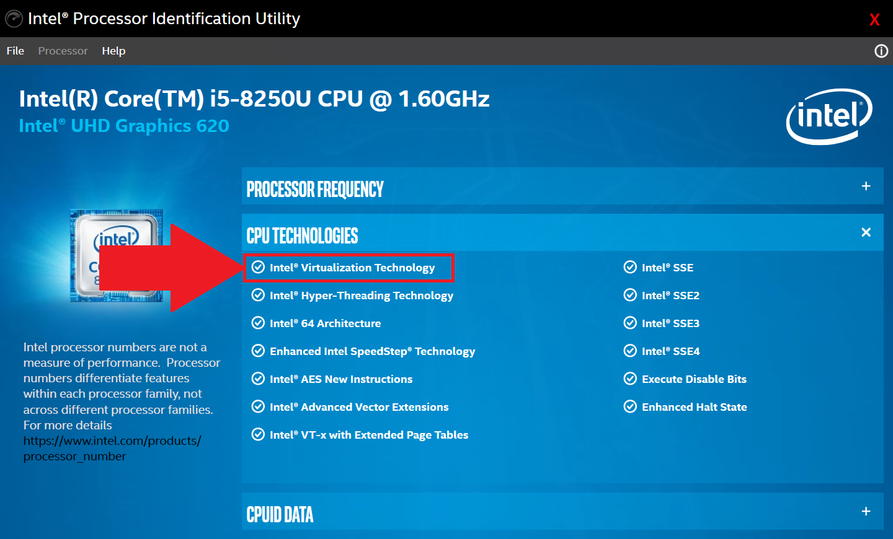

:::info **Please read the [*Material Usage Rules on this site*](../Disclaimer).**
:::
_______________________________________________
## What is virtualization and why enable it?

Virtualization lets you run different operating systems on your device, like Android. For example, ZennoDroid uses this virtual environment for better performance with the emulator. We strongly recommend enabling virtualization because you'll get much better performance when working with emulated devices.

***Here's how to check if virtualization is already enabled.***

  

 _______________________________________________ 
## Let's check if virtualization is available.

### Computers with Intel CPUs
Download and install the [**Intel Processor Identification Utility**](https://www.intel.com/content/www/us/en/download/12136/28539/intel-processor-identification-utility-windows-version.html?v=t), then go to the **CPU Technologies** tab. If there's a checkmark next to  
*Intel® Virtualization Technology*, it means you can enable virtualization.

  

### Computers with AMD CPUs
Download the [**AMD-V Detection Utility**](https://download.amd.com/techdownloads/AMD-VwithRVI_Hyper-V_CompatibilityUtility.zip) and extract the files. Run the **.exe** as administrator. The program will tell you if virtualization is available on your device.

  
_______________________________________________
## How to enter the BIOS?
 
1. Go to the **Start** menu and open **Windows Settings**.  
2. Click **Windows Update**, then choose **Recovery**, and then **Restart now**.  
3. Pick **Troubleshoot** and **Advanced options**.  
4. Choose **UEFI Firmware settings** and click **Restart now**.  

You can also enter BIOS by pressing the designated access key while your computer boots up:

  

We've listed the most popular manufacturers for your convenience in the table. If you don't see yours here, we recommend checking your device's user manual.
_________________
## Enabling virtualization
:::tip *The BIOS layout and look may vary between manufacturers, but the general process is similar.*
:::
>   
### Intel CPU   
   
1. Press **F7** or go to **Advanced Mode**.  
2. Choose **CPU Configuration**.  
3. Go to **Intel Virtualization Technology** and change the setting from **Disabled** to **Enabled**.  
4. Press **Exit** and select <mark>**Save changes & reset**</mark> to turn on virtualization.  
:::warning Make sure you save the changes before exiting, so they take effect.
::: 
### AMD CPU  

1. Press **F7** or go to **Advanced Mode**.
2. Choose **CPU Configuration**.
3. Find **SVM Mode** and select **Enabled** from the drop-down menu.
4. Finally, hit **Exit** and then **OK** to apply the settings.
:::warning Make sure you save the changes before exiting, so they take effect.
:::
_______________________________________________
## Useful links  
- [**Enabling virtualization in Windows, Microsoft website**](https://support.microsoft.com/ru-ru/windows/%D0%B2%D0%BA%D0%BB%D1%8E%D1%87%D0%B5%D0%BD%D0%B8%D0%B5-%D0%B2%D0%B8%D1%80%D1%82%D1%83%D0%B0%D0%BB%D0%B8%D0%B7%D0%B0%D1%86%D0%B8%D0%B8-%D0%B2-windows-c5578302-6e43-4b4b-a449-8ced115f58e1). 
- [**How to work with your computer's BIOS and UEFI**](https://club.dns-shop.ru/blog/t-328-prilojeniya/29344-kak-rabotat-s-bios-i-uefi-komputera-ili-noutbuka/?utm_referrer=https%3A%2F%2Fwww.google.com%2F).     
- [**What is a processor (CPU)**](https://help.sweb.ru/chto-takoe-processor-(cpu)_1365.html).