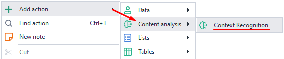
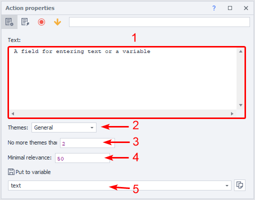
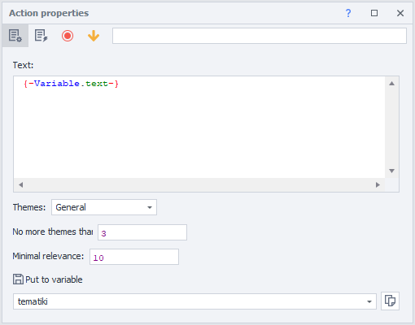
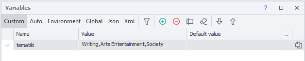

:::info **Please read the [*Material Usage Rules on this site*](../Disclaimer).**
:::
_______________________________________________
## Description.
With this action, you can identify the topic of the selected text. It can:
- Detect the topic of a website;
- Filter websites by categories for link placement;
- Parse content;
- Identify text by specified criteria.

:::warning **Works only with English text.**
:::

### How to add it to your project?
Via the context menu: **Add action → Content analysis → Context Recognition**

:::tip **If you need to identify the topic of a text outside your project.**
Then use ***Context Recognition*** as a **Tool**.
:::
_______________________________________________
## Working with the window.

**1.** Here, enter the text or variables whose context you want to detect.  
**2.** Topics:
   - **General**. This includes about 20 general-purpose topics that fit most texts.
   - **Detailed**. More narrow directions for texts, about 250 topics.
**3.** In this field, you can set the maximum number of topics you'll get after analysis. *Variables can be used here.*
**4.** Specify the minimum relevance percentage for the text, from 0% to 100%. *Variables can be used here.*
**5.** Here, you can select the variable where the result will be saved.

:::info **All topics found will be separated in the variable by `;`.**
:::
_______________________________________________
## Usage example.
Let's say you need to parse the text from a website's main page and identify at least three topics.

1. Parse the main article into the `text` variable.
2. Set a low relevance percent (10%) because the site has a lot of different topics.
3. Put the result in the `tematiki` variable.

_______________________________________________
## Pro tip.
The **Context Recognition** action is popular among SEO specialists. One of the most common uses is to identify website topics for placing advertising links.

If you post links to your product on every possible site, there's a high risk you'll get banned by search engines. So, it's best to check the page topics first, before posting your links. If the text doesn't match the focus of your site, just skip it.

Then, when you need to advertise your site, you simply use links for posting not from a general pool, but from one sorted by topic ahead of time. For example, you can post a car insurance article in a car blog, not one where they review movies.

That way, your chances of passing moderation go way up. This is especially important on large and reputable sites.

You can also use this method to check links that have been posted on your own site.
_______________________________________________
## Useful links.
- [**What is website parsing?**](https://blog.capmonster.cloud/ru/blog/sel-1/what-is-website-parsing-and-why-do-you-need-it).
- [**Environment variables**](../pm/Creating/Variables).