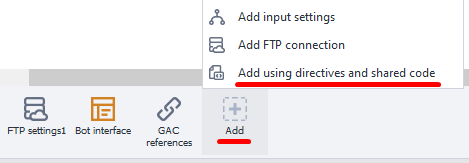

:::info **Please read the [*Material Usage Rules on this site*](../../Disclaimer).**
:::
_______________________________________________
## Description.
**Shared code** is functionality that extends the capabilities of standard C# blocks. It's used to insert additional classes and functions.

And **using directives** are needed to access functions and classes, as well as to create namespaces.

#### How can you use this?
- Work with C# code more efficiently.
- Create new namespaces.
- Organize working with large amounts of code.
- Avoid naming conflicts.

:::warning **Working with shared code assumes you already have basic C# knowledge.**
:::
_______________________________________________
## How do you add it to a project?
Via the context menu: **Add action → Custom code → Using directives and shared code**.


Or through the **[*Static block panel*](../Static%20Block%20Panel/CommonPrinciples) → Add → Add using directives and shared code**:


_______________________________________________
## Shared code.


This window is a code editor with syntax highlighting. In the context menu, you get access to basic code editing tools: copy, paste, comment, search, replace, etc.

At the bottom of the window, there’s a checkbox for loading code from your own file in `.txt` or `.cs` formats.

At the very top of the code are all the **using** directives used in your project. After that, there's an example of declaring `namespace ZennoLab.OwnCode`. You can create your own namespaces the same way and refer to them later.

To access functions and methods from the shared code, they need to be declared with the `public` modifier. If you don’t need to work with objects of a certain class, you can declare it static: `public static`. And if you aren’t planning to use inheritance, it’s best to declare the class as `public sealed` right away.
_______________________________________________
## Using Directives.


When you open this tab, you’ll see two fields:
- **Top field.** This is for adding *namespaces* that are used when executing code in C# actions. For example, to parse XML you need to write `using System.Xml;`.
- **Bottom field.** Here you see all the *using* directives used by the project by default. You can’t edit these.
_______________________________________________
## Example.
Let’s pass an image and a transparency coefficient to the `SetImageOpacity` method. As a result, you’ll get a semi-transparent picture you can save to disk.
```C
public static Image SetImageOpacity(Image image, float opacity)  
{  
    try  {  
        Bitmap bmp = new Bitmap(image.Width, image.Height);
        //create graphics from the image
        using (Graphics gfx = Graphics.FromImage(bmp)) {
            //create a color matrix object  
            ColorMatrix matrix = new ColorMatrix();      
            //set opacity 
            matrix.Matrix33 = opacity;  
            //create new attributes
            ImageAttributes attributes = new ImageAttributes();      
            //set the image’s opacity color
            attributes.SetColorMatrix(matrix, ColorMatrixFlag.Default, ColorAdjustType.Bitmap);    
            //draw the image
            gfx.DrawImage(image, new Rectangle(0, 0, bmp.Width, bmp.Height), 0, 0, image.Width, image.Height, GraphicsUnit.Pixel, attributes);
        }
        return bmp;  
    }  
    catch (Exception ex) {  
        return null;  
    }  
} 
```

And here’s how you call this function from a [**C# action**](./С):
`Image img = OwnCode.CommonCode.SetImageOpacity(Image.FromFile(project.Directory + "//image.jpg"), .5f);`
_______________________________________________
## Useful links.
- [**Comprehensive Guide to the C# Programming Language**](https://metanit.com/sharp/tutorial/?ysclid=m6tuqoibxu646819911).
- [**Using Directive: Import types from a namespace**](https://learn.microsoft.com/ru-ru/dotnet/csharp/language-reference/keywords/using-directive).