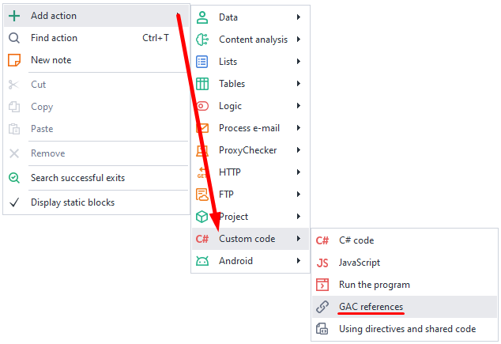
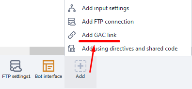

---
sidebar_position: 4
title: References from GAC
description: Third-party class library.
---  
:::info **Please read the [*Material Usage Rules on this site*](../../Disclaimer).**
::: 
_______________________________________________  
## Description  
When you use C# snippets, you get access to all the features of this language. For example, it includes a huge library of classes and methods that cover most typical tasks.

You can find descriptions of different classes and what they can do on the [**.NET Framework Class Library**](https://learn.microsoft.com/ru-ru/previous-versions/gg145045(v=vs.110)?redirectedfrom=MSDN) page.

But if you can’t find a class that solves your problem, you can use a third-party library. To do this, add the **References from GAC** action to your project, where you can connect a separate class library.
_______________________________________________ 
## How to add it to your project?  
Via the context menu: **Add action → Your code → References from GAC**.

Or through the **[*Static Block Panel*](../Static%20Block%20Panel/CommonPrinciples) → Add → Add References from GAC**:

_______________________________________________
## How to work with this action?  
 

When you open the action or the corresponding item from the [*Static Block Panel*](../Static%20Block%20Panel/CommonPrinciples), a window pops up that lists all the libraries currently connected.

With the **Add** button, you can add your own library—either by picking it from the list or by loading it from a file.

  

You can also use the filter to search:

  

Once the library you need is added, you’ll have to set a new namespace for it. Do this with the [*Using directives and shared code*](./Directives_Using) action, which we cover in a neighboring article.
_______________________________________________
## Useful links  
- [**C# Code Snippets**](https://learn.microsoft.com/ru-ru/visualstudio/ide/visual-csharp-code-snippets?view=vs-2022).