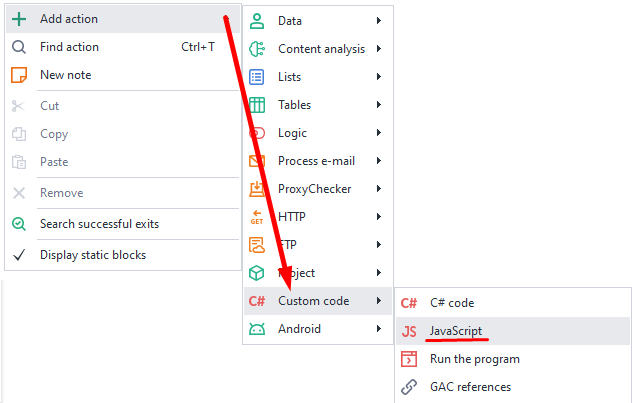
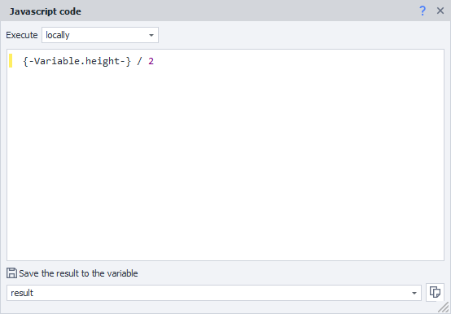

---
sidebar_position: 2
title: JavaScript Code
description: Working with JavaScript in ZennoDroid.
---  
:::info **Please read the [*Material Usage Rules on this site*](../../Disclaimer).**
::: 
_______________________________________________   
## Description  
This action lets you run custom JavaScript code and do arithmetic operations with project variables.

  

_______________________________________________ 
## How to add it to your project?  
Using the context menu: **Add action → Custom code → JavaScript**.

  
_______________________________________________
## How does this action work?  
There are **two modes:**

### Locally  
The code will run in an isolated environment, independent of the open app and outside of it.  
You can use this method to work with any data JS supports—like:  
- *variables*  
- *numbers*  
- *strings*

 

While working in this mode, you **don’t need** to write the *return* keyword if you plan to return a value. This action will return the result of the last line by itself.
In the example above, variable `{-Variable.result-}` gets the value `6`, which is the result of `2+2*2`.

:::info **You can test this code with the *JavaScript Tester*.**  

:::

### On the current page  
The code will run on the open browser page. Use it when you want to work with the DOM tree and interact with page elements.

In this mode, you get access to all objects on the current page, including libraries and frameworks hooked up on the site (like jQuery).

_______________________________________________  
:::warning **No matter which mode you use**  
In the action settings, you must specify a variable to save the result, even if your code logic isn’t supposed to return anything.
:::  
_______________________________________________  

## Usage Examples  
### Arithmetic operations  
|   |
|:--:|
| *After this action, the **result** variable will contain the value of **height** divided by **2*** |  

### Connecting JavaScript libraries  
You can also embed a library that wasn’t on the page originally. For example, you can add jQuery with code like this:

```JS  
int value1 = Convert.ToInt32(project.Variables["value1"].Value);
int value2 = Convert.ToInt32(project.Variables["value2"].Value);
int value3 = value1 + value2 // or value1 - value2 or value1 * value2, etc.
return value3.ToString(); // sum of two numbers  
```  
_______________________________________________
## Useful links  
- [**Basic JavaScript concepts**](https://medium.com/@stasonmars/%D0%BE%D1%81%D0%BD%D0%BE%D0%B2%D1%8B-%D0%BE%D1%81%D0%BD%D0%BE%D0%B2-%D0%B2-javascript-%D0%B4%D0%BB%D1%8F-%D1%82%D0%BE%D0%B3%D0%BE-%D1%87%D1%82%D0%BE%D0%B1%D1%8B-%D0%B8%D0%B4%D1%82%D0%B8-%D0%B4%D0%B0%D0%BB%D1%8C%D1%88%D0%B5-a5beae5dc9e4)
- [**JavaScript Tester**](../../Tools/Java_Tester)  
- [**Variables window**](../../pm/Interface/Variables)