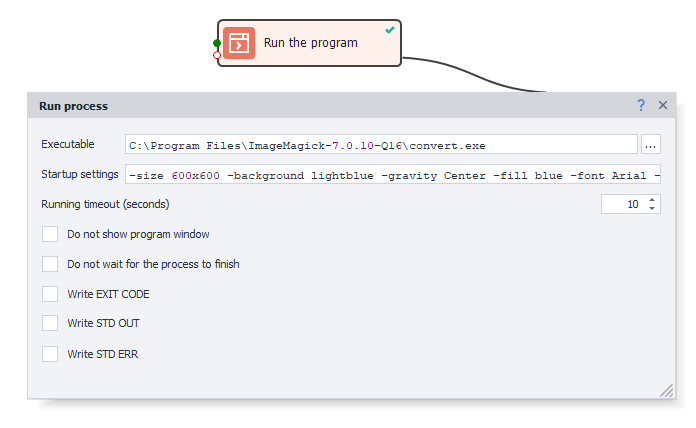

:::info **Please read the [*Terms of Use for materials on this site*](../../Disclaimer).**
:::
_______________________________________________
## Description.
This action lets you launch third-party programs. For example:
| Desktop programs     | Console utilities    |
|:--:| :--:|
| Notepad, WinRar, Paint | ffmpeg, ImageMagick |

#### How you can use it:
- [**ImageMagick**](https://imagemagick.org). A set of utilities for reading and editing files in many graphic (image) formats.
- [**FFmpeg**](https://ffmpeg.org). Open-source libraries that let you record, convert, and stream digital audio and video in various formats.
- Running scripts in [**Python**](https://www.python.org) and other programming languages.
- Or work with any other applications.

_______________________________________________
## How to add to your project?
Through the context menu: **Add Action → Own code → Run program**.

_______________________________________________
## How to work with the action?

_______________________________________________
### Executable file.
Here you write the full path to the file you want to run. Clicking on the ellipsis will open the standard file search window on your computer.
#### Details:
- **If the file isn't found at the specified path, the action will end with an error.**
- You can use [**variable macros**](../../pm/Interface/Variables).
- If the application's folder is in your [**PATH environment variable**](https://ru.wikipedia.org/wiki/PATH_(%D0%BF%D0%B5%D1%80%D0%B5%D0%BC%D0%B5%D0%BD%D0%BD%D0%B0%D1%8F)), you can just type the file name (for example, `notepad.exe` or `calc.exe`) instead of the full path.
_______________________________________________
### Launch parameters.
Here you can enter extra commands that get passed to the program you’re running. Each program has its own launch parameters (macros also work here).

|   |
|:--:|
| *Launching a new Chrome browser window with the URL https://zennolab.com* |

:::info **When launching console utilities, you pass arguments in this line.**
:::
_______________________________________________
### Timeout.
If the launched program doesn’t finish in the number of seconds specified here, the action will stop with an error. Handy when you know exactly how long something should take.

:::info **You can enter a fractional value separated with a comma `,`.**
:::
_______________________________________________
### Don’t show process window.
If you check this option, the program you run won’t open a visible window.
_______________________________________________
### Don’t wait for completion.
With this setting, *Timeout* gets ignored and the action won’t wait for the program to finish running.
_______________________________________________
### Save EXIT CODE.
[**Exit code**](https://ru.wikipedia.org/wiki/%D0%9A%D0%BE%D0%B4_%D0%B2%D0%BE%D0%B7%D0%B2%D1%80%D0%B0%D1%82%D0%B0) is a numeric value a program returns after it finishes. This code can indicate whether it finished successfully or if something went wrong.

A normal finish returns `0`. If you get something else, it probably means there was an error.

To find out what a specific code means, just google: `program_name exit code return_code`. **Example:** `ffmpeg exit code 137`.
_______________________________________________
### Save STD OUT.
**STDOUT (Standard Output)** is the standard output stream programs use to print text info (anything except errors). You see it in the console window.

#### Example:
When you install [ImageMagick](https://imagemagick.org/index.php), it adds its folder to the [*PATH environment variable*](https://ru.wikipedia.org/wiki/PATH_(%D0%BF%D0%B5%D1%80%D0%B5%D0%BC%D0%B5%D0%BD%D0%BD%D0%B0%D1%8F)). After that, you don’t need the full path to the exe file—just write: `magick.exe <here_are_arguments>`.

To show how it works, let’s run the program with the argument `-usage` and redirect **STD OUT** to a variable. The program will then output some basic info about itself.

_______________________________________________
### Save STD ERR.
**STD ERR (Standard Error)** is just for programs’ error outputs.

#### Example:
Let’s repeat the previous command, but make a mistake and type `-usage22`:

You can see in the screenshot that **STD ERR** got an error message saying there’s an invalid argument or not enough parameters.
But we also got text in **STD OUT**—the program is hinting how to use it correctly.
_______________________________________________
:::info **To follow along with the commands above.**
Install [**ImageMagick**](https://imagemagick.org).
Open a console window (like with **Win+R → type cmd.exe → press Enter**).
Then type these commands: `magick-usage` and `magick-usage22`.
:::
_______________________________________________
## Usage examples.
Let’s look at a few scenarios using ImageMagick.

**Goal:** create an image.
- **Size:** 600 by 600 pixels (`-size 600x600`).
- **Background color:** light green (`-background lightgreen`).
- **Position:** centered (`-gravity Center`).
- **Text color:** green (`-fill blue`).
- **Font:** Arial (`-font Arial`).
- **Font size:** 72 (`-pointsize 72`).
- **Text:** ZennoDroid (`label:ZennoDroid`).

**Result will be saved** to: `C:\Users\Administrator\Desktop\result.jpg`.

**Path:** `C:\Program Files\ImageMagick-7.1.1-Q16-HDRI\magick.exe`.

:::info **The file paths on your computer will probably be different.**
:::

|   |
|:--:|
| *Result* |

### Method 1. Parameters are hard-coded.

**Executable:** `C:\Program Files\ImageMagick-7.1.1-Q16-HDRI\magick.exe`.

**Launch parameters:** `-size 600x600 -background lightgreen -gravity Center -fill green -font Arial -pointsize 72 label:ZennoDroid C:\Users\Administrator\Desktop\result.jpg`.

After you run this action, you’ll see the file `result.jpg` appear on your desktop.
_______________________________________________
### Method 2. Parameters in variables.

**Executable:** `{-Variable.imagemagick_dir_path-}magick.exe`.

**Launch parameters:** `{-Variable.parameters-} {-Project.Directory-}result.jpg`.

> *`{-Project.Directory-}` is a system variable that stores the full path to your current project's location.*

Here, *the path to the folder with the exe* and *all parameters* are put in separate variables. This is convenient for running templates on different machines in case the path is different.

You can also split the parameters into several variables instead of just one.

The final `result.jpg` will be saved to the same directory where the project is.

:::warning **Pay attention.**
The project needs to be saved on your computer to use the `{-Project.Directory-}` variable; otherwise, it’ll be empty.
:::
_______________________________________________
### Example with a Python script.
:::tip Python needs to be installed on your system for this example to work.
:::

If you're searching for a solution online for some task, you might find scripts in different programming languages. Of course, you could rewrite the script and run it with the matching action, but it’s usually much easier to just launch the script directly with the **Run Program** action and immediately use its result.

**Executable:** `C:\Users\user\AppData\Local\Programs\Python\Python38-32\python.exe`.

**Launch parameters:** `C:\ZD\my_sript.py` and two arguments: `12 11`.

**Result:** `132` will be saved to the variable `result`.

In this example, the script sits at `C:\ZD\my_sript.py`. It takes two numbers as input, multiplies them, and prints the answer to the console.

For your case, the script might generate an image or some text. It could also have a neural net for solving captchas. Really, whatever you want.
_______________________________________________
## Useful links.
- [**Working with variables**](../../Data/WorkWithVariables).
- [**Writing robust Python scripts**](https://habr.com/ru/companies/ruvds/articles/462007/).